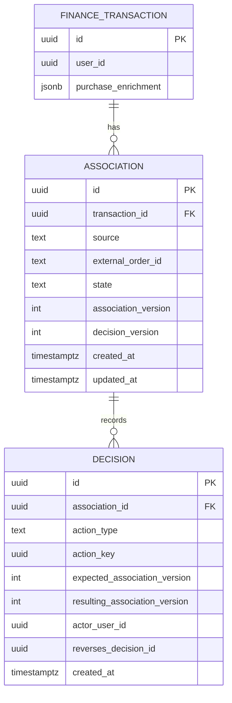
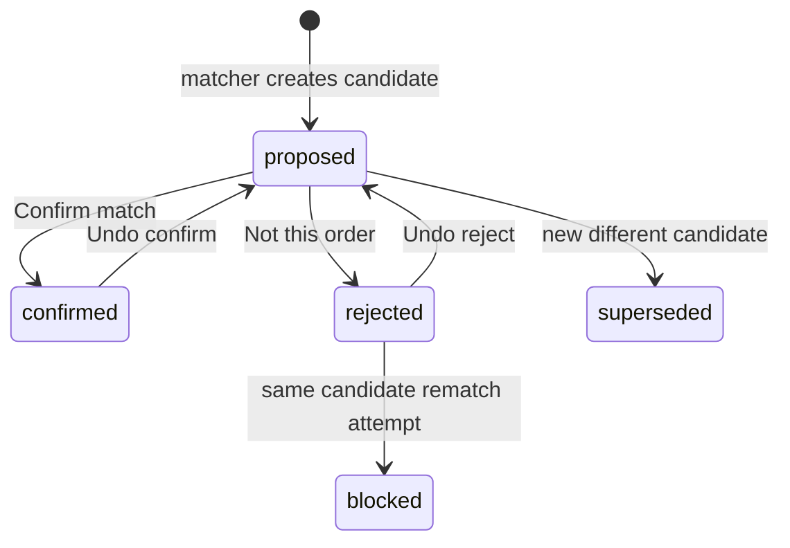

# Finance F-P6 Purchase Review — Data Contract Audit

**Status:** **BLOCKED** (structural — 2026-07-11)
**Owner:** Codex (data layer)
**Canonical index:** [FP6_PURCHASE_REVIEW.md](./FP6_PURCHASE_REVIEW.md)
**Product semantics:** [Product contract](./FP6_PURCHASE_REVIEW_PRODUCT_CONTRACT.md)

This document describes **verified current state** and **approved design direction**. Nothing in the “Required future data foundation” section is implemented unless explicitly marked otherwise.

---

## Verdict

```text
Current JSONB model: NOT a safe review-state store
F-P6a implementation: BLOCKED until association + decision foundation
```

---

## Current data map

### Where suggested orders live today

Suggested-order association and enrichment are stored together in:

```text
public.finance_transactions.purchase_enrichment  (JSONB)
```

The JSONB simultaneously carries:

- order identity (`source`, `orderId`, URLs)
- order date / total / status
- line items
- match confidence and matching metadata
- merchant enrichment
- return/refund info

### What does not exist today

| Capability | Present? |
| --- | ---: |
| Independent association entity | **No** |
| `association_id` | **No** |
| Persisted Confirmed / Rejected state | **No** |
| User decision history | **No** |
| Association version | **No** |
| Decision version | **No** |
| Idempotency record | **No** |
| Durable rejected-candidate memory | **No** |

### Writers that can mutate enrichment today

| Writer | Risk |
| --- | --- |
| [link-purchase-orders.mjs](../scripts/link-purchase-orders.mjs) | Automated match apply — replace/merge JSONB |
| Generic transaction update via [createRepo.ts](../../../packages/finance-core/src/repo/createRepo.ts) | May rewrite full row including enrichment |
| Operational apply ledger | Records **automated** apply runs — **not** authoritative user review decisions |

The optional apply-run ledger ([purchaseEnrichmentApplyLedger.mjs](../scripts/lib/purchaseEnrichmentApplyLedger.mjs)) logs operational changes. It is **not** a user decision audit trail.

### Why JSONB mutation is unsafe for review

| Operation | Risk on JSONB-only approach |
| --- | --- |
| Confirm | Cannot distinguish user decision from enrichment refresh |
| Reject | Clearing JSON loses rejected-candidate identity |
| Undo | Restoring old JSON may overwrite newer enrichment |
| Refresh | Cannot reliably read authoritative user decision |
| Retry | Duplicate decisions possible |
| Timeout | Cannot tell if mutation committed |
| Stale tab | Old client may overwrite newer decision |
| Rematching | Rejected candidate can reappear silently |
| Full transaction update | Rewrites entire enrichment payload |

Existing transaction updates lack reliable expected-version conditions for a purchase-review mutation path.

---

## `matched_review`

### What it is

`matched_review` is a **derived data-quality classification**, computed by [classify.mjs](../../../packages/finance-enrichment-contract/src/classify.mjs) and exposed through [purchaseEnrichmentDisplay.ts](../../../packages/finance-core/src/engine/purchaseEnrichmentDisplay.ts).

It is **not** a persisted review workflow state.

### Conditions that can trigger `matched_review`

Non-exhaustive list from classification reasons:

- `unknown_account`
- `non_clean_status`
- `low_or_medium_confidence`
- `duplicate_risk`
- `missing_items`
- `missing_total`
- `amount_mismatch`
- `source_coverage_gap`

### What it does not guarantee

- a durable review task exists
- a concrete actionable transaction↔order candidate
- the item has never been rejected
- the candidate can be mutated safely
- the problem is specifically transaction↔order identity

**Implication:** `matched_review` must not serve as persisted `proposed` state or sole Review Needed membership criterion.

---

## `unsupported_source`

### Current definition

From [resolveDisplayState()](../../../packages/finance-enrichment-contract/src/classify.mjs): enrichment has a truthy `source` that is **not** in `SUPPORTED_SOURCES` (`amazon`, `bestbuy`, `target`).

### What it does not require

- stable `orderId`
- concrete order candidate
- sufficient review evidence
- ability to Confirm/Reject

### Product alignment

```text
unsupported_source ≠ actionable purchase review
```

**Current UI gap:** [HistoryLedger.svelte](../src/lib/components/HistoryLedger.svelte) includes `unsupported_source` in the `purchase:review` filter alongside `matched_review`. **No filter change has been implemented yet.**

### Target split

| Classification bucket | Review Needed? | Confirm/Reject? |
| --- | ---: | ---: |
| Actionable association (`proposed`) | Yes | Yes |
| Source / coverage issue | Optional info | No |
| No concrete candidate | No | No |

---

## Association identity (design)

Stable candidate identity should derive from:

```text
source + canonical external_order_id
```

**Not** from:

- `matchedAt`
- detail URL alone
- display text
- current JSON blob hash alone

[mergeKeyFor()](../../../packages/finance-enrichment-contract/src/classify.mjs) informs merge keys for dedup; future association rows should use canonical external order identity.

---

## Required future data foundation (design only)

> **Not implemented.** Illustrative names only.

### Entity relationship (recommended)



- **`purchase_enrichment` JSONB** remains enrichment payload — not authoritative review state.
- **`ASSOCIATION.state`:** `proposed` | `confirmed` | `rejected`
- Same `source + external_order_id` for one transaction → same association row (version increments on mutation).
- Different order candidate → new association row.

### Association entity (minimum)

| Field | Purpose |
| --- | --- |
| `association_id` | Stable row identity |
| `transaction_id` | Owning bank transaction |
| canonical candidate key | `source` + external order id |
| `source` / `external_order_id` | Merchant order identity |
| `association_version` | Monotonic optimistic concurrency |
| `decision_version` | Latest decision epoch |
| `state` | `proposed` \| `confirmed` \| `rejected` |
| `created_at` / `updated_at` | Audit |

Same physical candidate → same association row. Different candidate → different association.

### Decision model (recommended)

```text
authoritative current association row
+
append-only decision events
```

Each decision event should support:

| Field | Purpose |
| --- | --- |
| `decision_id` | Stable idempotency / Undo target |
| `association_id` | FK |
| `action_key` | Client idempotency key |
| decision type | confirm / reject / undo_confirm / undo_reject |
| `expected_association_version` | Stale-write detection |
| `resulting_association_version` | Post-mutation version |
| candidate snapshot / hash | Audit & resurface detection |
| `actor` | Authenticated user |
| `timestamp` | Ordering |
| `reverses_decision_id` | Undo linkage |

### Required server capabilities (design)

Illustrative RPC surface — **none exist today**:

- Confirm match
- Reject match
- Undo exact decision
- Get / reconcile authoritative review state

All mutations require:

- `association_id`
- `action_key`
- expected association version
- expected decision version
- authenticated ownership check (RLS)

Browser must **not** require service-role key. Supabase guidance: combine Auth, grants, and RLS; if using `SECURITY DEFINER`, fix `search_path` and restrict execute privileges ([RLS docs](https://supabase.com/docs/guides/database/postgres/row-level-security)).

### RPC contract (draft)

> **Design only — not implemented.** Codex must validate against RLS and migration constraints before build.

| Operation | Input (minimum) | Success | Failure |
| --- | --- | --- | --- |
| **Confirm match** | `association_id`, `expected_association_version`, `action_key` | `{ state: "confirmed", association_version }` | `400` not `proposed`; `409` version conflict; `403` not owner |
| **Reject match** | same | `{ state: "rejected", association_version }` | same |
| **Undo decision** | `decision_id`, `expected_decision_version`, `action_key` | `{ state: "proposed", association_version }` | `400` not reversible; `409` superseded |
| **Get review state** | `transaction_id` | `{ association, decisions[] }` | `404` no association; `403` |

Validation on every mutation:

- `auth.uid()` owns the parent transaction
- `expected_*_version` matches current row
- duplicate `action_key` returns original result (idempotent)

### Manual-decision precedence

```text
Confirmed or rejected manual decisions
must outrank automatic matching and enrichment writes
for the same stable association.
```

| Automation may | Automation must not |
| --- | --- |
| Update non-identity enrichment on confirmed association | Clear manual Confirm/Reject |
| Create genuinely new candidate associations | Change confirmed transaction↔order pair |
| Mark old proposals stale / superseded | Resurrect rejected association as ordinary proposal |
| | Overwrite decision state via enrichment JSON merge |

**This precedence does not exist today** — implementation blocker.

---

## State machine (recommended)



`blocked` is a policy outcome: same rejected candidate must not silently return as `proposed`.

---

## Undo model (server)

- Undo validates `decision_id`, association version, and that decision is the latest reversible action
- 10s client timer is **not** the authority
- Failed Undo → prior state unchanged
- Timeout reconciliation queries by `action_key` / `decision_id` before retry

---

## Concurrency & idempotency

| Concern | Requirement |
| --- | --- |
| Double submit | Same `action_key` → same result, no duplicate events |
| Stale write | Reject with version conflict; client refreshes |
| Unknown timeout | Reconcile endpoint before blind retry |
| Parallel tabs | Last writer wins only with version check; never silent JSON merge |

---

## Migration scope (F-P6a planning)

1. New tables: associations + decision events (or equivalent)
2. Backfill: derive initial `proposed` from existing JSONB where actionable
3. RLS policies per `transaction_id` ownership
4. RPC functions with version checks
5. Precedence hooks in [link-purchase-orders.mjs](../scripts/link-purchase-orders.mjs)
6. Stop using JSONB as review state store; JSONB remains enrichment payload only
7. Filter split: actionable vs informational vs no candidate

---

## Tests (required before F-P6a UI)

| Layer | Cases |
| --- | --- |
| **Unit** | State transitions; version increment; Undo reversal |
| **Integration** | RLS ownership; cross-user denial |
| **RPC / idempotency** | Duplicate `action_key`; concurrent Confirm → one decision |
| **Precedence** | Matcher skips confirmed/rejected association; new candidate creates new row |
| **Timeout** | Reconcile committed vs uncommitted before retry |
| **E2E** | Review Needed → Confirm → Undo; stale tab 409 |

Concrete checklist:

- Confirm / Reject happy path with version increment
- Idempotent retry with same `action_key`
- Undo confirm / undo reject
- Stale version conflict
- Timeout reconcile (committed vs not committed)
- Rejected candidate cannot rematch silently
- Automated job respects manual decision precedence
- RLS: user A cannot mutate user B associations
- Confirm → enrichment refresh: pair stays confirmed; Undo targets exact decision

Full matrix: [Implementation guide — Test matrix](./FP6_PURCHASE_REVIEW_IMPLEMENTATION_GUIDE.md#test-matrix).

---

## Codex collaboration checklist

| # | Task | Deliverable | Acceptance |
| ---: | --- | --- | --- |
| 1 | Data map + RLS inventory | Section in this doc | All enrichment writers documented |
| 2 | Association + decision ER | Migration draft | Idempotency, Undo, audit |
| 3 | RPC contract sign-off | Draft table above finalized | Error codes + version fields |
| 4 | Version / idempotency impl | SQL functions | Duplicate request is no-op |
| 5 | Manual-decision precedence | Matcher + apply script rules | No silent resurrect of rejected pair |
| 6 | Consistency tests | Integration suite | Concurrent + timeout |
| 7 | Undo model | `reverses_decision_id` semantics | Failed undo leaves prior decision |
| 8 | Filter split | Code + doc update | `unsupported_source` not actionable Review Needed |

Estimates and phase ordering: [Implementation guide — Codex checklist](./FP6_PURCHASE_REVIEW_IMPLEMENTATION_GUIDE.md#codex-collaboration-checklist-f-p6a-data-foundation).

---

## Schema reference (current)

Baseline: [20260710160000_life_os_baseline.sql](../supabase/migrations/20260710160000_life_os_baseline.sql) — `finance_transactions.purchase_enrichment` JSONB only; no review tables.
