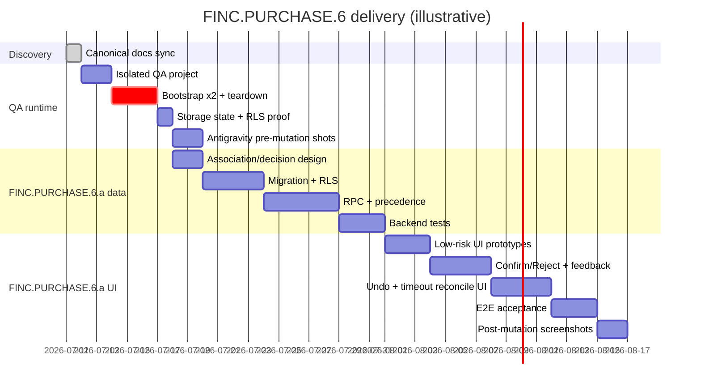

# Finance FINC.PURCHASE.6 Purchase Review — Implementation Guide

**Status:** Planning reference (2026-07-11)
**Canonical index:** [FP6_PURCHASE_REVIEW.md](./FP6_PURCHASE_REVIEW.md)
**Not authorization to implement** — FINC.PURCHASE.6.a remains **BLOCKED** until data foundation + isolated QA runtime gates pass.

This guide synthesizes user research, competitor patterns, phased delivery, risks, and team handoffs. It supplements — does not override — the [product contract](./FP6_PURCHASE_REVIEW_PRODUCT_CONTRACT.md) and [data contract](./FP6_PURCHASE_REVIEW_DATA_CONTRACT.md).

---

## User pain points & goals

Users need to review **one bank transaction ↔ one suggested order** quickly, **reversibly**, and with **transparent** system behavior.

| Pain | Target outcome |
| --- | --- |
| Low efficiency — manual reconciliation is slow | One-glance transaction↔order evidence; minimal context switching |
| Review risk — wrong confirm distorts data; irreversible ops erode trust | Authoritative Confirm/Reject + Undo + timeout reconciliation |
| Cognitive overload — raw enrichment JSON or dense rows | Clear separation of bank transaction vs suggested order; actions only on the association |
| Automation opacity — users cannot tell human vs machine state | Explicit success/failure/stale states; durable decision audit (once implemented) |

**Product principle (locked):** the user approves or rejects the **association**, not category, merchant normalization, every line item, or the matching algorithm permanently.

---

## Competitor patterns (research synthesis)

Public product patterns inform UX direction. Life OS FINC.PURCHASE.6 still requires its own association/decision data model — competitors assume backend match state we do not yet have.

| Product | Relevant pattern | FINC.PURCHASE.6 takeaway |
| --- | --- | --- |
| **Ramp** | PO view → “Match a card transaction”; filter by merchant, cardholder, date; multi-select match updates spend bar | Side-by-side evidence + filterable review queue; match is an explicit user action on a pair |
| **Spendesk** | 3-way match warnings; detail modal for line-level discrepancies | Surface partial/ambiguous evidence; warnings before confirm |
| **Brex** | Auto-attach + auto-validate receipts for known merchants; notify only on failure | Prefer automation for clean cases; human review for exceptions — aligns with `clean_enriched` vs actionable queue |
| **Expensify** | Reconciliation dashboard — imported vs statement totals | Useful for FINC.PURCHASE.6b+/audit; not the FINC.PURCHASE.6.a single-association review object |
| **Monzo Business** | Transaction detail → “Add receipt” / notes in one screen | Mobile one-surface review sheet; minimal navigation |
| **Soldo** | Mobile receipt capture in seconds, auto-linked to card txn | Fast mobile capture path — out of FINC.PURCHASE.6.a scope but informs future enrichment |
| **Extend** | Email/SMS receipt → AI match → “Matched” icon on txn | Visual matched state; reduce manual work when confidence is high |

**Shared industry patterns:**

- Automate when confidence is high; queue exceptions for human review
- Show transaction vs candidate receipt/order comparison before action
- Use clear action labels (`Match`, `Confirm`, `Not this order`) — not ambiguous icons alone
- Provide visible outcome + short undo window where mistakes are costly

External references (public docs):

- [Ramp — Match card transactions to POs](https://support.ramp.com/)
- [Spendesk — Delivery notes and 3-way match](https://help.spendesk.com/)
- [Brex — Auto-validate receipts](https://www.brex.com/support)
- [Expensify — Reconcile company card expenses](https://help.expensify.com/)
- [Monzo — Add information to transactions](https://monzo.com/)
- [Extend — Attach receipts](https://support.paywithextend.com/)

---

## Recommended delivery phases

Aligned with [FP6_PURCHASE_REVIEW.md](./FP6_PURCHASE_REVIEW.md) gates. Dates are **illustrative** — adjust when FINC.PURCHASE.6.a section opens.

**Priority rules:**

1. **Docs + QA runtime** before claiming any visual baseline
2. **Backend RPC + migration** before production Confirm/Reject wiring
3. **Feature flag** for UI mutations until E2E passes
4. **Post-mutation screenshots** only after FINC.PURCHASE.6.a UI ships

---

## Low-risk frontend prototypes (pre–FINC.PURCHASE.6.a UI)

These validate UX **without** changing the database. They do **not** unblock FINC.PURCHASE.6.a or replace the data foundation.

### Prototype A — static / Storybook

- Mock JSON for: no candidate, single candidate, ambiguous candidate
- Confirm/Reject trigger client-only state transitions + Undo affordance demo
- **Acceptance:** keyboard/touch paths; loading/disabled/success/error visuals; a11y labels
- **Risk:** none to production — no backend

### Prototype B — mock API integration

- Feature flag / “Demo Review Mode” in dev or QA only
- MSW or Mirage mock for Confirm/Reject/Undo RPC shapes from [data contract RPC table](./FP6_PURCHASE_REVIEW_DATA_CONTRACT.md#rpc-contract-draft)
- **Acceptance:** idempotent click handling; timeout UX; flag off restores current behavior
- **Risk:** must not merge mock paths without flag guard; remove or gate before prod

See [Product contract — UX alternatives](./FP6_PURCHASE_REVIEW_PRODUCT_CONTRACT.md#ux-pattern-alternatives-ranked).

---

## Risks & rollback

| Risk | Mitigation | Rollback |
| --- | --- | --- |
| Data loss / enrichment overwrite | New association/decision tables; JSONB remains enrichment payload only | Feature flag off; migration reversible in staging first |
| Concurrent review conflicts | Optimistic locking (`expected_version`); 409 → refresh | Client shows stale conflict, no blind retry |
| Auto-match overwrites manual decision | Manual-decision precedence in matcher + DB policy | Pause matcher job; exclude confirmed/rejected associations |
| UI regressions on History list | Item-scoped disable; no immediate row removal | Feature flag disables mutations |
| Low user trust (unclear undo/errors) | Prototype A/B user test before prod UI | Keep items in queue without forced action |
| QA secret leakage | Bootstrap local-only; Antigravity storage-state only | Rotate QA password; never commit artifacts |

---

## Test matrix

| Layer | Focus | Example cases |
| --- | --- | --- |
| **Unit (backend)** | Association state transitions | Confirm → `confirmed` + version++; Reject → `rejected`; Undo reverses correct decision |
| **Integration (DB + RLS)** | Ownership isolation | User A cannot read/mutate User B associations |
| **RPC contract** | Idempotency & concurrency | Duplicate `action_key` → same result; version mismatch → 409 |
| **Unit (frontend)** | Component states | Button loading/disabled; inline notice; 10s Undo visibility |
| **a11y** | Keyboard & screen reader | Tab order evidence → actions; `aria-busy`; live region on success |
| **E2E (QA env)** | Full review flow | Review Needed filter → expand/sheet → Confirm → Undo; timeout reconcile path |
| **Security** | RLS penetration | Unauthenticated / cross-user RPC calls rejected |

Additional scenario: **Confirm → automated enrichment refresh** — non-identity fields may update; pair stays confirmed; Undo still targets exact decision.

Full backend checklist: [Data contract — Codex tasks](./FP6_PURCHASE_REVIEW_DATA_CONTRACT.md#codex-collaboration-checklist).

---

## Codex collaboration checklist (FINC.PURCHASE.6.a Data Foundation)

| Task | Deliverable | Acceptance | Est. |
| --- | --- | --- | ---: |
| Confirm current data map + RLS | Addendum in data contract | All enrichment writers listed | 1d |
| Finalize association + decision ER | Migration draft | Supports idempotency, Undo, audit | 2d |
| RPC contract sign-off | Request/response + error codes | Version + `action_key` on every mutation | 2d |
| Implement version/idempotency | SQL functions + tests | Duplicate request is no-op | 3d |
| Manual-decision precedence | Matcher + apply script rules | Auto job cannot resurrect rejected pair | 1d |
| Post-decision consistency tests | Integration suite | Concurrent + timeout scenarios | 2d |
| Undo model | `reverses_decision_id` semantics | Failed undo leaves prior decision | 2d |
| Filter audit | `matched_review` vs actionable queue | Document + implement filter split | 1d |

---

## Antigravity & QA integration

Detailed steps: [FP6_QA_AUTH.md](./FP6_QA_AUTH.md).

Summary:

1. Provision isolated non-production Supabase
2. Rotate disposable QA password (historical password **compromised** — do not reuse)
3. Run `npm run qa:fp6:bootstrap` **twice** (idempotency)
4. Verify RLS + generate `.tmp/finance-fp6-qa.storage-state.json`
5. Hand Antigravity **only** `UI_QA_URL` + storage-state path
6. Capture pre-mutation baselines; post-mutation shots wait for FINC.PURCHASE.6.a UI
7. Run `npm run qa:fp6:teardown` and verify clean state

---

## References

1. SAP — AI in finance operations (auto-match + anomaly flagging) — industry context for exception queues
2. [Supabase RLS](https://supabase.com/docs/guides/database/postgres/row-level-security) — browser-safe mutation pattern
3. WCAG — button labels, focus order, status feedback for Confirm/Reject/Undo
4. Competitor links — see table above

Internal SSOT:

- [FP6_PURCHASE_REVIEW_PRODUCT_CONTRACT.md](./FP6_PURCHASE_REVIEW_PRODUCT_CONTRACT.md)
- [FP6_PURCHASE_REVIEW_DATA_CONTRACT.md](./FP6_PURCHASE_REVIEW_DATA_CONTRACT.md)
- [FP6_QA_AUTH.md](./FP6_QA_AUTH.md)
