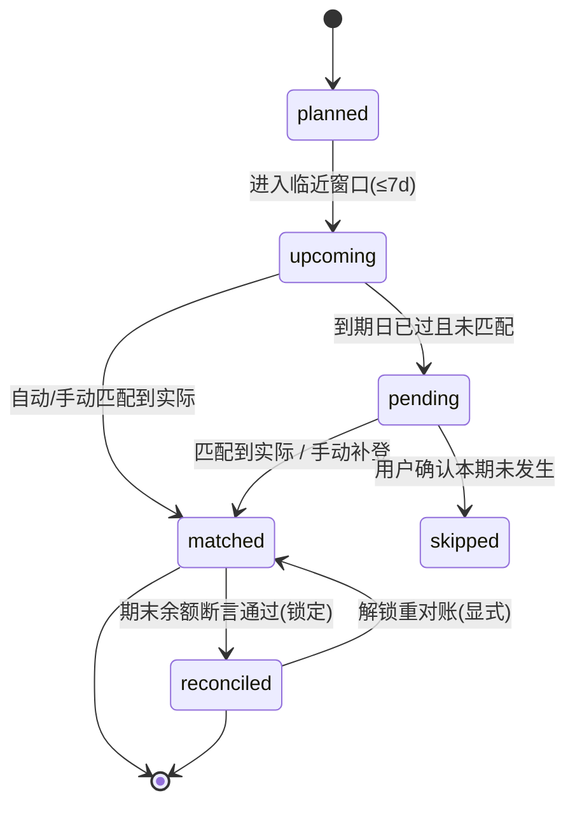
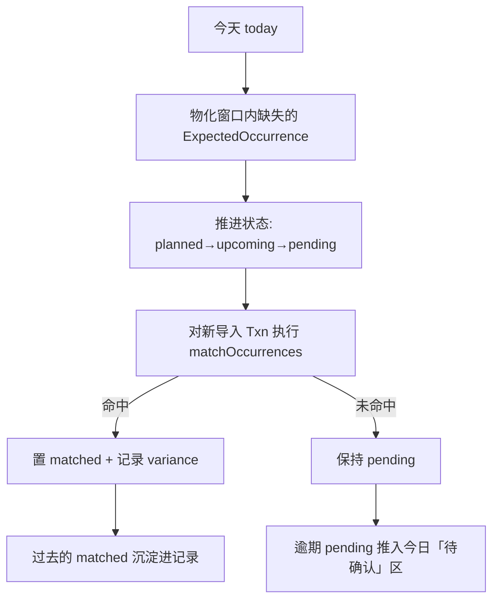

# Finance OS — P1B 统一时间轴与校对设计（Timeline & Reconciliation）

> 状态：`P0–P4 COMPLETE`
> 作者：Owner + Agent 协作
> 日期：2026-06-01
> 关联：延续 `docs/pto-audit-export/15_P1A_REALITY_LOOP.md` 中被 defer 的 **P1B Monthly Review**

## 0. 一句话目标

让 **规划（未来）→ 今日（当下）→ 记录（过去）** 成为同一条带状态机的时间轴，并提供
一套**从轻到重的三层校对手段**，使「现在能放心花」第一次拥有可信的现实地基。

## 1. 锚定的产品决策（Owner 已拍板）

| 决策点 | 选择 | 对设计的影响 |
| --- | --- | --- |
| 实际交易来源 | **CSV 手动导入为主**（无银行实时流水） | 不做 Plaid `pending→posted` 生命周期；`cleared` 口径简化为「已出现在某次导入」 |
| 对账严格度 | **YNAB 实用派** | 余额对不上时允许一键生成可见的「对账调整」补差，但默认先引导修源头 |
| 本轮交付 | **正式设计文档** | 本文件；实现分阶段（P0→P3），每阶段独立可上线 |

## 2. 现状断层（为什么必须改）

当前是**两套互不相交的账本**，仅在聚合层相遇：

| 账本 | 数据源 | 时间方向 | 更新者 |
| --- | --- | --- | --- |
| 计划账本 | `cashFlows[]` + `events[]` + `Account.balance` | 仅朝前（`engine/daily.ts: projectDaily`） | 手填 |
| 实际账本 | `transactions`（`Txn`，CSV 导入） | 仅朝后（`HistoryView`） | 导入 |

相遇点仅有：`HistoryView.PlanReality`（月均对比）与 `ReviewView.CalibrationView`（基线回调计划）。

由此产生四个核心缺陷：

1. **缺逐笔过渡**：未来的一次性 `one-time-purchase` 到期后只是在 `FutureCashflowView`
   翻出一个 `reconciled` 布尔（`types.ts: ScenarioEvent.reconciled`），既不落地成 `Txn`，也不改余额。
2. **循环项永远是假设**：`projectDaily` 每月重新生成房租，但从不知道「本月房租到底付没付、付了多少」。
3. **`Account.balance` 是悬空锚点**：投影完全从手填余额起算，过期后（>30 天才有 banner）
   `safeToSpend` 即失真，且无「校对到分」的手段。
4. **「今日」不知道今天已发生什么**：它假设整月循环项仍会发生，靠余额已被手动扣减「碰巧对上」。

## 3. 先验研究（四套成熟范式）

| 产品 | 关键机制 | 借鉴点 |
| --- | --- | --- |
| **YNAB** | `Uncleared/Cleared/Working` 三态；Reconcile 比对「已清算余额」并**锁定**已对账交易；对不上可生成「对账调整」补差 | 现金分三口径；对账=锁定一个区间；允许显式补差（实用派） |
| **PocketSmith** | 预测余额轨 vs 实际余额轨双轨并存；日历上出现红/绿**校正旗**；可「把过去预测重置到实际」，预测从当前真实余额重锚；循环预算改动可选 `仅此/此后/整条序列` | 预测必须从「最近真实锚点」起算；发散可视化 + 一键重锚；循环改动的作用域三选一 |
| **Monarch** | 循环日历颜色态：**蓝=即将 / 绿=如期 / 黄=金额不符 / 红=该发生未发生**；新交易自动匹配预期项 | 「今日/本月关键账单」的逐笔状态语言 |
| **Beancount** | `balance` 断言（带日期的自审计检查）+ `pad`（仅建账期初）；原则「先修源头，别强行平账」 | 带日期的**余额断言**把对账从肉眼变自动测试（我们缺的那块） |

## 4. 设计原则

1. **单一时间轴（One Spine）**：过去/今日/未来是同一条流的不同区段。
2. **逐笔可追溯**：每笔计划都能落地或匹配到一笔实际，有清晰生命周期。
3. **锚定现实**：今日/未来的数字从「最近一次余额断言 + 之后真实交易」推导，而非裸 `Account.balance`。
4. **校对分层**：逐笔匹配 → 期末断言 → 预测重锚，从轻到重。
5. **永不静默漂移**：计划与实际发散主动可视化，给「修源头」与「重锚/补差」两条出路。
6. **不破坏既有 SoT 边界**：沿用 P1A 的「历史交易不反推余额」纪律，新增能力以**显式动作**触发。

## 5. 核心实体：`ExpectedOccurrence`（预期条目）

它是计划项在**某具体日期**上的物化实例，是计划与实际之间的关节。

```ts
// 建议落点：src/engine/timeline.ts（纯函数引擎） + 持久化表 expected_occurrences
type OccurrenceState =
  | "planned"     // 未来，未临近
  | "upcoming"    // 进入临近窗口（默认 ≤7 天）
  | "pending"     // 到期日已过但未匹配 → 需确认/补登
  | "matched"     // 已匹配实际，未对账锁定（可能有偏差）
  | "reconciled"  // 落入已对账区间，锁定不变
  | "skipped";    // 用户确认本期未发生

interface ExpectedOccurrence {
  id: string;
  sourceType: "cashflow" | "event" | "card_bill" | "goal_transfer" | "annual_fee";
  sourceId: string;            // → cashFlows[].id / events[].id / accounts[].id
  date: string;                // 预计发生日 YYYY-MM-DD
  expectedAmount: number;      // 计划金额（带符号：正流入/负流出）
  accountId?: string;          // 影响的现金账户
  state: OccurrenceState;
  matchedTxnId?: string;       // 匹配到的真实交易
  actualAmount?: number;
  actualDate?: string;
  reconciledPeriodId?: string; // 落入的已对账区间
  varianceAmount?: number;     // actual - expected（派生）
  varianceDays?: number;       // 日期偏差（派生）
}
```

设计要点：
- **物化是幂等的**：`rollTimeline(today)` 重复运行不产生重复条目（按 `sourceId+date` 去重）。
- **可重算**：任意一天打开 App 都能从 `计划 + 实际 + 断言` 重建整条轴，不依赖上次关闭时的瞬时态。
- **过去区段只保留实例，不再保留「永久循环规则」的展开** —— 循环规则只在 `[today-7, today+horizon]`
  窗口内物化，历史靠已沉淀的 `matched/reconciled` 实例 + `transactions`。

## 6. 生命周期状态机



UI 颜色语言（直接用于 `TodayView` 现金日历 / 本月关键账单 / `FutureCashflowView`）：

| 状态 | 颜色 | 含义 |
| --- | --- | --- |
| `upcoming` | 🔵 蓝 | 即将发生 |
| `matched`（一致） | 🟢 绿 | 如期发生，金额一致 |
| `matched`（偏差） | 🟡 黄 | 发生了，但金额/日期超阈值（显示 Δ） |
| `pending`（逾期） | 🔴 红 | 该发生却没找到 → 待补登/待确认 |
| `reconciled` | 🔒 灰锁 | 已对账，锁定 |

## 7. 每日滚动过渡 `rollTimeline(today)`

在 App 启动 / 检测到跨天时执行（纯函数，确定性）：



步骤定义：
1. **物化**：为每个计划项在 `[today-7, today+horizon]` 内补齐缺失实例（幂等）。
2. **推进状态**：按 `today` 计算 `planned→upcoming→pending`。
3. **自动匹配**：复用 `engine/realityLoop.ts: buildTransactionFingerprint` 思路，新增
   `matchOccurrences(txns, occurrences)`，按 `(accountId, |Δdate|≤N, |Δamount|≤容差, 类别/商户)` 匹配。
4. **沉淀**：`today` 之前的 `matched` 退出「今日/未来」，归入「记录」。
5. **抛待办**：仍 `pending(红)` 的进入今日页「待确认」区（**取代** `ScenarioEvent.reconciled` 布尔）。

## 8. 三层校对手段

### L1 逐笔匹配校对（日常 · 最轻）
即状态机的 `matched` 绿/黄。用户在「今日/本月关键账单」一眼看到：房租✅如期、电费⚠️比计划高 $40、
某订阅🔴没扣。动作：`确认匹配` / `重新关联` / `标记未发生(skipped)`。

### L2 期末余额断言（每周/每月 · 中等）—— 当前完全缺失
把 `Account.balance + updatedAt` 升级为**带日期的断言序列**：

```ts
// 建议落点：types.ts + 持久化表 balance_assertions
interface BalanceAssertion {
  id: string;
  accountId: string;
  date: string;     // 该日「日初」成立（对齐 beancount 语义）
  amount: number;   // 从银行 App 抄来的当前余额
  note?: string;
}
```

对账校验（beancount 思路）：

```
期望余额 = 上一次断言值 + Σ(两次断言之间已 matched 的真实流水)
对账差  = 用户抄来的银行余额 − 期望余额
```

- 差 = 0 → 一键 **Reconcile**：区间内 `matched` 全部锁为 `reconciled`（YNAB 锁定）。
- 差 ≠ 0 → 默认**引导修源头**（漏记/重复/金额错）；找不到时（**YNAB 实用派**）允许一键生成
  一条**可见**的「对账调整」交易补差（`flow_type = reconcile_adjustment`，排除生活支出统计）。

> 兼容：现有 `Account.balance` 视为「该账户最近一次断言」。引入断言表后，
> `balance` 字段保留为「最近断言的物化缓存」，避免破坏现有读取路径。

### L3 预测重锚 + 计划校准（每月 · 最重）—— 升级现有 Calibration
- **重锚（PocketSmith）**：`projectDaily` 起点改为「最近 `reconciled` 断言 + 其后 matched/pending」，
  不再用裸 `Account.balance`。预测轨与实际轨发散时，今日页给出「重置预测到当前实际」入口。
- **校准（已有，增强）**：`realityLoop.buildCalibrationRows` 从「月均对比」升级为
  「**逐项预期 vs 实际命中**」，对每个循环项给出「建议把计划额从 $X 调到实际中位 $Y」，
  并支持 PocketSmith 式作用域 `仅本期 / 本期及以后 / 整条序列`。

## 9. 「今日」与 safe-to-spend 重定义

今日页顶部新增三现金口径（YNAB 三态在 CSV 场景下的映射）：

| 口径 | 定义（CSV-only） |
| --- | --- |
| **Cleared（已清算）** | 最近断言 + 已 `reconciled` 流水（= 已出现在某次导入并对账） |
| **Working（在途）** | Cleared + 已 `matched` 未对账 + 已知 `pending` 流出 |
| **现在能放心花** | Working − 安全垫 − 已预留目标 − 未来低谷缺口 |

- `safeToSpendBreakdown` 既有逻辑保留，**仅把 base 从裸 `balance` 换成 Working**。
- 中部新增「今天的预期条目」区（✅已发生 / 🔵今天待发生 / 🔴逾期待确认），其下接现有现金日历，
  日历格复用同一套状态色。

## 10. Source-of-truth 边界（延续 P1A 纪律）

- **当前余额 SoT**：`balance_assertions`（最近断言）；`accounts.balance` 降级为物化缓存。
- **历史交易 SoT**：`transactions`（仅显式确认后写入）。
- **预期条目 SoT**：`expected_occurrences`（由计划物化 + 匹配/对账状态）。
- 历史交易**不自动反推**余额；只有 L2 对账的「对账调整」是唯一允许的显式平账写入，且可见。
- `safeToSpend` 公式本体不改，仅换 base 口径（need re-verify in tests）。

## 11. 数据模型 diff（建议）

新增表：
- `expected_occurrences`（见 §5）
- `balance_assertions`（见 §8 L2）

扩展 `transactions`：
- `expected_occurrence_id`（可空，匹配回链）
- `flow_type` 增加枚举值 `reconcile_adjustment`

扩展 `types.ts`：
- 新增 `ExpectedOccurrence`、`OccurrenceState`、`BalanceAssertion`
- `ScenarioEvent.reconciled` 标记为 `@deprecated`（由状态机取代，保留读兼容）

## 12. 分阶段落地（每阶段独立可上线）

| 阶段 | 范围 | 主要改动文件 | 价值 |
| --- | --- | --- | --- |
| **P0** | 余额断言 + 对账（L2） | `types.ts`、`lib/repo.ts`、`ReviewView`（「账户对账」Tab）、`supabase/migration_p1b_balance_assertions.sql` | ✅ 已实现（2026-06-01） |
| **P1** | `ExpectedOccurrence` + 状态机 + `matchOccurrences` + 今日状态色（L1） | 新 `engine/timeline.ts`、`store/timeline.tsx`、`TodayView`、`supabase/migration_p1b_expected_occurrences.sql` | ✅ 已实现（2026-06-01） |
| **P2** | 重锚 + 三态现金口径（L3 上半） | `engine/daily.ts`、`hooks/useDashboard.ts`、`TodayView` | ✅ 已实现（2026-06-01） |
| **P3** | 逐项校准升级（L3 下半） | `engine/realityLoop.ts`、`ReviewView.CalibrationView` | ✅ 已实现（2026-06-01） |
| **P4** | Occurrence 驱动投影 + 日历状态/动作 | `engine/daily.ts`、`hooks/useDashboard.ts`、`TodayView` | ✅ 已实现（2026-06-01） |

依赖关系：P0 → P1 → P2 → P3（P0 的断言是 P2 重锚的前置）。

## 13. 概念 → 文件映射

| 设计件 | 现有/新文件 |
| --- | --- |
| 物化 + 状态机 | 新 `src/engine/timeline.ts`；喂给 `src/engine/daily.ts` |
| 自动匹配 | 复用 `src/engine/realityLoop.ts: buildTransactionFingerprint`；新 `matchOccurrences()` |
| 余额断言 + 对账 | `src/types.ts` + `src/lib/repo.ts` + `ReviewView` 新页 + `supabase/` 迁移 |
| 重锚 / 三态现金 | `src/engine/daily.ts`（起点）+ `src/hooks/useDashboard.ts`（derived） |
| 状态色 UI | `src/components/TodayView.tsx`、`src/components/FutureCashflowView.tsx` |
| 校准增强 | `src/engine/realityLoop.ts` + `ReviewView.CalibrationView` |

## 14. 测试计划（关键回归）

- `engine/timeline.test.ts`：物化幂等、状态推进、跨天滚动、匹配容差边界。
- `engine/daily.test.ts`：重锚后 base 切换不破坏既有 outlook 字段（与现有快照对比）。
- `lib/repo.*.test.ts`：断言 CRUD、对账锁定、对账调整写入的 RLS 与幂等。
- `engine/realityLoop.test.ts`：逐项校准（替代月均）数值正确性。
- 现金口径：`safeToSpend` 在 Working base 下的数值回归（对照 P0 已通过基线）。

## 15. 已知风险 / 取舍

- **匹配假阳/假阴**：CSV 无银行 ID，匹配靠日期+金额+类别启发式；需可一键纠正且不静默改余额。
- **重锚滥用**：重锚会掩盖真实漂移；UI 要求先看「修源头」再给重锚，并保留发散历史（PocketSmith 做法）。
- **状态膨胀**：物化窗口要有上限（horizon），过去只留实例不留规则展开。
- **bundle 体积**：延续 P1A 已知主 chunk > 500kB 警告，新增引擎注意按需加载。

## 16. 有意延后

- 银行 API / Plaid 实时流水与 `pending→posted` 生命周期（本轮 CSV-only 明确不做）。
- AI 自动分类与自动匹配置信度学习。
- 家庭多人账本的并发对账。

## 17. 已锁定参数（2026-06-01，Agent 综合行业标准 + CSV-only 场景）

| 参数 | 取值 | 理由 |
| --- | --- | --- |
| 临近窗口 | **7 天** | Monarch/账单提醒类产品的常见默认值 |
| 日期匹配容差 | **±3 天** | 银行入账日与账单日常见偏移；CSV 批量导入无 pending 态，略宽于实时同步产品 |
| 金额匹配容差 | **max($1, 2%)** | 小额订阅/手续费波动；与 `recurring_items.amount_tolerance` 默认 20% 相比更严，专用于逐笔命中 |
| 对账调整统计口径 | **计入余额对账、排除生活支出** | `flow_type=reconcile_adjustment`，`include_in_spending_analytics=false`，`include_in_cash_flow_history=true`（YNAB 调整交易同类做法） |
| P0 账户范围 | **仅 checking / savings（liquid≠false）** | 信用卡/贷款对账模型不同（statement vs 当前余额），延后到 P1+ |
| 首次断言 | **无历史断言时直接锚定，不做 txn 校验** | 建立 beancount 式 opening balance；第二次起才跑期望余额公式 |
| 期望余额公式 | `上次断言 + Σ(账户匹配且 date > 上次断言日 的 balanceDelta)` | `balanceDelta` 统一 manual/import 的 amount 符号差异 |
