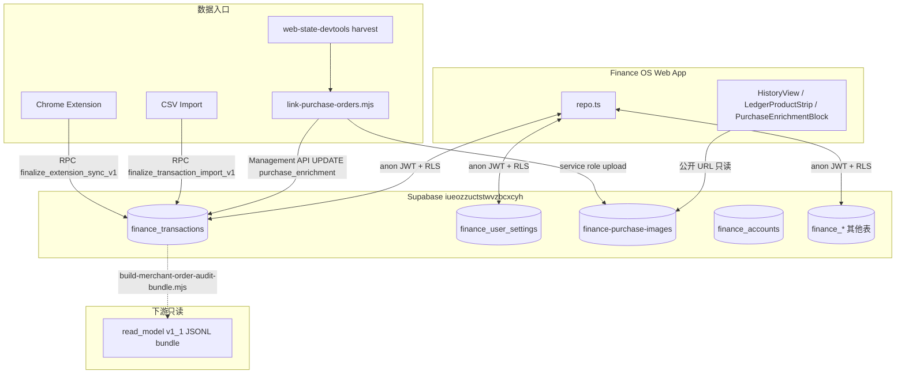

# AUDIT_DATA_CONTEXT v1.1 — Finance OS 数据使用与 Supabase 存储审计

> **文档类型：** Bundle 内审计上下文（reviewer handoff）
> **审计快照时间：** 2026-07-07
> **项目：** `/Users/kenpan/「Projects」/life-os`
> **Bundle：** `tools/web-state-devtools/bridge/data/merchant-order-audit-20260707-1620-after-target-final/`
> **Git HEAD（bundle 构建时）：** `1b18c5785fb8bb7762e9d7a485755dc506448758`
> **Read Model：** **v1.1**（Target final batch 已 apply）
> **本文档版本：** `AUDIT_DATA_CONTEXT_v1_1`
> **配套 handoff：** `read_model/DOWNSTREAM_HANDOFF_v1_1.md`

**审计边界（本文档生成时确认）：**

- 只读审计与文档落盘；**未**修改 DB、**未**运行 apply、**未**运行 migrations、**未**删除行、**未**变更 read model 数据行。

---

## 1. 基础设施总览

| 项                    | 值                                                                           |
| --------------------- | ---------------------------------------------------------------------------- |
| Supabase Project Ref  | `iueozzuctstwvzbcxcyh`                                                       |
| Supabase URL          | `https://iueozzuctstwvzbcxcyh.supabase.co`                                   |
| 部署站点              | Netlify `kensfinanceos`（`finance-os` workspace）                            |
| Schema 布局           | Finance 在 `public`，表前缀 `finance_`；同项目还有 Planner / Fitness / Music |
| Auth                  | 四 app 共用 Supabase Auth；`@life-os/sync` 统一 `LIFE_OS_AUTH_STORAGE_KEY`   |
| 管理 SQL 工具         | `scripts/supabase-sql.sh`（Management API，非直连 5432）                     |
| 规范用户（canonical） | `c2831538-94b0-4a57-b034-5e873a53c42e`                                       |

**关键设计原则：**

- 银行/卡流水主体在 `finance_transactions`
- 商户订单上下文挂在同一行的 **`purchase_enrichment` JSONB 列**（非独立订单表）
- 商品缩略图在 **公开 Storage bucket** `finance-purchase-images`
- 下游消费应优先用 **frozen read model v1.1 bundle**，而非直接扫生产 JSONB

---

## 2. 当前生产数据量（只读 SQL，2026-07-07）

```json
{
  "total_txns": 5410,
  "enriched_txns": 276,
  "canonical_user_txns": 5407,
  "canonical_enriched": 273,
  "enriched_by_source": {
    "amazon": 141,
    "target": 82,
    "bestbuy": 50
  },
  "accounts": 19,
  "settings_rows": 1
}
```

| Storage                            | 值          |
| ---------------------------------- | ----------- |
| `finance-purchase-images` 对象数   | **581**     |
| 总字节                             | **~2.1 MB** |
| enrichment 行含 `imageStoragePath` | **249**     |

### Read Model v1.1（bundle，非 DB）

| 指标           | 值                                                                                            |
| -------------- | --------------------------------------------------------------------------------------------- |
| Bundle         | `tools/web-state-devtools/bridge/data/merchant-order-audit-20260707-1620-after-target-final/` |
| Clean orders   | 105                                                                                           |
| Clean items    | 331                                                                                           |
| Target clean   | 81                                                                                            |
| Amazon clean   | 20                                                                                            |
| Best Buy clean | 4                                                                                             |
| Review queue   | 168                                                                                           |

---

## 3. 数据架构（审计视角）



---

## 4. Supabase 表清单（Finance 相关）

定义来源：`apps/finance/src/lib/supabaseTables.ts`、`apps/finance/supabase/schema.sql` + migrations

| 表                                              | 用途                | 与商户订单关系                                   |
| ----------------------------------------------- | ------------------- | ------------------------------------------------ |
| **`finance_transactions`**                      | 核心流水            | **`purchase_enrichment` JSONB**                  |
| `finance_accounts`                              | 账户                | `account` 字段关联 enrichment 账户映射           |
| `finance_user_settings`                         | 用户设置            | **`merchant_order_catalog` JSONB**（未匹配订单） |
| `finance_transaction_imports`                   | CSV 导入批次        | 导入产生 txn，后续可 enrichment                  |
| `finance_extension_processed_captures`          | 扩展 capture 幂等   | 扩展同步不写 enrichment                          |
| `finance_review_items`                          | 导入审核            | 独立审核流                                       |
| `finance_merchant_rules`                        | 商户规则            | 分类/规则，非订单                                |
| `finance_cash_flows` / `goals` / `scenarios` 等 | 规划/场景           | 不直接存订单                                     |
| `finance_data`                                  | **遗留** JSONB 备份 | 只读回滚用                                       |
| `core_allowed_devices`                          | 设备授权            | 跨 app                                           |

所有 Finance 表均有 `os_module text DEFAULT 'finance'`（`20260705211305`）。

---

## 5. `finance_transactions` 列详情

### 基线 + P1A Reality Loop

| 列组         | 重要列                                                           |
| ------------ | ---------------------------------------------------------------- |
| 标识         | `id uuid PK`, `user_id uuid → auth.users`                        |
| 日期/金额    | `txn_date`, `occurred_on`, `amount`, `source_amount`             |
| 商户         | `merchant`, `merchant_name`, `description`                       |
| 账户         | `account`, `source_account_label`, `institution`, `account_type` |
| 分类/流      | `category`, `normalized_category`, `flow`, `flow_type`           |
| 分析标记     | `include_in_spending_analytics`, `include_in_cash_flow_history`  |
| 审核         | `review_status`, `review_flags jsonb`                            |
| 扩展同步     | `platform_id`, `capture_source`（部分唯一索引幂等）              |
| **商户订单** | **`purchase_enrichment jsonb`**                                  |
| 模块         | `os_module`                                                      |

### `purchase_enrichment` 迁移

```sql
-- apps/finance/supabase/migrations/20260706230000_purchase_enrichment.sql
alter table public.finance_transactions
  add column if not exists purchase_enrichment jsonb;

create index if not exists finance_transactions_purchase_enrichment_idx
  on public.finance_transactions (user_id)
  where purchase_enrichment is not null;
```

**索引：** 部分索引 `(user_id) WHERE purchase_enrichment IS NOT NULL`
**无** `(user_id, source, orderId)` / `mergeKey` 唯一约束 — duplicate 风险在 DB 层未阻断（见 §15、§16）

---

## 6. `purchase_enrichment` JSONB 契约

**TypeScript 权威类型：** `apps/finance/src/engine/purchaseEnrichment.ts`

```typescript
interface PurchaseEnrichment {
  source: 'amazon' | 'bestbuy' | 'target'
  orderId?: string
  orderDate?: string
  orderTotal?: number
  status?: string // 商户原始字符串，非规范化 enum
  detailUrl?: string
  lineItems?: PurchaseLineItem[]
  returnInfo?: PurchaseReturnInfo
  matchConfidence?: 'high' | 'medium' | 'low'
  matchedAt?: string // ISO timestamp
  // returnInfoDecision — 仅链接时内存用，写入前 strip
  // schemaVersion — 当前未写入；见 §15 演化风险
}

interface PurchaseLineItem {
  title: string
  price?: number
  quantity?: number
  detailUrl?: string
  imageUrl?: string // 商户 CDN 或 Supabase 公开 URL
  imageStoragePath?: string // bucket 内相对路径
  asin?: string
}
```

**`returnInfo`：** `apps/finance/src/engine/purchaseReturnStatus.ts`
状态：`none | cancelled | return_in_progress | returned | refunded`，可含 `refundAmount`、`relatedTxnId`、`isRefundCredit`

**写入前处理：**

- `stripLinkMetadata()` 移除 `returnInfoDecision`
- `mergePurchaseEnrichment()` 合并已有 enrichment（Amazon returnInfo 有特殊逻辑）
- CLI apply 时 `--inserts-only` / `--updates-only` 控制写入范围

---

## 7. Storage：`finance-purchase-images`

**迁移：** `apps/finance/supabase/migrations/20260707003000_finance_purchase_images_storage.sql`

| 属性       | 值                                 |
| ---------- | ---------------------------------- |
| Bucket     | `finance-purchase-images`          |
| 公开读     | **是** (`public = true`)           |
| 单文件上限 | 256 KB（迁移）/ 脚本下载限 ~220 KB |
| MIME       | jpeg, png, webp, jpg, gif          |

**对象路径规则**（`apps/finance/scripts/lib/purchaseImageStorage.mjs`）：

```
{userId}/{source}/{orderId}/{sha1_16hex}.{ext}
```

例：`c2831538-.../target/5167-1284-0074-6745/a1b2c3d4e5f67890.jpg`

**RLS（storage.objects）：**

| Policy                                  | 操作   | 规则                      |
| --------------------------------------- | ------ | ------------------------- |
| `finance_purchase_images_public_select` | SELECT | bucket 匹配即可（公开）   |
| `finance_purchase_images_insert_own`    | INSERT | 路径第一段 = `auth.uid()` |
| `finance_purchase_images_update_own`    | UPDATE | 同上                      |
| `finance_purchase_images_delete_own`    | DELETE | 同上                      |

**UI 读图**（`lineItemImageSrc()`）：优先 `imageUrl`，否则拼公开 URL：

```
{VITE_SUPABASE_URL}/storage/v1/object/public/finance-purchase-images/{imageStoragePath}
```

**浏览器 App 不上传 Storage**；上传仅 CLI（service role）。

---

## 8. 其他 JSONB 列

| 位置                    | 字段                                         | 用途                                               |
| ----------------------- | -------------------------------------------- | -------------------------------------------------- |
| `finance_user_settings` | `merchant_order_catalog`                     | 未匹配银行流水的 harvest 订单（Target RedCard 等） |
| `finance_user_settings` | `assumptions`                                | 财务假设                                           |
| `finance_user_settings` | `portfolio_allocation_target`                | 组合目标                                           |
| `finance_transactions`  | `review_flags`                               | 导入审核标记                                       |
| `finance_accounts`      | `fund_allocations` / `underlying_allocation` | 基金分配                                           |

`merchant_order_catalog` 形状（migration comment）：

```json
{ "updatedAt": "...", "sources": { "target": { "orders": [...] }, "bestbuy": { "orders": [...] } } }
```

---

## 9. RLS 与安全模型

**Finance 表通用模式**（`schema.sql`）：

- SELECT / INSERT / UPDATE / DELETE 均要求 `auth.uid() = user_id`
- RPC 使用 `SECURITY INVOKER`，依赖调用者 JWT

**读写主体：**

| 主体                           | 凭证                                | 能写什么                                                                        |
| ------------------------------ | ----------------------------------- | ------------------------------------------------------------------------------- |
| Finance Web App                | `VITE_SUPABASE_ANON_KEY` + 用户 JWT | 全部 `finance_*`（RLS 范围内）；**不**写 Storage                                |
| Chrome Extension               | 用户 JWT → RPC                      | `finance_transactions`（无 enrichment）；`finance_extension_processed_captures` |
| CLI `link-purchase-orders.mjs` | Management API + service role       | **UPDATE `purchase_enrichment`**；Storage upload                                |
| 下游消费者                     | 读 bundle JSONL                     | **无 DB 访问**（推荐）                                                          |

**审计注意：**

- `finance-purchase-images` **公开可读** — 路径含 `userId` / `source` / `orderId` 元数据（见 §15）
- `purchase_enrichment` 无 DB 级唯一约束 — **P0 broad apply blocker**（见 §15、§18）
- Management API + service role 脚本绕过 RLS — **P0 gated operational risk**（见 §15、§18）

---

## 10. Finance OS 应用内数据使用

### 数据层：`apps/finance/src/lib/repo.ts`

- 所有 Supabase CRUD 集中于此
- `txnFromRow` / `txnToRow`：`purchase_enrichment` ↔ `purchaseEnrichment` 映射
- 列缺失时降级警告（`isPurchaseEnrichmentColumnMissing`）

### UI 消费点

| 组件                          | 文件                                             | 用途                                             |
| ----------------------------- | ------------------------------------------------ | ------------------------------------------------ |
| `PurchaseEnrichmentBlock`     | `src/components/PurchaseEnrichmentBlock.tsx`     | 订单详情、行项目、退货 badge                     |
| `LedgerProductStrip`          | `src/components/LedgerProductStrip.tsx`          | 账本行内商品条                                   |
| `HistoryView`                 | `src/components/HistoryView.tsx`                 | 历史流水展示                                     |
| `MerchantOrderCatalogSection` | `src/components/MerchantOrderCatalogSection.tsx` | **未关联** harvest 订单（来自 settings catalog） |

### 引擎层

| 模块                                                                   | 用途                  |
| ---------------------------------------------------------------------- | --------------------- |
| `amazonOrderMatch.ts` / `targetOrderMatch.ts` / `bestbuyOrderMatch.ts` | 订单↔txn 匹配         |
| `purchaseEnrichment.ts`                                                | 类型、merge、图片 URL |
| `purchaseReturnStatus.ts`                                              | 退货/退款状态         |
| `ledgerDisplay.ts`                                                     | 账本展示逻辑          |

---

## 11. 数据管道（写入路径）

### A. 银行流水入口（无 enrichment）

1. **Chrome Extension** → `finalize_extension_sync_v1` RPC
   - 写 `finance_transactions`（`platform_id` + `capture_source` 幂等）
   - **不写** `purchase_enrichment`

2. **CSV Import** → `finalize_transaction_import_v1` RPC
   - 批量写 txn + `finance_transaction_imports`

### B. 商户订单 enrichment（后挂）

1. **Harvest**（`tools/web-state-devtools`）→ raw JSON（`bridge/data/*-export/`）
2. **Match**（engine）→ 订单 ID、金额、日期对齐
3. **Apply**（`link-purchase-orders.mjs --apply`）→
   - Management API `UPDATE finance_transactions SET purchase_enrichment = ...`
   - 可选 `--upload-images` → Storage + 写 `imageStoragePath`
4. **Catalog sync**（未匹配订单）→ `finance_user_settings.merchant_order_catalog`

### C. Read Model 构建（只读）

`build-merchant-order-audit-bundle.mjs` →
从 DB export + raw export → `merchant-read-model-v1.mjs` → clean / review queue JSONL

**已批准 apply 历史（审计记录）：**

- Target batch 1–3 + **final 21**（scoped `--only-transaction-ids`）
- Broad apply：**未批准**

---

## 12. CLI 脚本矩阵

| 脚本                                    | 读 DB    | 写 DB        | 写 Storage    |
| --------------------------------------- | -------- | ------------ | ------------- |
| `link-purchase-orders.mjs`              | ✓        | ✓ enrichment | ✓（apply 时） |
| `link-amazon-orders.mjs`                | ✓        | ✓            | ✓             |
| `audit-purchase-data.mjs`               | ✓        | ✗            | ✗             |
| `target-link-dry-run-report.mjs`        | ✓        | ✗            | ✗             |
| `rebuild-bestbuy-export-from-db.mjs`    | ✓        | ✗            | ✗             |
| `build-merchant-order-audit-bundle.mjs` | ✓ export | ✗            | ✗             |

---

## 13. 迁移文件清单

### 已纳入 `supabase/migrations/`（时间戳）

| 文件                                                        | 内容                       |
| ----------------------------------------------------------- | -------------------------- |
| `20260705211305_life_os_module_tagging.sql`                 | 模块标记                   |
| `20260705212000_life_os_table_prefixes.sql`                 | `finance_*` 表重命名       |
| `20260706230000_purchase_enrichment.sql`                    | **purchase_enrichment 列** |
| `20260707003000_finance_purchase_images_storage.sql`        | **Storage bucket + RLS**   |
| `20260707103000_fix_finalize_extension_sync_casts.sql`      | 扩展同步 RPC               |
| `20260707213000_extension_sync_cast_audit_v2.sql`           | cast 审计                  |
| `20260707220000_fix_extension_sync_on_conflict_partial.sql` | ON CONFLICT 修复           |
| `20260707214000_fix_source_left_paren.sql`                  | source 字段修复            |

### 独立 migration（可能需手动 apply）

`migration_p1a_reality_loop.sql`、`migration_extension_sync_durable.sql`、`migration_merchant_order_catalog.sql`、`migration_backup_restore_v2.sql` 等

**运维注意：** AGENTS.md 记载直连 `supabase migration up --linked` 在此网络会失败，需用 `scripts/supabase-sql.sh` 并手动记录 `supabase_migrations.schema_migrations`。

---

## 14. 下游 Read Model v1.1（审计用 frozen 快照）

**Bundle：**
`tools/web-state-devtools/bridge/data/merchant-order-audit-20260707-1620-after-target-final/`

### 强制下游规则（Hard Rules）

| 规则             | 要求                                                                                                                        |
| ---------------- | --------------------------------------------------------------------------------------------------------------------------- |
| **版本绑定**     | 消费者 **必须** 使用 read model **v1.1** 文件（`*_v1_1.jsonl` / `read_model_manifest_v1_1.json`）；不得混用 v1 或生产 JSONB |
| **会计状态**     | 消费者 **不得** 从 `purchase_enrichment.status` 或 clean 行 `status` 推断会计状态（退货、净支出、对账结论）                 |
| **Review queue** | 消费者 **不得** 将 `review_queue_v1_1.jsonl` 当作产品真相或 clean feed 输入                                                 |
| **DB 直连**      | 新集成 **不得** 直接扫生产 `finance_transactions.purchase_enrichment`                                                       |
| **Apply 边界**   | 消费者 **不得** 基于本 bundle 触发 broad `--apply` 或 DB 变更                                                               |

**允许消费：**

| 文件                                          | 用途                 |
| --------------------------------------------- | -------------------- |
| `read_model/merchant_orders_clean_v1_1.jsonl` | 主 clean order feed  |
| `read_model/merchant_items_clean_v1_1.jsonl`  | clean line items     |
| `read_model/read_model_manifest_v1_1.json`    | 版本、统计、文件清单 |
| `read_model/DOWNSTREAM_HANDOFF_v1_1.md`       | 完整下游契约         |

**仅运维/审核（非产品真相）：**

| 文件                                 | 用途                                               |
| ------------------------------------ | -------------------------------------------------- |
| `read_model/review_queue_v1_1.jsonl` | 排除/风险行 + `reasons[]` — 清理优先级与 dashboard |

**Clean v1.1 质量保证（smoke test 已通过）：**

- duplicate transactionId = 0
- Unknown account = 0
- returned/refund in clean = 0
- missing title/qty = 0
- items 100% join 到 orders

---

## 15. 审计风险与未决项（强化评级）

| 风险 ID | 风险                                  | 严重度                                         | 评级说明                                                                                                  | 缓解 / 未决                                                                                         |
| ------- | ------------------------------------- | ---------------------------------------------- | --------------------------------------------------------------------------------------------------------- | --------------------------------------------------------------------------------------------------- |
| R-01    | **无 enrichment 唯一约束**            | **P0 — broad apply blocker**                   | DB 层无法阻止同一 `(user_id, source, orderId)` 重复写入；Amazon/Best Buy review queue 已出现 duplicate 组 | 必须先 duplicate cleanup + partial unique index（§16）；broad apply **禁止**                        |
| R-02    | **CLI Management API / service role** | **P0 — gated operational risk**                | `link-purchase-orders.mjs` 绕过 RLS，可批量 UPDATE enrichment 与 Storage                                  | 仅 scoped `--only-transaction-ids` + 双人审批；需 apply run ledger（§16）                           |
| R-03    | **公开 Storage + 路径元数据**         | **Medium — accepted risk / pending hardening** | 路径 `{userId}/{source}/{orderId}/...` 公开可读；知道 URL 结构可枚举缩略图                                | **Current state:** v1.1 已接受（商品缩略图 + bundle 本地消费）；外部消费者扩展前须 hardened（P1-4） |
| R-04    | **status 非规范化**                   | **Medium — downstream interpretation risk**    | Amazon 等为原始商户字符串（如 `"Delivered July 1"`）；clean 与 review 过滤逻辑依赖启发式                  | 下游不得做 enum 假设；v2 引入 normalized status                                                     |
| R-05    | **JSONB 无 schemaVersion**            | **Medium — evolution risk**                    | `purchase_enrichment` 无版本字段；字段增删无法 DB 级拒绝                                                  | P1 写入 `schemaVersion: 1`；迁移时双读                                                              |
| R-06    | partial clean dataset                 | Info                                           | 273 enriched → 105 clean；非全量商户历史                                                                  | 下游按 source 标注覆盖范围                                                                          |
| R-07    | Broad apply 未批准                    | Process                                        | 168 review queue 行待处理                                                                                 | 继续 scoped batch                                                                                   |
| R-08    | 无 returns 会计模型                   | Medium                                         | clean 视图排除退货；净支出不可用                                                                          | 不得用于会计 reconciliation                                                                         |
| R-09    | `finance_data` legacy                 | Low                                            | 遗留备份表仍存在                                                                                          | P2 归档评估                                                                                         |

---

## 16. 推荐下一版数据模型（未实施 — 设计建议）

> 本节为 reviewer handoff 建议；**未**包含在本 bundle 的 DB 变更中。

### 16.1 提取字段（generated column 或物化 read-model 表）

在 `finance_transactions` 上增加可索引、可约束的提取列（或独立 `finance_purchase_enrichment_read_model` 表），从 JSONB 派生：

| 列名                   | 来源                                                          | 用途                          |
| ---------------------- | ------------------------------------------------------------- | ----------------------------- | ------- | ------------ | -------- |
| `purchase_source`      | `purchase_enrichment->>'source'`                              | 过滤、统计、partial unique 键 |
| `purchase_order_id`    | `purchase_enrichment->>'orderId'`                             | 去重、reconciliation          |
| `purchase_merge_key`   | `detailUrl` 或 `source:orderId` / `target:in_store:receiptId` | 稳定关联键                    |
| `purchase_source_view` | `sourceView` 或推断 `online                                   | in_store                      | receipt | data_export` | 下游分群 |

**实现选项：**

- **A.** Postgres `GENERATED ALWAYS AS (...) STORED` 列 + 索引
- **B.** 物化表 / nightly sync，由 `build-merchant-order-audit-bundle.mjs` 同源逻辑填充
- **C.** 继续 bundle-only，但 DB 列用于 apply 幂等与查询

### 16.2 Partial unique 策略（duplicate cleanup 之后）

> **Operational note — DO NOT APPLY YET:** The indexes / constraints below are **design candidates only**.
> Do not apply them until Amazon / Best Buy duplicate groups are classified and a backfill plan is approved.
> Review queue still contains duplicate / unknown / return risks — running this SQL prematurely would block legitimate cleanup.

```sql
-- 示意：cleanup 后启用；NULL orderId 行排除
-- DO NOT APPLY YET — design draft only
CREATE UNIQUE INDEX finance_txn_purchase_enrichment_uq
  ON finance_transactions (user_id, purchase_source, purchase_order_id)
  WHERE purchase_enrichment IS NOT NULL
    AND purchase_order_id IS NOT NULL
    AND purchase_source IN ('amazon', 'bestbuy', 'target');
```

- in_store receipt（`orderId` 即 receipt）需单独 merge_key 唯一策略
- 启用前必须完成 Amazon/Best Buy duplicate 人工或脚本清理

### 16.3 Apply run ledger 表

用于 P0 运维可追溯与 broad apply 门控：

**`finance_purchase_enrichment_apply_runs`**

| 列                           | 类型        | 说明                                       |
| ---------------------------- | ----------- | ------------------------------------------ |
| `id`                         | uuid PK     | run id                                     |
| `user_id`                    | uuid        | 目标用户                                   |
| `started_at` / `finished_at` | timestamptz | 执行窗口                                   |
| `operator`                   | text        | 执行人 / CI job                            |
| `git_head`                   | text        | 脚本版本                                   |
| `mode`                       | text        | `dry-run` \| `scoped` \| `broad`           |
| `scope`                      | jsonb       | `--only-transaction-ids`、source filter 等 |
| `stats`                      | jsonb       | inserts/updates/skipped/errors             |
| `approved_by`                | text        | broad 必填                                 |

**`finance_purchase_enrichment_apply_run_items`**

| 列                 | 类型    | 说明                                      |
| ------------------ | ------- | ----------------------------------------- |
| `run_id`           | uuid FK | → apply_runs                              |
| `transaction_id`   | uuid    | 受影响 txn                                |
| `action`           | text    | `insert` \| `update` \| `skip` \| `error` |
| `before` / `after` | jsonb   | enrichment 快照（可选压缩）               |
| `reason`           | text    | skip/error 原因                           |

### 16.4 JSONB 契约演进

```typescript
interface PurchaseEnrichment {
  schemaVersion: 1 // 新增；写入时必填
  // ... existing fields
}
```

- Reader：`schemaVersion` 缺失视为 `0`（legacy）
- Writer：自下一 approved apply 起写入 `schemaVersion: 1`

---

## 17. 关键文件路径索引

| 类别              | 路径                                                                            |
| ----------------- | ------------------------------------------------------------------------------- |
| 本文档            | `.../AUDIT_DATA_CONTEXT_v1_1.md`                                                |
| Supabase 客户端   | `apps/finance/src/lib/supabase.ts`                                              |
| 数据仓库          | `apps/finance/src/lib/repo.ts`                                                  |
| 表名常量          | `apps/finance/src/lib/supabaseTables.ts`                                        |
| Enrichment 类型   | `apps/finance/src/engine/purchaseEnrichment.ts`                                 |
| 链接脚本          | `apps/finance/scripts/link-purchase-orders.mjs`                                 |
| 图片存储          | `apps/finance/scripts/lib/purchaseImageStorage.mjs`                             |
| Read model 引擎   | `tools/web-state-devtools/bridge/scripts/merchant-read-model-v1.mjs`            |
| Audit bundle 构建 | `tools/web-state-devtools/bridge/scripts/build-merchant-order-audit-bundle.mjs` |
| Handoff 文档      | `.../read_model/DOWNSTREAM_HANDOFF_v1_1.md`                                     |
| SQL 运维          | `scripts/supabase-sql.sh`                                                       |
| 环境变量样例      | `apps/finance/.env.example`                                                     |

---

## 18. Production Hardening Checklist

### P0 — broad apply 之前必须完成

| #    | 项                    | 验收标准                                                                            | 关联风险 |
| ---- | --------------------- | ----------------------------------------------------------------------------------- | -------- |
| P0-1 | Duplicate cleanup     | Amazon/Best Buy duplicate `orderId` 组清零或人工裁决入 review                       | R-01     |
| P0-2 | Partial unique index  | `(user_id, purchase_source, purchase_order_id)` partial unique 已 migration + 验证  | R-01     |
| P0-3 | Apply run ledger      | `finance_purchase_enrichment_apply_runs` + `_run_items` 表存在；scoped apply 已写入 | R-02     |
| P0-4 | Scoped apply 政策     | broad apply 需书面审批 + `--only-transaction-ids` 或等价 scope                      | R-02     |
| P0-5 | Read model 重建       | 每次 approved apply 后重建 bundle；manifest `generatedAt` 更新                      | R-07     |
| P0-6 | Review queue 清零计划 | 168 行按 `reasons[]` 分批处理；不得并入 clean                                       | §14      |
| P0-7 | Dry-run 门禁          | broad 前 `link-purchase-orders.mjs` dry-run 报告存档                                | R-02     |

### P1 — 外部消费者扩展之前必须完成

| #    | 项                     | 验收标准                                                                                       | 关联风险 |
| ---- | ---------------------- | ---------------------------------------------------------------------------------------------- | -------- |
| P1-1 | 下游契约签署           | 消费者确认 §14 Hard Rules（v1.1 only；无会计推断；无 review_queue 真相）                       | R-04     |
| P1-2 | `schemaVersion` 写入   | 新 apply 写入 `purchase_enrichment.schemaVersion: 1`                                           | R-05     |
| P1-3 | 提取列或 read-model 表 | `purchase_source` / `purchase_order_id` / `purchase_merge_key` / `purchase_source_view` 可查询 | §16.1    |
| P1-4 | Storage 风险接受       | 公开 bucket + 路径元数据已书面接受，或改为 signed URL                                          | R-03     |

> **Current state (R-03 / P1-4):** Accepted for v1.1 — images are product thumbnails and downstream consumption is bundle-based (no public URL enumeration in consumer path). Production hardening (signed URL or path脱敏) remains **required before external consumer expansion**; v1.1 delivery is not the long-term security end state.
> | P1-5 | Normalized status 路线图 | 文档化 v2 status enum；消费者不得依赖 raw status | R-04 |
> | P1-6 | Per-source 覆盖声明 | 集成文档标明 Amazon 20 / Best Buy 4 / Target 81 clean 非全量 | R-06 |
> | P1-7 | 监控与告警 | apply run 失败率、duplicate 检测、review queue 增长 | R-02 |

### P2 — 清理 / nice-to-have

| #    | 项                           | 说明                                                                    |
| ---- | ---------------------------- | ----------------------------------------------------------------------- |
| P2-1 | `finance_data` legacy 归档   | 评估只读备份表退役                                                      |
| P2-2 | Returns 会计模型             | v2 read model 含 returned/refunded 专用视图                             |
| P2-3 | Best Buy in-store harvest    | `viewsCaptured` 扩展至 receipt/in_store                                 |
| P2-4 | Amazon `harvestSince` 元数据 | raw export 补齐时间窗口字段                                             |
| P2-5 | Bundle CI 自动化             | `build-merchant-order-audit-bundle.mjs` 纳入 scheduled read-only export |
| P2-6 | Image path 脱敏              | Storage 路径去除可猜测 `userId` 段                                      |
| P2-7 | 独立 enrichment 表评估       | 长期是否从 JSONB 拆出 `finance_merchant_orders`                         |

---

## 19. 审计结论摘要

1. **Finance OS 的核心数据模型**是 `finance_transactions` 单行流水 + 可选 `purchase_enrichment` JSONB，不是独立订单表。
2. **商品图片**存 Supabase Storage 公开 bucket，路径与 `userId` / `source` / `orderId` 绑定；App 只读 URL，CLI 写入。
3. **生产 enriched 273 行**（Amazon 141 / Target 82 / Best Buy 50），经 read model 过滤后 **105 clean orders** 可供下游安全使用。
4. **写入通道三条**：Extension（txn only）、App（RLS CRUD）、CLI（enrichment batch apply）。
5. **Broad apply 未批准**；R-01（无唯一约束）与 R-02（Management API）为 **P0 门控**。
6. **下游必须**消费 read model v1.1；**不得**从 `purchase_enrichment.status` 推断会计状态；**不得**使用 `review_queue` 作为产品真相。
7. **推荐下一版**：提取列 + partial unique + apply run ledger + `schemaVersion`（§16、§18）。

---

_文档结束 — `AUDIT_DATA_CONTEXT_v1_1` · 只读审计 · 无 DB 变更_
