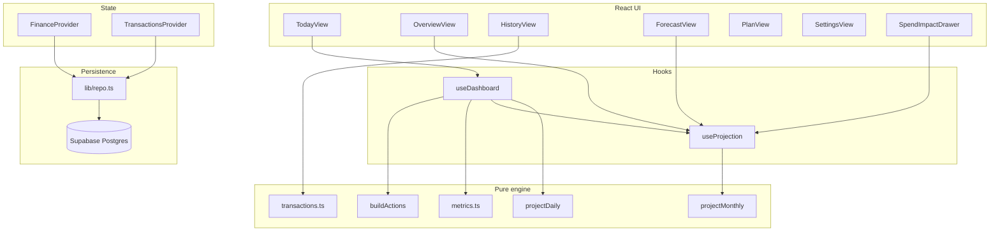
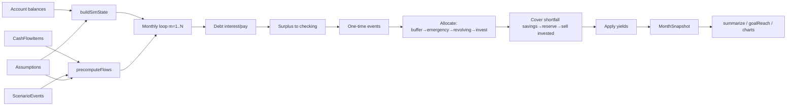

# Core Logic and Formulas

## System architecture

## Calculation reference

| Calculation | Formula in plain English | Mathematical formula | Source files | Function or selector | Inputs | Default assumptions | Edge-case behavior | Test coverage | Risk level | Classification |
| --- | --- | --- | --- | --- | --- | --- | --- | --- | --- | --- |
| Net worth | 资产合计减负债 | NW = checking+savings+invested+property+reserve−Σdebt | `monthly.ts` | `snapshot()` | Account balances | — | 负债存正数 | `dashboard.test.ts` | Medium | TRUSTED |
| Total assets | 各资产桶之和 | 见 buildSimState | `monthly.ts` | `buildSimState` | accounts | — | other 正余额→checking | partial | Medium | TRUSTED |
| Total liabilities | 信用卡+贷款余额 | Σ debt.balance | `monthly.ts` | snapshot liabilities | accounts | — | bal≤0 卡忽略 | monthly.test | Medium | TRUSTED |
| Liquid cash | 可流动 checking+savings | liquidCash = checking+savings | `monthly.ts` | snapshot | liquid flag | reserve excluded | liquid=false→reserve | dashboard.test | Medium | TRUSTED |
| Safe to spend (主) | 未来现金低谷−缓冲−计划预留 | max(0, L−B−P) | `metrics.ts`, `useDashboard.ts` | `computeSafeToSpend` | daily lowestBalance, buffer, plannedSavings | buffer=3000 | floor at 0 | dashboard.test | **High** | NEEDS_REVIEW |
| Monthly income | 周期性收入×发薪次数×增长 | Σ monthlyIncomeFor×growth | `monthly.ts` | `precomputeFlows` | cashFlows, events | salaryGrowth=0 | biweekly 3-pay months | monthly.test | Medium | TRUSTED |
| Monthly expenses | 必要+非必要 | ess+non | `monthly.ts` | precomputeFlows | cashFlows | — | partner 减免 | scenarios.test | Medium | TRUSTED |
| Monthly surplus | 收入−支出−还款 | surplus | `monthly.ts` | month loop | flows+debts | — | 首月 snapshot surplus=0 | monthly.test | Medium | TRUSTED |
| CC obligations (month) | 本月卡账单事件和 | Σ card events in month | `useDashboard.ts` | cardObligations | daily events | — | reserve 还款卡跳过 | dashboard.test | Medium | TRUSTED |
| Revolving debt | 滚动卡余额 | debt.balance revolving | `monthly.ts` | min payment 2% | creditMode | apr default | 无现金时负 checking | monthly.test | High | TRUSTED |
| Emergency reserve (target) | 储蓄目标池 | emergencyTarget on savings | `monthly.ts` | allocation step 4 | assumptions | 12000 default | 与 goal.current 分离 | — | High | NEEDS_REVIEW |
| Goal funding | 里程碑达标月 | first m: metric≥target | `metrics.ts` | `goalReachMonth` | projection, goal | — | 未达标 null | monthly.test | Medium | TRUSTED |
| Upcoming 30d obligations | 35天窗内流出绝对值 | obligations30 | `daily.ts` | projectDaily | cashFlows, cards | — | 年度项忽略 | dashboard.test | Medium | TRUSTED |
| Lowest checking balance | 日模拟最低 liquid | min balance path | `daily.ts` | projectDaily | — | 同日 out before in | dashboard.test | Medium | TRUSTED |
| Historical monthly spending | 净花销按月 | Σ spendingOf | `transactions.ts` | `monthlySeries` | Txn[] inSpending | — | 排除 CC payment | transactions.test | Medium | TRUSTED |
| Recurring spending | 多 merchant 月重复 | heuristic | `transactions.ts` | `computeRecurring` | Txn[] | minMonths=3 | 无确认 | transactions.test | Low | TRUSTED |
| Refund handling | 负花销 | spendingOf=-budgetImpact | `transactions.ts`, `txnPayload.ts` | refund flow | manual | — | 导入依赖预处理 | partial | Medium | NEEDS_REVIEW |
| Internal transfer | 排除花销 | inSpending=false | import flags | — | — | — | transactions.test sample | Low | TRUSTED |
| CC payment exclude | 不计 lifestyle | inSpending=false | import | — | — | transactions.test | Low | TRUSTED |
| Duplicate/mirror | 排除分析 | excludeReason | statistics count | — | — | 无 UI fix | Low | PARTIAL |
| Forecast account growth | 月逐步模拟 | 10-step loop | `monthly.ts` | `projectMonthly` | assumptions | horizon 20y | negativeCash flag | monthly.test | Medium | TRUSTED |
| Investment return | 月有效利率复利 | invested×(1+mReturn) | `monthly.ts` | step 6 | baselineReturn 6% | brokerage=retirement | monthly.test | Medium | TRUSTED |
| Inflation adjustment | 名义→今天购买力 | nominal/(1+mInfl)^m | `finance.ts` | `toTodayDollars` | inflation 2.5% | display only | format layer | finance.test | Low | TRUSTED |
| Scenario delta | sim NW − baseline NW | diffByYear | `metrics.ts` | computeSpendImpact | extra events | — | — | monthly.test | Medium | TRUSTED |
| Opportunity cost one-time | 复利未来值 | amount×(1+r)^y | `finance.ts` | futureCostOneTime | 6% | — | monthly.test | Low | TRUSTED |
| Milestone delay | simMonth−baseMonth | delayMonths | `metrics.ts` | goalDelays | goals | Infinity if never | monthly.test | Medium | TRUSTED |
| Cash vs financing | — | — | — | — | — | NOT_IMPLEMENTED | — | — | NOT_IMPLEMENTED |
| Home purchase logic | — | — | — | — | — | NOT_IMPLEMENTED | — | — | NOT_IMPLEMENTED |
| Household expense split | 伴侣分担比例 | ess/non × (1−pct) | `monthly.ts` | partner-contribution | contributionPercent | category optional | scenarios.test | Medium | PARTIAL |

## Forecast calculation pipeline

## Logic risks that could materially mislead the user

### Critical

**1. Safe-to-spend 专款语义错误**

- **Scenario**：用户设「旅行专款」已存 $8,000（`goal.current`），月分配 $200。
- **Behavior**：`useDashboard` 仅扣 $200（`monthlyAllocation`），UI 却暗示已预留专款（`ScenariosView` GoalRow、`TodayView` SafeToSpendNote）。
- **Evidence**：`hooks/useDashboard.ts` L44–46；`components/ScenariosView.tsx` L190–191。
- **Impact**：Safe-to-spend 可能高估数千美元。

**2. Spend Impact 与 Today 页 safe-to-spend 不一致**

- **Scenario**：用户在「今日」看到可花 $3,000，试算抽屉显示「之后还能放心花」用另一公式。
- **Behavior**：`computeSpendImpact` 用 `cashAfter - emergencyTarget - upcoming30`（L147–148），非 `projectDaily` 低谷法。
- **Evidence**：`engine/metrics.ts` `computeSpendImpact`。
- **Impact**：同一消费两种结论，破坏信任。

### High

**3. 历史花销不反馈预测**

- **Scenario**：真实月均 $4,500，规划支出 $3,500。
- **Behavior**：Forecast 仍按 $3,500；仅 History 显示警告文字。
- **Evidence**：`HistoryView` `PlanReality`；`monthly.ts` 无 Txn 输入。
- **Impact**：长期净资产预测系统性偏乐观。

**4. 目标 monthlyAllocation 不影响模拟**

- **Scenario**：用户分配 $800/月至「买房」专款。
- **Behavior**：月引擎仍按 `investRatio` 分配全部结余；专款仅影响 STS 的 P 项（且仅为 allocation 非 actual）。
- **Evidence**：`monthly.ts` 无 goals；`ScenariosView` SavingsBudgetCard。
- **Impact**：里程碑达成时间与 STS 均可能不准。

### Medium

**5. 信用卡日常消费路由假设**

- **Scenario**：用户多张卡、statement 未更新。
- **Behavior**：`pickSpendingCard` 选 dueDay 最早卡；首期 statement 与 variableMonthly 切换。
- **Evidence**：`daily.ts` L63–71, L196–207。
- **Impact**：30 天现金低谷偏差。

**6. 预测精度展示**

- **Scenario**：20 年后净资产显示精确到美元。
- **Behavior**：`money()` 格式化无 uncertainty band on point estimate。
- **Evidence**：`ForecastView` summary。
- **Impact**：虚假精确感（区间带仅图表）。

### Low

**7. 应急跑道用 liquidCash / essential 而非 reserve**

- **Scenario**：大量资金在 non-liquid reserve。
- **Behavior**：`emergencyRunwayMonths = liquidCash/essential` 不含 reserve。
- **Evidence**：`metrics.ts` `summarize` L44。
- **Impact**：跑道可能偏保守（若 reserve 本应为应急）。

## Double-counting and exclusion checks

| Check | Verified? | Evidence |
| --- | --- | --- |
| Aggregate accounts double-count | PARTIAL | 引擎逐账户加总；无聚合账户类型；`dashboard.test` 无 duplicate account case |
| CC payments excluded from spending | YES | `transactions.test.ts` sample row 6；`inSpending=false` |
| Internal transfers excluded | YES | flow type + inSpending |
| Refunds reduce spending | YES (engine) | negative budgetImpact；导入 UNVERIFIED |
| Mirror duplicates excluded | YES (if flagged) | excludeReason；无 app 修复 |
| Balances from snapshot not txn sum | YES | `Account.balance` manual；txn 不参与 NW |
| STS excludes brokerage/HSA/retirement | YES | not in liquidCash |
| Revolving vs paid-in-full | YES | `monthly.test.ts` 信用卡两种模式 |
| Negative cash handled | PARTIAL | `negativeCash` flag；UI 日历标红；无全局 alert |
| Forecast compounds monthly | YES | `monthlyRate` per month |
| Nominal vs inflation distinguished | YES | displayMode + chart labels |
| Precision appropriate | NO | point estimates without CI |
