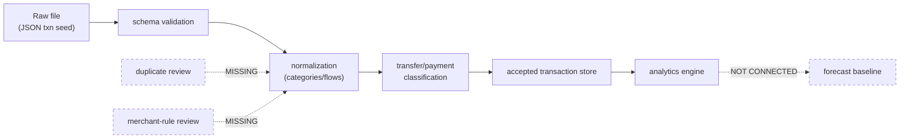
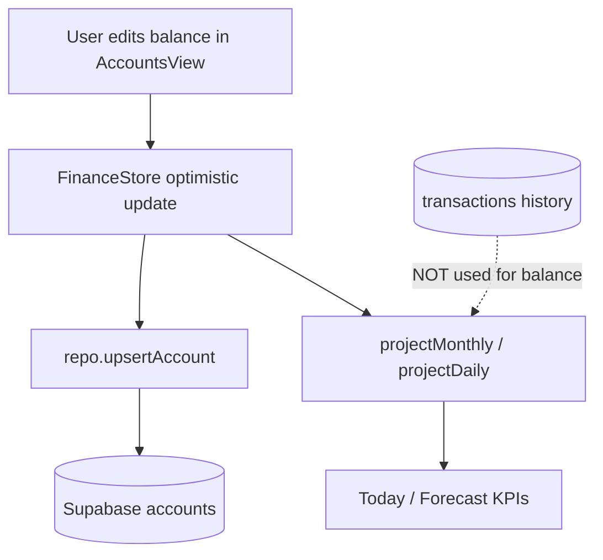
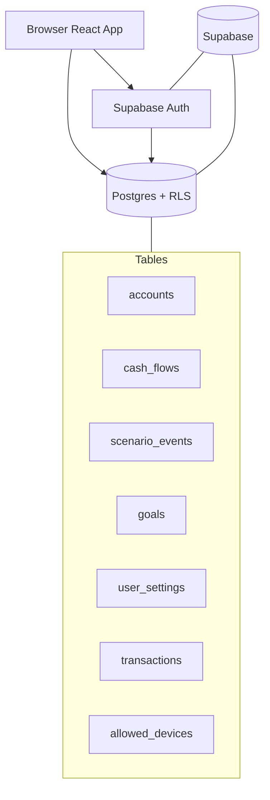

# Data Model and Pipeline

## Data sources

| Source | Used in production UI? | Evidence | Notes |
| --- | --- | --- | --- |
| Manual balance entry | **VERIFIED** YES | `AccountsView` → `upsertAccount` | 当前余额 SoT |
| Screenshot-extracted seed | UNVERIFIED | 无代码路径 | 可能历史运维手段 |
| JSON seed import (finance) | NO (dead code) | `persistence.ts` `parseImportedJSON` | 未接 Settings |
| CSV transaction import | NO | 无 parser/UI | — |
| JSON transaction seed (offline) | PARTIAL | `scripts/gen-txn-sql.mjs` | `src/data/transactions.json` 不在 repo |
| Supabase Postgres | **VERIFIED** YES | `lib/repo.ts` | 主读写 |
| localStorage (finance) | NO (legacy) | `persistence.ts` STORAGE_KEY | Auth 路径不用 |
| localStorage (theme/auth) | **VERIFIED** YES | `fos-theme`, `finance_os_auth` | 非财务明细 |
| Sample/hard-coded defaults | **VERIFIED** | `defaults.ts` emergency goal 12000 | 新用户空白+默认 goal |
| External bank API | NO | — | — |
| Mock data in tests | Tests only | `*.test.ts` fixtures | — |

## Data entities

### Account

| Field | Required | Notes |
| --- | --- | --- |
| Schema | `Account` | `src/types.ts` L18–54 |
| id, name, type, balance | yes | PK (user_id,id) in DB |
| liquid, creditMode, statementBalance, dueDay, apr, … | optional | 信用卡/贷款专用 |
| Derived | liquidCash, invested 等 | 引擎层，非 DB 列 |
| Sensitive | name, note, balance | 明文存 Supabase |

### Transaction (`Txn`)

| Field | Required | Notes |
| --- | --- | --- |
| Schema | `Txn` | `engine/transactions.ts` L20–41 |
| date, merchant, category, account, flow, amount, budgetImpact | yes | DB `transactions` |
| inSpending, inCashFlow, excludeReason | yes | 分析开关 |
| id | optional on import | uuid from DB |
| source | import \| manual | — |

### ScenarioEvent, Goal, CashFlowItem, AssumptionSet, FinanceData

见 `src/types.ts` L56–184；DB 表 `scenario_events`, `goals`, `cash_flows`, `user_settings`.

**未实现实体**：MerchantRule, DuplicateGroup, ReviewItem, MonthlySnapshot（持久化）, Scenario（独立对比容器）.

## Source-of-truth matrix

| Data concept | Current source of truth | Derived from | Persisted where | Editable by user | Importable | Exportable | Known risks |
| --- | --- | --- | --- | --- | --- | --- | --- |
| Current account balance | Manual entry | — | Supabase `accounts` | YES | NO (UI) | NO (UI) | Stale >30d |
| Monthly income/expense plan | User cashFlows | — | `cash_flows` | YES | NO | NO | vs history drift |
| Historical spending | Supabase transactions | Offline JSON→SQL | `transactions` | partial (edit row) | offline only | NO | USER_ID in script |
| Safe-to-spend | Derived | daily+goals+assumptions | — | indirect | — | — | Formula split |
| Net worth / forecast | Derived | monthly engine | — | indirect | — | — | Balance SoT |
| Goals | User | — | `goals` | YES | NO | NO | current vs engine |
| Assumptions | User | defaults merge | `user_settings.assumptions` | YES | NO | NO | — |
| Auth session | Supabase Auth | — | localStorage | login | — | — | anon key public |

## Import pipeline

**Verified offline path**：`scripts/gen-txn-sql.mjs` → batched INSERT → Supabase `transactions`.

**Missing steps**：应用内 validation UI、duplicate review、merchant rules、accepted store 用户确认、analytics→forecast 反馈。

## Current-balance pipeline

**结论（VERIFIED）**：

- 当前余额 = **手动录入**的 `Account.balance` 快照，**不是**交易重建。
- 交易历史仅用于 History 分析，**不参与** NW/forecast 输入。
- **冲突风险**：用户更新余额但未对账 past one-time events（`reconciled` 标记仅 UI 提示，`FutureCashflowView`）。
- **Stale 风险**：`updatedAt` 超过 30 天 banner + action，不阻止计算。

## Privacy boundary

| Item | Label | Detail |
| --- | --- | --- |
| Financial rows in Supabase | **VERIFIED** RISK | 云 Postgres；RLS `auth.uid()=user_id` |
| Merchant names stored | **VERIFIED** | Plaintext `transactions.merchant` |
| Account numbers | N/A | 无 account number 字段；账户名为文本 |
| localStorage finance blob | UNVERIFIED legacy | `finance_os_v1` 键存在代码中但未使用主路径 |
| Theme preference | **VERIFIED** local | `fos-theme` |
| Auth tokens | **VERIFIED** local | `finance_os_auth` via supabase-js |
| Export user data | **RISK** missing | No UI |
| Delete user data | **RISK** partial | Per-txn delete；无 wipe account |
| External telemetry | UNVERIFIED | 无 Sentry 等；`console.error` on sync fail |
| Logging | **VERIFIED** minimal | persist failure console |
| CSV injection on export | N/A | export not exposed |
| Third-party APIs | **VERIFIED** Supabase only | No bank APIs |

## System architecture (data plane)

