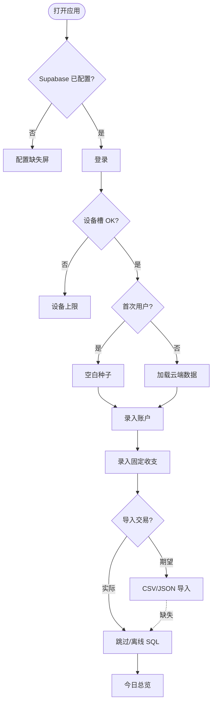
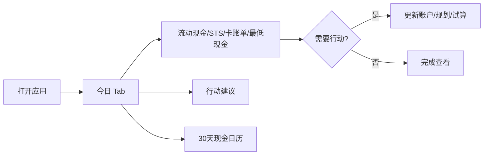
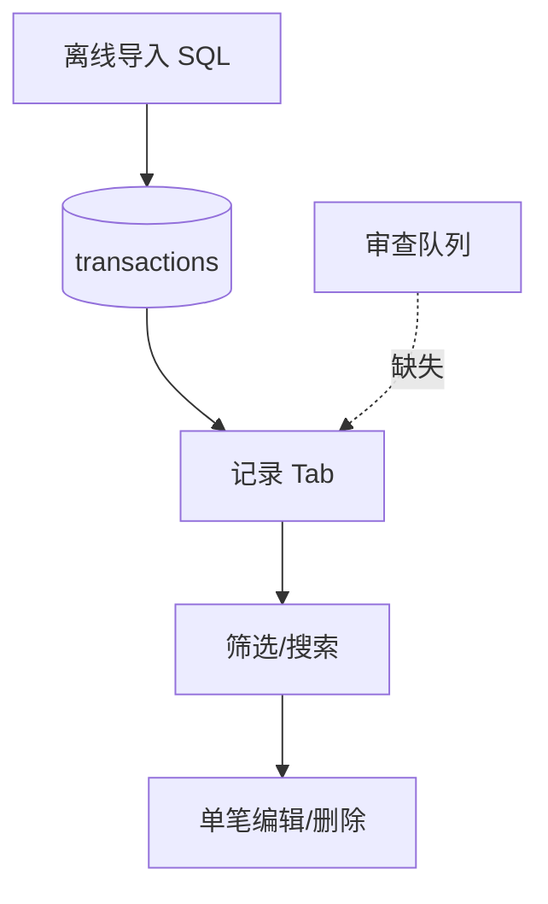
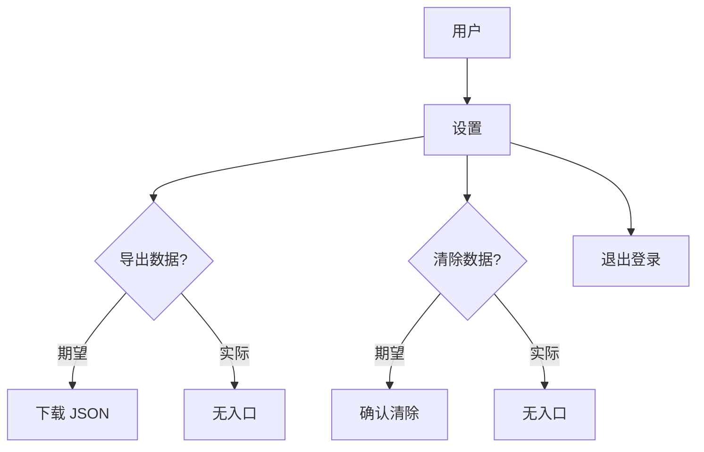

# User Flows

## Flow A — First-time setup

**Goal**：导入或录入数据，获得可信总览。

| Step | User action | Screen | System response | Data read | Data written | Decision | Empty/error | Status |
| --- | --- | --- | --- | --- | --- | --- | --- | --- |
| 1 | 打开应用 | Login | 需 Supabase env | — | — | 有配置？ | config-missing 屏 | WORKING |
| 2 | 登录 | AuthGate | session | Auth | — | — | 密码错误 | WORKING |
| 3 | 设备授权 | AuthGate | ensureDeviceAuthorized | allowed_devices | device row | 槽位满？ | device-limit | WORKING |
| 4 | 首次种子 | — | seedFinanceData empty | — | user_settings+default goal | — | — | WORKING |
| 5 | 录入账户 | 设置→账户 | upsertAccount | — | accounts | 类型/余额 | empty CTA | WORKING |
| 6 | 录入收支 | 规划→固定收支 | upsertCashFlow | — | cash_flows | — | empty CTA | WORKING |
| 7 | 导入交易 | — | **无 UI** | — | — | — | — | **BROKEN** |
| 8 | 重复/商户审查 | — | **不存在** | — | — | — | — | NOT_IMPLEMENTED |
| 9 | 完成态 | 今日 | dashboard KPIs | all | — | — | 无 explicit completion | PARTIAL |

## Flow B — Daily check-in

| Step | Action | Screen | Response | Read | Write | Status |
| --- | --- | --- | --- | --- | --- | --- |
| 1 | 打开今日 Tab | TodayView | KPI 4 卡 | dashboard | — | WORKING |
| 2 | 看 safe-to-spend | KPI | computeSafeToSpend | daily+goals | — | PARTIAL |
| 3 | 看行动 inbox | 卡片 | buildActions ≤3 | outlook | — | WORKING |
| 4 | 看现金日历 | 日历 | projectDaily events | cashFlows | — | WORKING |
| 5 | 数据新鲜度 | header/banner | stale if >30d | updatedAt | — | WORKING |

## Flow C — Simulate one-time purchase

| Step | Action | Screen | Response | Status |
| --- | --- | --- | --- | --- |
| 1 | 点 FAB「试算消费」 | SpendImpactDrawer | open | WORKING |
| 2 | 输入金额/来源 | 抽屉 | live impact | WORKING |
| 3 | 看现在层 | cashAfter, safeAfter | 简化公式 | PARTIAL |
| 4 | 看 5/10/20 年 | diffByYear | projection diff | WORKING |
| 5 | 看目标延迟 | goalDelays | goalReachMonth | WORKING |
| 6 | 保存场景 | — | **不可保存** | NOT_IMPLEMENTED |

## Flow D — Simulate recurring lifestyle upgrade

同 Flow C，`type=monthly` → `expense-change` event；无 duration/end；无 baseline 并排 UI。**PARTIAL**.

## Flow E — Review imported transactions

| Step | Expected | Actual | Status |
| --- | --- | --- | --- |
| Duplicate review | 队列 | 无 | NOT_IMPLEMENTED |
| Transfer reclass | 批量 | 单笔 edit ledger | PARTIAL |
| Recurring confirm | 确认 | 只读列表 | PARTIAL |
| Batch/undo | 有 | 无 | NOT_IMPLEMENTED |
| Completion | 完成态 | 无 | NOT_IMPLEMENTED |

## Flow F — Update current balances

| Step | Action | Screen | Status |
| --- | --- | --- | --- |
| 1 | 设置→账户 | AccountsView | WORKING |
| 2 | 展开账户改 balance | AccountRow | WORKING → Supabase |
| 3 | updatedAt 自动更新 | todayISO | WORKING |
| 4 | Forecast 自动刷新 | useProjection deps | WORKING |
| 5 | 与交易对账 | — | NOT_IMPLEMENTED |

## Flow G — Create and compare scenarios

| Step | Expected | Actual | Status |
| --- | --- | --- | --- |
| Create salary/expense/partner event | ScenariosView | WORKING | |
| Toggle enable | toggleEvent | WORKING | |
| Side-by-side baseline vs alt | 两列对比 | **无**；仅全局 events 叠加 | PARTIAL |
| Save named scenario | — | NOT_IMPLEMENTED | |
| Duplicate/rename/delete event | delete/remove | WORKING single event | |

## Flow H — Review monthly performance

| Step | Screen | Status |
| --- | --- | --- |
| History KPIs | avg spending/income | WORKING |
| Plan vs actual | PlanReality card | WORKING read-only |
| Forecast vs actual | — | NOT_IMPLEMENTED |
| Adjust baseline | — | NOT_IMPLEMENTED |

## Flow I — Export, restore, delete

| Step | Expected | Actual | Status |
| --- | --- | --- | --- |
| Export JSON | Settings | persistence.exportJSON **未接线** | NOT_IMPLEMENTED |
| Import restore | — | NOT_IMPLEMENTED | |
| Clear all data | — | NOT_IMPLEMENTED | |
| Delete single txn | History ledger | WORKING | |

## User-flow gaps

| Gap | Affected flow | Severity | User impact | Root cause | Evidence | Proposed fix |
| --- | --- | --- | --- | --- | --- | --- |
| 无交易导入 UI | A, E | High | 无法自助 onboarding | 仅 offline script | gen-txn-sql.mjs | MVP import 或 runbook |
| 无 export/clear | I | High | 数据不可移植/难删除 | persistence 未接 UI | SettingsView | Wire Supabase export/wipe |
| STS 试算不一致 | B, C | Critical | 决策矛盾 | 两套公式 | metrics.ts | Unify |
| 历史→规划不写入 | H | High | 预测脱离现实 | 无 writeback | PlanReality | Explicit sync button |
| 无 scenario 对比 | G | Medium | 难比较人生选项 | 单 events 列表 | ScenariosView | Named scenarios |
| 无 review 完成态 | E | Medium | 不知数据是否干净 | 无 queue | — | Minimal review flags |
| 专款 current 未扣 STS | B | Critical | 高估可花 | useDashboard | useDashboard.ts | PTO 口径+fix |
| Supabase 硬依赖 | A | Medium | 无 env 不可用 | AuthGate | AuthGate | Offline fallback doc |
