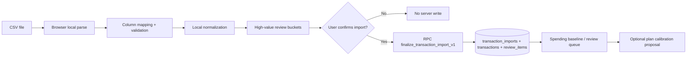

# Finance OS — P1A Reality Loop

## Executive result

`P1A CONDITIONAL PASS`

## Product outcome

- 已实现最小可信闭环：`Review → Import transactions` 本地解析/映射/预览/高价值审查/显式确认导入/完成态。
- 导入后可回答近 3/6/12 个月实际支出、收入、净现金流、周期性与一次性开销拆分，并给出基线置信度。
- 提供显式校准流：`Use recent actuals to update plan`，仅在用户勾选并确认后写入计划项。

## Scope delivered

- 新增 `Review` 一级导航与四个子流：
  - `Import transactions`
  - `Review queue`
  - `Spending baseline`
  - `Update plan`
- 新增 CSV 本地验证与规范化引擎：`src/engine/realityLoop.ts`
- 新增 Supabase 迁移与原子导入 RPC：`supabase/migration_p1a_reality_loop.sql`
- 新增 P1A 测试与合成 fixture：
  - `src/engine/realityLoop.test.ts`
  - `src/lib/repo.security.test.ts`
  - `src/test-fixtures/p1a/*`

## Source-of-truth boundaries

- 当前账户余额 SoT：`accounts.balance`（手工维护快照）
- 历史交易 SoT：`transactions`（仅显式确认后写入的规范化记录）
- 历史交易不反推当前余额：导入/审查/基线/校准均不触碰 `accounts.balance`
- Safe-to-spend 公式未改动（遵循 P0 已通过逻辑）

## Data model diff

- 新表：
  - `transaction_imports`
  - `merchant_rules`
  - `review_items`
  - `recurring_items`
- 扩展 `transactions`：补充 `import_id`、`transaction_fingerprint`、`occurred_on`、`flow_type`、`include_in_spending_analytics`、`review_flags` 等字段，并保留旧字段兼容当前 History 路径。

## Migration results

- 已创建迁移文件：`supabase/migration_p1a_reality_loop.sql`
- 本地静态审查：通过（语法与约束设计完整）
- 远端实际执行：**PASS**（2026-05-30 live gate）
  - `20260531023517 migration_p1a_reality_loop`
  - `20260531023715 p1a_fix_finalize_import_ambiguity`（RPC `import_id` 歧义 hotfix）
- 详见：`docs/pto-audit-export/16_P1A_LIVE_VERIFICATION.md`

## Import architecture

## CSV validation

- 已实现：
  - 登录态要求（RPC 端二次强校验 `auth.uid()`）
  - 扩展名 `.csv` allowlist
  - 文件名长度限制
  - 文件大小限制（10MB）
  - 行数限制（25,000）
  - 空文件、分隔符不可识别、解析失败拦截
  - 必填映射（Date/Amount/Description）未完成前不可预览
- 限制常量集中定义：`IMPORT_LIMITS`

## Normalization logic

- 预算影响约定：
  - `budgetImpact < 0`：支出
  - `budgetImpact > 0`：收入或退款改善
  - `budgetImpact = 0`：内部流转或忽略
- 规则：
  - 信用卡还款：`credit_card_payment`，不计生活支出
  - 内部转账：`internal_transfer`，不计生活支出
  - 退款：`refund_or_reversal`，计入并抵扣支出
  - 高金额未分类自动进高优先审查桶

## Idempotency behavior

- L1 同文件重导：
  - `transaction_imports(user_id, source_file_hash)` finalized 唯一索引
  - RPC 内再次检测，命中即拒绝
- L2 交易级指纹：
  - `transaction_fingerprint` 基于日期/金额/描述/账户标识确定性生成
  - 同指纹不自动删，仅标记候选审查

## Duplicate-review behavior

- 已实现审查类型与优先级入库：`review_items`
- 审查队列支持：
  - 过滤（All open / High impact / Duplicates / Transfers / Uncategorized / Recurring / Resolved）
  - 单项 `Confirm` / `Ignore`
- 当前最小版本未实现完整批量 Undo（已列入后续）

## Merchant-rule behavior

- 本地生成 starter 规则建议（基于 recurring 候选）
- 用户确认导入后才持久化到 `merchant_rules`
- 规则结构包含 `match_type`、`match_value`、`normalized_category` 与覆盖开关

## Recurring-candidate behavior

- 保守检测：最少出现次数 + 金额波动阈值 + 节奏推断（月/周/年/不规则）
- 不自动确认订阅，仅建议并进入审查语义
- 可持久化为候选（`recurring_items` 预留）

## Spending-baseline formulas

- 仅使用交易表中：
  - `include_in_spending_analytics = true`
  - 导入已 finalized 的接受行
- 窗口：3/6/12 月
- 指标：
  - 平均月支出
  - 中位月支出
  - 月收入
  - 月净现金流
  - 周期性支出 / 一次性支出（最小可信拆分）

## Baseline confidence logic

- 状态：
  - `Ready to use`
  - `Review recommended`
  - `Not ready`
- 降级条件：
  - 高影响未解决审查项
  - 高金额未分类
  - 覆盖月份不足

## Plan-calibration flow

- 显式四段式：
  1. 选择 3/6/12 月基线
  2. 展示计划 vs 实际差异
  3. 勾选要更新的分类
  4. `Apply selected updates` 才写入
- 校准只改 `cash_flows` 对应项，不改余额/交易/目标/储备策略

## Forecast integration

- 校准页提供 1/5/10 年差异预览（最小估算版）
- 应用后走现有预测引擎刷新，不触碰 Safe-to-spend 公式本体

## Security and RLS verification

| Table or RPC | Own access | Cross-user read blocked | Cross-user write blocked | Anon blocked | Public blocked | Notes |
| ------------ | ---------- | ----------------------- | ------------------------ | ------------ | -------------- | ----- |
| `transaction_imports` | LIVE PASS | LIVE PASS | LIVE PASS | LIVE PASS | LIVE PASS | 迁移已定义 RLS + own-row policy |
| `transactions` (P1A fields) | LIVE PASS | LIVE PASS | LIVE PASS | LIVE PASS | LIVE PASS | 继承既有 RLS，新增字段兼容 |
| `review_items` | LIVE PASS | LIVE PASS | LIVE PASS | LIVE PASS | LIVE PASS | own-row policies |
| `merchant_rules` | LIVE PASS | LIVE PASS | LIVE PASS | LIVE PASS | LIVE PASS | own-row policies |
| `recurring_items` | LIVE PASS | LIVE PASS | LIVE PASS | LIVE PASS | LIVE PASS | own-row policies |
| `finalize_transaction_import_v1` | LIVE PASS | LIVE PASS | LIVE PASS | LIVE PASS | LIVE PASS | `SECURITY INVOKER` + `auth.uid()` + revoke anon/public |

- Live 验证结论：**CONDITIONAL PASS**（见 `16_P1A_LIVE_VERIFICATION.md`）

## CSV-injection defense

- 新增 `neutralizeSpreadsheetCell()`：
  - 处理以 `= + - @ \t \r` 开头单元格，自动前缀 `'`
- 测试覆盖：`src/lib/repo.security.test.ts`

## Manual QA results

- Live gate 浏览器 QA：**12/15 张指定截图已采集**（合成 CSV + disposable Test User B）
- 未采集：Security Advisor Dashboard、Merchant rule preview、Recurring candidate、Review batch preview（后三者因 UI 未实现）
- Owner 真实 CSV 本地 preview：**BLOCKED**（Owner 手动步骤见 `16_P1A_LIVE_VERIFICATION.md`）

## Live verification corrections (2026-05-30)

- **`src/lib/repo.ts`**：当线上缺少 `public.scenarios` 或 `scenario_events.scenario_id` 时，`loadFinanceData()` 不再阻断登录（P2A migration 未在线上应用时的防御性修复）。
- **Test User B auth**：SQL 创建的 auth user 需补齐 `auth.identities` 与空 token 字段，否则 password login 失败。
- **RPC hotfix**：`finalize_transaction_import_v1` 内对 `import_id` 限定表别名 `t.import_id`。

## Test, type-check, lint, and build results

- `npm run test`: PASS（101/101）
- `npm run typecheck`: PASS
- `npm run lint`: PASS（3 个既有非阻断 warning）
- `npm run build`: PASS（产物 warning：主 chunk > 500kB）

## Known limitations

- 审查队列当前为最小可信动作，未实现完整批量 Undo / edit category / apply rule to similar。
- Plan calibration 预览为保守估算，不是全情景对比引擎。
- 线上 DB 尚未应用 P2A `scenarios` migration（repo 已加 fallback）。
- Security Advisor 仅 MCP 文本证据，缺 Dashboard 截图。

## Deferred intentionally

- P1B Monthly Review
- 银行 API 自动拉取
- AI 自动分类
- 高级家庭账本模式

## PTO decisions required

1. 是否将 `merchant_rules` 自动建议扩展到更强匹配（contains/prefix）默认策略。
2. 是否将“未完成手工截图”设为发布阻断项。
3. 是否将大体积 bundle 警告纳入 P1A 阻断（或延期到 P1B 性能迭代）。

## Recommended next milestone

- 见 `16_P1A_LIVE_VERIFICATION.md`：**P1A CONDITIONAL PASS** — 关闭 Review Queue / Merchant Rules / Recurring UI 缺口 + Owner 补证后再 **P1A PASS**，然后才开启 P1B。
