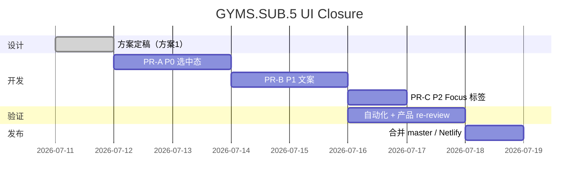

# Fitness GYMS.SUB.5 — UI/Copy Closure Guide

**Date:** 2026-07-11 · **Closed:** 2026-07-13（方案 1 + 文案 + P2 Focus 标签全部实现于 #19 `67e72b81`）
**Parent:** [`FT-P5-substitution.md`](./FT-P5-substitution.md)（工程 gate PASS · 产品 gate **PASS**）
**Scope:** 产品 UI/copy closure 与下一步实施；**不**改动状态模型或归因逻辑。

> **✅ 已完成（2026-07-13）：** 下述方案 1（P0 选中态 + `aria-pressed` + checkmark）、P1 文案（Modal/Summary）、P2 Focus `Switched from` 标签均已落地并合并（#19）。`substitution.spec.js` 断言选中态与文案，9/9 绿。本文保留为实施记录。

---

## 执行摘要

GYMS.SUB.5 工程闭环已完成，发布阻塞集中在 **SkipModal 替代选中态不可见** 与 **部分完成场景下的文案歧义**。竞品与无障碍调研支持以下方向：

- 部分完成场景优先使用 **Replace / Swap（替换）** 而非单纯 **Skip（跳过）**
- 选中态需 **主题色背景 + 边框**（及非颜色辅助指示），满足 WCAG 2.1 SC 1.4.11 非文本对比度（UI 状态指示 ≥ 3:1）
- 替代选项应暴露 **可访问选中语义**（`aria-pressed` 或 `radiogroup` + `aria-checked`）
- 替代确认后 Focus 需 **轻量上下文过渡提示**，降低「随机跳项」认知负担
- Summary 负责解释替代关系；Stats 保持 **performance-only**

**推荐方案：方案 1（背景高亮 + `aria-pressed`）** — 改动最小、风险最低，可立即解除 P0 阻塞。

**快速修复（紧急）：** 仅修改 `.skip-alt.active` 背景/边框/文字色，可先不改文案，后续迭代 P1。

---

## 研究方法

| 维度 | 来源 |
| --- | --- |
| 竞品交互 | Fitbod（Replace）、Strong、JEFIT、Gym Exercises & Workouts（swap / skip 并列） |
| 设计系统 | Material Design 3 States / Chip 选中态；Apple HIG 状态反馈 |
| 无障碍 | WCAG 2.1 SC 1.4.11；WAI-ARIA Authoring Practices — Radio Group Pattern |
| 文案 | Nielsen Norman Group — 按钮/链接应准确承诺即时动作 |
| 过渡 UX | UXmatters — fluid task transitions 需在上下文切换时传递相关信息 |

---

## 主要发现（与当前实现对照）

| 发现 | 现状 | 目标 |
| --- | --- | --- |
| 选中态对比度不足 | `.skip-alt.active` 无背景高亮，与未选中几乎相同 | 主题色背景 + 边框 + 可选 checkmark |
| 文案歧义 | 部分完成后仍显示 `Skip · {exercise}` | 0 sets → Skip；partial → Replace remaining sets |
| 过渡提示缺失 | Focus 直接切换，无来源说明 | 轻量 `Switched from {planned}` |
| Summary 语义 | `[Skipped] 2/4` 与已完成组数矛盾 | `Replaced after 2 sets` + 替代动作独立行 |
| ARIA 语义 | 替代项无选中状态暴露 | `aria-pressed` 或 `radiogroup` + `aria-checked` |

**行业术语参考：** Gym Exercises & Workouts 明确区分 *"swap, add, edit and skip exercises"*；Fitbod 使用 *Replace* 描述动作替换。部分完成场景应对齐 **替换/交换**，而非暗示丢弃已完成组数。

---

## 三套实施方案

### 方案 1：背景高亮 + `aria-pressed`（**推荐**）

**视觉：**

```css
.skip-alt.active {
  background-color: var(--accent-bg);
  border-color: var(--accent);
  color: var(--accent);
}
```

可与 `.skip-reason.active` 共用视觉语言；建议额外加 checkmark 图标，避免仅依赖颜色。

**ARIA：**

```svelte
<button
  type="button"
  class="skip-alt"
  class:active={skipModal.substituteId === alt.id}
  aria-pressed={skipModal.substituteId === alt.id}
  onclick={() => (skipModal.substituteId = alt.id)}
>
  {exerciseName(alt)}
</button>
```

**文案：** 按 `log.done` 分支 — 见 [文案规则](#文案规则)。

**Focus：** 标题下增加次级标签 `Switched from {planned name}`。

**Summary：** `log.done > 0 && substituteId` → badge `Replaced`；0 sets → `Skipped`。

**改动文件：** `app.css` · `SkipModal.svelte` · `FocusSession.svelte` · `SummaryView.svelte` · i18n keys

**风险：** 低。深色/浅色模式需目测对比度；可分两 PR：先 CSS，后文案。

---

### 方案 2：单选组 + 选中图标

在方案 1 基础上，将替代列表改为 `role="radiogroup"` + `role="radio"` + `aria-checked`，左侧圆形/勾选图标强化非颜色反馈；支持方向键切换。

**优点：** 选中反馈最强；ARIA 语义最完整。
**缺点：** 需键盘导航 QA、读屏器验证；改动中等。
**回退：** 保留图标 + 方案 1 样式，暂不重构为 radiogroup。

---

### 方案 3：分段控制（Segmented Control）

将「跳过剩余」与「替换为 {substitute}」做成并排大按钮或分段控件，动词直接写在按钮上。

**优点：** 语义最直观。
**缺点：** 重构 SkipModal 流程，与现有 reason + alternatives 两步结构冲突；成本高。
**结论：** **不纳入 GYMS.SUB.5 closure**；若未来用户测试仍显示高误操作率再评估。

---

## 方案对比

| 特性 | 方案 1 | 方案 2 | 方案 3 |
| --- | --- | --- | --- |
| 选中态可视性 | 较好 | 很好（图标+背景） | 最佳 |
| 开发复杂度 | **低** | 中 | 高 |
| ARIA 语义 | 基本（`aria-pressed`） | 完整（radiogroup） | 良好 |
| 与现有 Modal 流程一致 | **最高** | 较高 | 低 |
| 修复成本/风险 | **最低** | 中等 | 最高 |

**定案：方案 1 为 GYMS.SUB.5 closure 默认路径。** 方案 2 可作为无障碍增强 follow-up；方案 3 出 scope。

---

## 文案规则

| 状态 | Modal 标题 | 确认按钮 |
| --- | --- | --- |
| `done === 0` | `Skip · {exercise}` | `Confirm skip` |
| `0 < done < totalSets` | `Replace remaining sets · {exercise}` | `Confirm replacement` |
| `done >= totalSets` | 不展示替代入口 | — |

**Summary badge：**

| 条件 | Badge |
| --- | --- |
| 跳过且无完成组数 | `Skipped` |
| 部分完成 + 有 substitute | `Replaced`（或 `Replaced after N sets`） |
| 替代动作行 | 无 badge；独立显示完成组数 |

**Focus 过渡（P2，可选）：**

```text
Switched from Barbell bench press
```

**Stats：** 不重复替代关系；仅按 `exId` 统计实际完成组数。

---

## 实施步骤与优先级

| 序 | 任务 | 优先级 | 文件 | 验收 |
| --- | --- | --- | --- | --- |
| 1 | `.skip-alt.active` 背景/边框/文字 + checkmark | **P0** | `app.css` · `SkipModal.svelte` | 选中/未选中肉眼可辨；对比度 ≥ 3:1 |
| 2 | `aria-pressed`（或 radiogroup） | **P0** | `SkipModal.svelte` | Tab 聚焦；读屏器播报选中态 |
| 3 | Modal 标题/确认按钮按 `done` 分支 | **P1** | `SkipModal.svelte` · i18n | 部分完成场景无「Skip」歧义 |
| 4 | Summary `Skipped` → `Replaced` | **P1** | `SummaryView.svelte` · i18n | `2/4` + substitute 语义一致 |
| 5 | Focus `Switched from` 标签 | **P2** | `FocusSession.svelte` | 不遮挡主 CTA |
| 6 | Playwright 补充选中态/文案断言 | P1 | `substitution.spec.js` | focused suite 仍绿 |
| 7 | Targeted product re-review | 发布前 | — | 产品 gate 转 PASS |

### 建议 PR 切分

```text
PR-A（P0 解阻塞）: CSS + aria-pressed + checkmark
PR-B（P1 文案）  : Modal + Summary i18n
PR-C（P2 可选）  : Focus transition label
```

### 时间线（估算）



---

## A/B 测试（可选 · 全量后）

GYMS.SUB.5 closure **不依赖** A/B 即可 ship；若需量化文案/样式迭代，可在全量后开启。

### 目标指标

| 指标 | 说明 |
| --- | --- |
| Confirm rate | 打开替代 modal 后确认替代的比例 |
| Substitution completion rate | 确认替代后完成剩余组数的比例 |
| Mis-confirm rate | 未选中但以为已选中导致的错误替代（日志/反馈） |
| Summary misread rate | 用户对 Skipped/Replaced 理解偏差（调研） |
| Support rate | 替代相关询问/投诉占比 |

### 实验设计（参考）

- **对照组：** closure 前 UI（或仅 PR-A）
- **实验组：** PR-A + PR-B 完整 closure
- **样本：** 假设 baseline confirm rate ~50%，目标 +5pp，α=0.05，power=0.8 → 约 **800–1000** 次替代事件（按 DAU 约 4 周）
- **显著性：** p < 0.05；同时看效应量

### 建议埋点（若引入 analytics）

```text
substitution.initiated   { plannedId, selectedId, doneSets }
substitution.confirmed   { plannedId, substituteId, doneSets }
substitution.completed   { substituteId, setsCompleted }
summary.viewed           { hasSubstitution: boolean }
```

**注意：** 当前 Fitness 以 local-first 为主，埋点需与隐私/产品策略对齐后再实现；**不作为 closure 阻塞项**。

---

## 风险与缓解

| 风险 | 缓解 |
| --- | --- |
| 选中态仍不明显 → 误确认 | PR-A 合并前做 light/dark 目测 + 对比度检查；必要时升方案 2 |
| ARIA 与读屏器不一致 | VoiceOver / NVDA 抽测；参考 WAI-ARIA Radio Group 示例 |
| 「跳过」术语误导 | PR-B 按 `done` 分支；Summary 用 Replaced |
| 进度紧张 | **快速修复：** 仅 PR-A，文案暂缓 |
| 破坏工程 gate | 不改 `sessionQueue.js` / `session.js` 归因；仅 UI 层 |

---

## 验证清单（closure 完成定义）

- [x] `.skip-alt.active` 与未选中态肉眼可区分（accent 背景 + 边框 + inset 阴影 + checkmark 指示）
- [x] `aria-pressed` 语义正确（`SkipModal.svelte`）
- [x] 0 sets：Skip 文案；partial：`replaceRemainingTitle` / `confirmReplacement`
- [x] Summary：partial + substitute → `Replaced` badge（`SummaryView.svelte`）
- [x] Focus：`Switched from …` 标签（`FocusSession.svelte`）
- [x] `npx playwright test tests/session-queue.spec.js tests/substitution.spec.js` — **9/9 绿（2026-07-13）**
- [x] `npm run check` · `npm run build` — PASS（#19 CI）
- [x] Targeted product re-review — 闭环于 #19（selected state 现明显可辨）

---

## 参考来源

| 来源 | 要点 |
| --- | --- |
| [Fitbod Help — Replace an Exercise](https://support.fitbod.me/) | Swipe → Replace 交互 |
| Gym Exercises & Workouts (App Store) | *swap, add, edit and skip exercises* |
| [WAI-ARIA APG — Radio Group Pattern](https://www.w3.org/WAI/ARIA/apg/patterns/radio/) | 单选组键盘与 `aria-checked` |
| [WCAG 2.1 SC 1.4.11 Non-text Contrast](https://www.w3.org/WAI/WCAG21/Understanding/non-text-contrast.html) | UI 组件状态对比度 ≥ 3:1 |
| [Nielsen Norman Group — Link promises](https://www.nngroup.com/articles/link-promise/) | 标签须准确承诺动作结果 |
| [UXmatters — Fluid task transitions](https://www.uxmatters.com/) | 上下文切换时传递相关信息 |
| [Material Design 3 — States](https://m3.material.io/foundations/interaction/states) | 选中态多指示器，避免仅依赖颜色 |

---

## 相关文档

| 文档 | 角色 |
| --- | --- |
| [`FT-P5-substitution.md`](./FT-P5-substitution.md) | 工程 gate · 状态模型 · 测试证据 |
| [`../../../docs/roadmap/apps/fitness.md`](../../../docs/roadmap/apps/fitness.md) | Fitness roadmap |
| [`../../../docs/LIFEOS_ROADMAP.md`](../../../docs/LIFEOS_ROADMAP.md) | Monorepo Now / Next |
