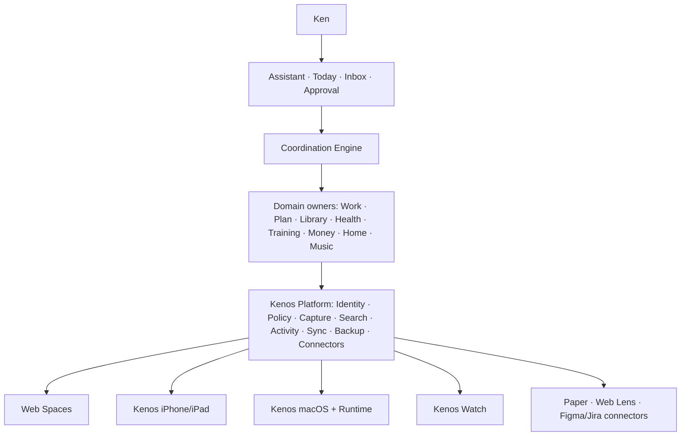
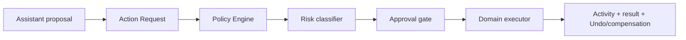

# Kenos 目标架构与治理

## 1. 架构结论

Kenos 采用 **模块化单体 + 清晰领域边界 + 一个结构化数据主干 + 多原生终端 + Assistant 统一协调**。

- 不把所有数据塞进 Assistant。
- 不为每个领域建立独立微服务和 Supabase 项目。
- 不让 Web、iPhone、Mac、Watch、Paper 或插件创建新的领域真源。
- 共享的是身份、契约、动作、搜索、同步、权限、审计和恢复。
- 领域自己拥有专业模型、规则和写入 API。



## 2. “一个 Kenos”的正式含义

| 层面 | 必须统一 | 不必统一 |
| --- | --- | --- |
| 产品 | Kenos 品牌、账户、意图入口 | 每个平台相同导航深度 |
| 身份 | user/device/auth context | 每端相同登录 UI |
| 数据 | Entity ID、唯一 Owner、安全域、分类 | 各领域内部表结构 |
| 行为 | Action Contract、风险、幂等、Activity | 每端控件和系统集成 |
| 智能 | Assistant 协调、Memory 规则、Policy | 每领域专业算法 |
| 体验 | 可信、清晰、可恢复、即时反馈 | 所有页面视觉一致 |

统一不等于把代码、表和页面合成一个巨型模块。用户表面是一套系统，内部边界必须更严格，而不是更松散。

## 3. 当前仓库与目标差距

| 能力 | 2026-07-18 现状 | 目标差距 |
| --- | --- | --- |
| SSO | 多 app 共用 `@life-os/sync` | 增加 device/auth context 和安全域授权 |
| 共享读模型 | `core_*` 今日快照 | 明确读模型来源、版本和延迟，不冒充写真源 |
| 事件 | `life_events` + Outbox | 分离 Action Request、Domain Event、Activity，增加幂等/权限/可追溯 |
| 对象引用 | wikilink 试点 | 稳定 `EntityRef` 与 `entity_links`，按真实痛点扩展 |
| Web shell | Fitness/Home/Music/AIOS/Knowledge/Health 已采用 AppShell | Planner/Finance 仍需评估收敛；Portal 将退役，不投资无价值迁移 |
| Settings | Planner/Fitness/Home/Finance 已大量使用共享 settings；Music 部分使用 | 收敛外观/账号/备份行为，保留领域内容；旧审核中的 Finance 事实已过期 |
| Generator | create/promote/add-capability + AppManifest 已存在 | 先维护，不在核心契约冻结前扩张模板 |
| Assistant 工具 | MCP fleet 已有 | 所有写工具进入统一 Policy/Approval/Activity |
| 原生客户端 | AIOS/Knowledge/Health Tauri，Health companion，Music Capacitor | 收敛为一个 Kenos Apple 产品，旧壳渐进退役 |
| 离线 | 多 app local-first 但策略不同 | 统一 Mutation/Outbox/Conflict/Recovery contract |

## 4. 领域所有权

### 4.1 Owner 矩阵

| 数据/能力 | 唯一写入 Owner | 允许的引用者 | 明确禁止 |
| --- | --- | --- | --- |
| 用户身份、全局 Entity ID、设备 | Core | 全部 | app 自建用户主表 |
| 对话、建议、审批请求 | Assistant | System、相关领域 | 把领域事实长期保存在聊天正文 |
| 职业项目、会议、交付、工作决策 | Work | Plan、Library、Assistant | Work 自建可独立完成的任务真源 |
| 任务、时间块、例行、日程 | Plan | Work、Assistant、Watch | 其他域复制并独立完成任务 |
| Notes、Documents、Sources、Research、Decisions | Library | Work、Assistant、Search | 把保存来源直接视为个人偏好 |
| AI 长期个性化认知 | Memory Service | Assistant，按 scope 授权 | 自动吞入全部 Library |
| 睡眠、精力、压力、恢复等状态 | Health | Assistant、Plan、Training | 上传不必要的原始健康明细 |
| 训练计划、动作、组和训练记录 | Training | Health、Plan、Watch | Plan 存训练领域细节 |
| 账户、交易、预算、预测 | Money | Assistant、Plan、Home | 用可覆盖更新改历史交易 |
| 房间、物品、家具、空间关系 | Home | Money、Plan、Library | Finance 自建物品真源 |
| 音乐库、歌单、播放偏好 | Music | Assistant | 为普通设置 fork 平台控件 |
| 通知投递策略 | Notifications | 全领域提交候选 | 每个 app 独立轰炸用户 |
| 自动化定义与运行 | Automation | Assistant/System | LLM 直接执行脚本 |
| Connector 原始对象 | 外部系统（Figma/Jira 等） | Work/Library 镜像或引用 | 将镜像冒充外部真源 |

### 4.2 跨领域写入

任何跨领域变更都通过目标 Owner 的 Action API:

```text
Work 发现行动项
  -> CreateTask Action Request
  -> Policy/Approval
  -> Plan Executor 写正式 Task
  -> Activity 记录结果
  -> Work 保存 task_id 引用
```

禁止 Work 直接写 Plan 表，也禁止 Work 同时保存第二个可完成状态。

## 5. 核心 Entity 模型

Core 只定义跨领域必需字段，不创建覆盖所有领域的巨型 `entities` 业务表。

```text
Entity metadata
  id
  entity_type
  owner_domain
  owner_id
  security_domain
  data_classification
  version
  created_at
  updated_at
  archived_at
```

领域表继续保存专业字段。例如 Work Project 有 stakeholder/deliverable/risk，Home Project 有 room/item/layout。Core 只保证它们可被引用、搜索、授权和审计。

## 6. 安全域

### 6.1 四个域

| 域 | 内容 | 默认跨域策略 |
| --- | --- | --- |
| Personal | 私人 Plan、Money、Health、Training、私人 Library/Memory | 不进入 Work |
| Work | Jira/Figma/Teams/邮件、工作项目/会议/联系人/文档 | 不进入 Personal Memory；不默认发云端 AI |
| Household | 共享 Home、宠物、家庭任务、共享账单/日历 | 首期只定义边界，不默认实现多用户 |
| System | Device、Connector、Automation、Activity、Permission、Backup、Runtime | 仅控制面读取，不混入领域内容 |

### 6.2 强制规则

- 跨域搜索默认关闭，用户显式选择后才在当前请求中开启。
- 每次跨域读取、推断、写入都产生 Activity。
- Connector 的授权同时绑定 user、device、security domain、scopes 和 expiry。
- Work 内容的保留、模型处理和云存储以公司政策为上限。
- “本机进程”不等于“可信进程”；仍需身份与最小授权。

## 7. 数据分类

| 分类 | 云存储 | 云端 AI | 本地 AI | 跨域搜索 | 建议保留 |
| --- | --- | --- | --- | --- | --- |
| `public` | 可 | 可 | 可 | 可 | 按业务 |
| `personal` | 加密与最小化后可 | 用户策略决定 | 可 | 默认否 | 用户可控 |
| `sensitive` | 最小化 | 默认否 | 可 | 否 | 尽量短 |
| `work_confidential` | Connector/公司策略决定 | 默认否 | 公司策略允许时 | 仅 Work | 按公司政策 |
| `restricted_local_only` | 不可 | 不可 | 可 | 本机限定 | 用户控制 |
| `ephemeral` | 仅任务期 | 按任务 | 按任务 | 不进长期索引 | 自动到期 |

对象没有分类时按更严格一档处理。分类不是展示标签，而是必须参与 storage、model routing、search、retention 和 export policy。

## 8. Assistant 与权限

### 8.1 风险等级

| Level | 示例 | 默认行为 |
| --- | --- | --- |
| R0 | 查找、读取、总结 | 授权范围内自动，记录敏感访问 |
| R1 | 创建草稿、可重建分类 | 自动并记录 |
| R2 | 移动任务、改时间等可逆结构化修改 | 预览或执行后提供 Undo |
| R3 | 发邮件、改 Jira、共享文件、敏感写入 | 明确确认 |
| R4 | 删除、生产迁移、财务关键动作、大规模修改 | 备份 + 影响预览 + 强确认 |

### 8.2 执行链



LLM 只能生成和解释 Action Request，不能持有 service role，不能自行提升权限，也不能跳过 executor 的领域校验。

### 8.3 授权持续时间

- 本次动作。
- 本次会话。
- 当前项目。
- 当前 Connector。
- 永久允许某类低风险动作。

永久不可全自动授权: 不可恢复删除、外发敏感内容、大规模生产迁移、安全策略修改、权限提升和权限规则自身修改。

## 9. AI 信任升级

每一种 capability 独立升级:

```text
Observe -> Suggest -> Draft -> Confirm -> Execute and notify -> Automatic
```

不得有“总体信任等级”。邮件已可信不代表文件删除或 Jira 写入自动获得权限。每项能力持续记录采纳率、修改率、拒绝率、撤销率、错误率、失败影响、模型版本和 prompt 版本。

## 10. Library 与 Memory

### Library

用户可直接查看、编辑、导出的资产: Note、Document、Source、Research、Decision、Collection、Citation。

### Memory

Assistant 用于个性化的派生认知。每条 memory 至少包含:

```text
statement
source_refs
status: observed | inferred | user_confirmed | superseded | expired | rejected
confidence
sensitivity
scope
created_at
last_confirmed_at
expires_at
supersedes
```

规则:

- 保存一篇文章不等于接受其观点。
- 一次行为不构成长期偏好。
- 推断会衰减，敏感记忆不跨安全域。
- 用户可查看、修改、否定和删除。
- 重要个性化建议必须能指出来源。

## 11. Goal 与 Coordination

### 11.1 Goal 层级

```text
Value -> Goal -> Outcome -> Initiative -> Project -> Action/Habit -> Review/Evidence
```

Goal 只提供优先级和决策依据，不直接写领域数据。当前 owner 建议为 Core Goals，最终在 `OPEN-004` 冻结。

### 11.2 Recommendation 输入

每个领域向 Coordination Engine 提交标准化 recommendation:

- requested_action
- urgency / importance
- external_commitment
- estimated_time
- energy_type / energy_cost
- deferrability
- consequence_if_skipped
- reversibility / confidence
- goal_links / evidence

### 11.3 裁决顺序

1. 硬约束: 日程冲突、资金不足、健康限制、外部截止、禁用时间、设备不可用。
2. 可重复规则/评分: 目标权重、承诺、当前状态、延迟成本、风险、历史成功率。
3. Assistant 解释和协商: 推荐保留什么、推迟什么、原因和替代方案。

关键约束不能交给 LLM 临场决定。

## 12. 通知与注意力预算

| 级别 | 产品表现 |
| --- | --- |
| Silent | 只进入 Activity |
| Digest | Today/日终摘要 |
| Contextual | 进入相关页面时显示 |
| Active | 普通通知 |
| Time-sensitive | 允许突破部分 Focus |
| Critical | 极少数健康/安全事件 |

初始主动中断目标上限为每天 3 次，最终值见 `OPEN-007`。同一事项不重复通知；能合并、延后到自然中断点或自动处理，就不单独打断。通知正文不显示敏感财务、健康或工作内容。

## 13. 离线、同步与冲突

### 13.1 每项能力必须声明

```text
online_requirement
device_requirement
offline_read
offline_write
queue_strategy
degraded_behavior
recovery_behavior
```

高频操作先本地持久化和反馈，再加入 Outbox。不可用能力明确说明原因和数据状态，不允许静默失败。

### 13.2 Mutation Envelope

```text
mutation_id
idempotency_key
entity_ref
device_id
actor_id
base_version
occurred_at
received_at
operation
payload
```

### 13.3 冲突策略

| 数据 | 策略 |
| --- | --- |
| Activity、训练组、交易导入 | append-only |
| 任务完成状态 | 事件合并 |
| 标题和简单字段 | 乐观锁 + version |
| 日历时间 | 显式冲突或 Coordination 规则 |
| 长文本 | 版本历史 + 冲突副本 |
| 文件 | content hash + version |
| 财务交易 | 新增 correction，不覆盖 |
| 自动化配置 | 乐观锁，拒绝静默覆盖 |
| 权限 | 以最新明确用户授权为准，不自动合并 |

业务写入与 Outbox 记录必须在同一数据库事务中；消费者用 `idempotency_key` 去重。

## 14. Connector 生命周期

统一状态:

```text
disconnected -> connecting -> healthy
                            -> degraded
                            -> reauth_required
                            -> rate_limited
                            -> schema_changed
                            -> disabled -> retired
```

每个 Connector 必须公开 scopes、安全域、最后成功时间、同步范围、当前错误、下次重试、保留规则、写权限和断开后镜像处理。默认只读；写权限单独申请。浏览器 Cookie、登录会话和 Supabase service role 不进入插件。

## 15. 存储职责

| 存储 | 长期职责 | 不负责 |
| --- | --- | --- |
| Supabase | 结构化运行真源、关系、Action/Activity、跨设备同步 | 大型原始文件、Work 违规镜像 |
| iCloud / Files | 用户可见文档、导入导出、原生文件交换 | 结构化数据库真源 |
| KenosVault 8TB | 重型原始资产、长期归档、本地索引源 | 移动端直接路径访问 |
| 设备 SQLite | 缓存、离线读写、Outbox、索引 | 新领域真源 |
| 外部系统 | Jira/Figma/邮件等原始对象 | Kenos 内部任务/记忆真源 |

Mac Runtime 作为本地计算节点时，移动端提交 Job，Runtime 执行后把结果写回正式存储。Mac 不在线时必须显示云端 fallback、轻量本地结果或 queued 状态。

## 16. System 控制面

System 是管理、诊断和恢复界面，不是日常首页。包含:

- Connections、Permissions、Automations、Activity。
- Sync、Storage、Vault、Devices、Runtime、Models。
- Backups、Recovery、Notifications、Data export、Diagnostics、Account。

默认只显示需要处理的问题，状态使用“正常 / 注意 / 阻塞”，每个故障提供原因、影响和修复动作。Assistant 可以解释状态，但不能隐藏事实。

## 17. Minimum Sustainable Core

高级 AI、复杂浏览器自动化、图像生成和多模型路由全部停摆时，以下能力仍必须可靠:

1. Capture: 输入不丢。
2. Find: 找到任务、项目、文档和来源。
3. Plan: 任务与时间可用。
4. Work: 职业项目上下文可用。
5. Library: 知识和文件可用。
6. Sync: 跨设备最终一致并可见状态。
7. Permissions: 不越权。
8. Activity: 知道系统做了什么。
9. Backup & Restore: 可恢复。
10. Basic Assistant: 可查询并发起安全动作。

## 18. 初始可靠性目标

| 能力 | 初始目标 |
| --- | --- |
| 本地按钮反馈 | 150ms 内出现状态反馈 |
| Capture 本地持久化 | 500ms 内确认 |
| 在线结构化同步 | 95% 在 10 秒内完成 |
| 后台任务 | 始终显示 queued/running/failed/succeeded |
| 数据删除 | 默认可恢复 |
| 高风险动作审计覆盖 | 100% |
| 未解释的 AI 自动写入 | 0 |
| 静默同步失败 | 0 |
| 生产备份 | 每晚 |
| 恢复演练 | 每月 |
| Connector health check | 每日 |

这些是初始内部 SLO，不是营销承诺。实现前必须在 QA 文档中定义可测量口径。

## 19. 明确不做

- 全仓一次性改名。
- 每领域独立微服务或 Supabase 项目。
- 合并全部领域业务表。
- 全量公司邮件/Teams 长期镜像。
- Assistant 自动发送所有外部内容。
- 全量 Library 自动进入 Memory。
- 在 Library/同步未稳定前做 File Provider。
- 复杂 Goal/OKR Dashboard。
- 在核心契约未稳定前继续扩张 generator。
- 一次性原生化所有 Web 页面。
- 大规模无人监督浏览器自动化。
- 为此次重构创建 branch、worktree 或 stash。

## 20. 架构参考

- [NIST AI RMF](https://airc.nist.gov/airmf-resources/airmf/): AI 风险的 Govern、Map、Measure、Manage。
- [NIST SP 800-207A](https://csrc.nist.gov/pubs/sp/800/207/a/final): 不基于设备或网络位置给予隐式信任。
- [Microsoft Strangler Fig pattern](https://learn.microsoft.com/en-us/azure/architecture/patterns/strangler-fig): 渐进替换、明确过渡架构并最终退役旧实现。
- [Supabase RLS](https://supabase.com/docs/guides/database/postgres/row-level-security): 在数据库边界执行逐用户访问控制。
- [Apple notifications HIG](https://developer.apple.com/design/human-interface-guidelines/notifications/): 通知应及时、高价值、避免重复且不泄露敏感信息。
