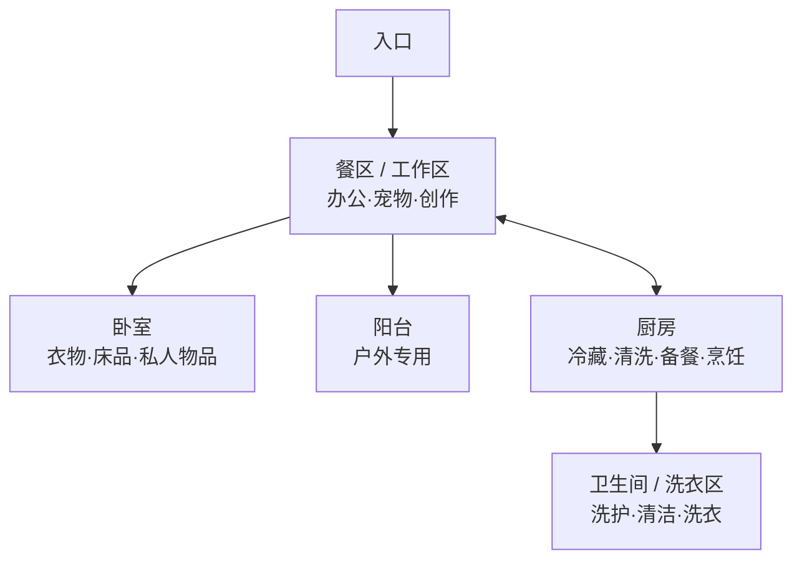

# 家庭结构与储藏分配指南

> 版本：HomeOS v15  
> 更新日期：2026-07-15  
> 数据来源：HomeOS RoomPlan 扫描、柜内扫描、户型图与 5 张现场照片

## 1. 住宅结构

当前扫描建筑面积约为 **681.6 平方英尺，约 63.3 平方米**。住宅由五个主要空间组成：

1. **餐区/工作区**：开放式核心空间，同时承担办公、用餐、宠物照护、3D 打印与创作功能。
2. **厨房**：与餐区直接相连，拥有连排上下柜、冰箱、食品高柜和开放食品架。
3. **卧室**：包含内置衣物壁橱、八格柜与床边拉篮。
4. **卫生间/洗衣区**：包含洗手台下柜、开放墙架、浴缸以及洗衣/烘干设备。
5. **阳台**：与餐区相连，建议仅用于户外工具和耐温差物品。



> 上图为空间关系示意，不代表精确比例和墙体位置。

## 2. 整体储藏策略

### 2.1 按人体工学高度分层

- **黄金高度（70‑140 cm）**：每天使用的食品、餐具、洗护、文具与宠物日用品。
- **低位区（0‑70 cm）**：锅具、饮料、米面、大包装和设备等重物。
- **高位区（140 cm 以上）**：纸品、空容器、季节附件等轻型低频物。
- **缓冲区**：每个主要储物系统保留 10%‑20% 空间，不把柜体塞满。

### 2.2 三个“零长期储物面”

以下三处只用于当前正在进行的活动，不作为物品的永久位置：

- 厨房备餐台面。
- 主办公桌面。
- 折叠长桌。

桌面上使用完成的物品，应在当天回到对应的 S 编号储物区。

### 2.3 主要生活动线

- **烹饪动线**：S10 冰箱 / S11 食品高柜 → 水槽 → 备餐台 → 炉灶 / S9 三抽柜。
- **归家动线**：入口 → S14 玄关家务壁橱 → 餐区/卧室。
- **工作动线**：主桌 ↔ S17 文件柜 / S18 推车 / S19 格子架。
- **宠物动线**：S8 补给站 ↔ 宠物围栏，不穿过厨房备餐位。

## 3. 储物区总览

> 尺寸顺序为宽 × 深 × 高。“约”代表照片估算或扫描受遮挡。

| 编号 | 用户友好名称 | 柜体/结构 | 尺寸 | 依据 |
|---|---|---|---|---|
| S1 | 锅具重物柜 | 2 组双门下柜，约 4 扇门 | 190 × 66 × 89 cm | RoomPlan |
| S2 | 每日食品架 | 1 组开放钢丝架，6 层 | 120 × 67 × 196 cm | RoomPlan |
| S3 | 浴室洗护柜 | 双门＋三抽 | 外部 133 × 55 × 85 cm；内腔 88 × 60 × 60 cm | RoomPlan＋柜内实测 |
| S4 | 卧室八格柜 | 约 4 列×2 层，8 格 | 134 × 50 × 82 cm | RoomPlan |
| S5 | 工作边柜 | 1 组，门/格数待确认 | 约 66 × 70 × 113 cm | RoomPlan，受遮挡 |
| S6 | 床边三层篮 | 1 组三层钢丝拉篮 | 约 39 × 115 × 112 cm | RoomPlan，深度需复核 |
| S7 | 冰箱顶备用柜 | 1 组双门吊柜 | 88 × 44 × 56 cm | RoomPlan |
| S8 | Onyx & Sard 补给站 | 1 组宠物用品架 | 86 × 43 × 159 cm | RoomPlan |
| S9 | 炉边三抽柜 | 1 组地柜，3 抽 | 49 × 63 × 89 cm | RoomPlan |
| S10 | 冰箱冷藏冷冻 | 1 台双开门冰箱 | 87 × 86 × 172 cm | RoomPlan |
| S11 | 冰箱旁食品高柜 | 窄高柜，上下 2 扇门 | 42 × 68 cm；高约 229 cm | RoomPlan＋照片估算 |
| S12 | 水槽上方餐具柜 | 连排吊柜，照片可见约 5 组/9 扇门 | 连排约 249 × 36 cm，高待测 | RoomPlan＋照片 |
| S13 | 卧室衣物壁橱 | 1 个内置壁橱 | 占地 213 × 66 cm | 户型图 |
| S14 | 玄关家务壁橱 | 1 个走廊内置柜 | 占地 81 × 107 cm | 户型图 |
| S15 | 洗衣补给位 | 洗衣壁龛，柜体待配置 | 区域 109 × 183 cm | 户型图 |
| S16 | 阳台户外箱 | 密封箱/窄柜规划位 | 待测 | 规划 |
| S17 | 桌下三抽文件柜 | 带锁带轮，3 抽 | 48 × 59 × 67 cm | RoomPlan |
| S18 | 工作随手推车 | 开放推车，约 3 层 | 约 79 × 38 × 81 cm | 照片估算 |
| S19 | 工作八格架 | 推测 2 列×4 层 | 约 76 × 38 × 147 cm | 照片估算 |
| S20 | 创作设备架 | 主设备位＋侧架＋底层设备位 | 约 119 × 61 × 183 cm | 照片估算 |
| S21 | 浴室三层随手架 | 开放搁板，照片可见 3 层 | 扫描范围约 78 × 36 × 136 cm | RoomPlan＋照片 |

## 4. 厨房储藏分配

厨房的核心目标是让取食、清洗、备餐和烹饪形成连续动线，并尽量清空操作台面。

### S1 锅具重物柜

- **水槽下柜**：洗碗块、清洁剂、垃圾袋、备用海绵；全部放入防漏盒。
- **备餐下柜**：铸铁锅、汤锅、平底锅、锅盖和常用小家电。
- 最重物放在膝盖至腰部高度，不把重锅放进吊柜。
- 清洁用品与食品必须实体分隔。

### S2 每日食品架

- **中部第 3‑4 层**：早餐、零食、咖啡、茶、每日食品。
- **底层**：饮料、米面、未开封大包装。
- **顶层**：纸品、空保鲜盒和其他轻型低频物。
- 食品按“先到期在前”摆放，不与宠物粮和清洁剂混架。

### S7 冰箱顶备用柜

- 烘焙模具、空保鲜盒、备用纸品、季节性餐具。
- 只放轻型低频物；不放玻璃重物、大瓶液体或常用物。
- 取物使用稳定踏凳，不踩椅子。

### S9 炉边三抽柜

- **上抽**：锅铲、食品夹、测量勺、开瓶器。
- **中抽**：隔热手套、保鲜膜、烘焙纸。
- **下抽**：立放锅盖或轻型小家电。
- 刀具不与需要徒手翻找的工具混抽。

### S10 冰箱冷藏冷冻

- **冷藏上层**：即食、熟食和剩菜。
- **冷藏中层**：乳品、开封食材和每日用品。
- **冷藏下层**：生鲜防漏盒。
- **冷冻区**：按肉类、速冻食品、备餐分装、宠物冷冻食品分盒。
- 门架只放耐温差的调味品；冰箱顶不堆物。

### S11 冰箱旁食品高柜

- **胸腰高**：早餐、咖啡、茶、零食和常用干货。
- **底部**：米面、油、大包装与未开封备货。
- **顶部**：季节性餐具和轻型低频容器。
- 重物不超过腰高；柜门前保持约 80 cm 开启空间。

### S12 水槽上方餐具柜

- **水槽上方**：杯、碗、盘和常用餐具。
- **备餐区上方**：轻型干货、餐盒和保鲜用品。
- **炉灶侧上柜**：少量调味补充装。
- 常用物放最下层，最高层只放轻物。

## 5. 卫生间与洗衣区分配

### S3 浴室洗护柜

- **上抽**：每日护肤、牙护、梳理与理容工具。
- **中抽**：洗护补充装和低频护理用品。
- **下抽**：卷纸、毛巾和其他干燥备品。
- **水槽下**：只放密闭防漏盒中的卫浴清洁用品。
- 药品、纸质文件和带电池设备离开潮湿区。

### S15 洗衣补给位

- **机上薄柜/侧边窄架**：洗衣液、柔顺剂、洗衣网袋和去渍工具。
- **入口侧**：干湿或深浅色分类脏衣篮。
- **下层**：未开封洗衣补充装。
- 不在洗衣机或烘干机顶部形成散堆。
- 新增柜门不得与机器门的开启范围冲突。

### S21 浴室三层随手架

- **胸腰高层**：每日备品和常用小物。
- **下层**：卷纸和较重的补充装。
- **上层**：轻型低频备品。
- 每层使用可擦洗浅盒；瓶罐不放在搁板边缘。

## 6. 卧室、玄关与阳台分配

### S4 卧室八格柜

建议将 8 个格子分为：

1. 常用床品。
2. 换季床品。
3. 电子配件。
4. 旅行用品。
5. 季节附件。
6. 空收纳袋/压缩袋。
7. 低频个人物品。
8. **待归位缓冲格**。

较重类别放下排，每格只保留一个主类别。

### S6 床边三层篮

- **上层**：睡前换下但可以再穿的衣物。
- **中层**：次日穿搭或家居服。
- **下层**：待洗衣物。
- 干净衣物不与待洗衣物混层；床侧保持至少 60 cm 通道。

### S13 卧室衣物壁橱

- **靠入口侧**：当季高频衣物。
- **中段挂衣区**：外套、衬衫、连衣裙和易皱衣物。
- **上层**：床品、换季衣物和空旅行箱。
- **底部**：统一抽屉箱、鞋盒或重型换季箱。
- 常穿衣物放在肩至膝高度，挂杆和层板保留约 20% 空位。

### S14 玄关家务壁橱

- **上层**：备用纸品和轻型低频备品。
- **中部挂钩**：外套、日常包、雨具和吸尘器配件。
- **底部**：吸尘器、拖把、清洁工具和外出用品。
- 清洁剂放入防漏盒，并与宠物和食品分区。
- 外出物品在入口就地归位，不带入餐区和卧室。

### S16 阳台户外箱

- 户外工具、防水垫、季节户外用品和耐温差的密封箱。
- 纸品、食品、药品、电池和电子设备不放阳台。
- 重物贴地靠墙，箱体离地防潮。
- 不遮挡阳台门、排水口和至少 75 cm 的通道。

## 7. 工作、宠物与创作区分配

### S5 工作边柜

- 充电器、摄影附件、封箱工具、大型在办项目盒。
- 每个项目使用独立项目盒，项目结束后清空或转入归档。
- 高频设备放手臂自然触及区，线材不跨越椅子脚轮范围。

### S8 Onyx & Sard 补给站

- 每只宠物使用独立带盖盒。
- **胸腰高**：日粮、零食和每日照护用品。
- **靠出口侧**：牵引绳、外出包和拾便袋。
- **上层带盖盒**：药品和低频护理用品。
- **底层**：密封粮桶和较重备货。
- 人类食品、宠物食品和清洁剂分别储存。

### S17 桌下三抽文件柜

- **上抽**：每日文具、便签、小工具。
- **中抽**：每个在办项目一个文件夹。
- **下抽**：低频归档、打印纸和纸张耗材。
- 放在主桌右下方并锁定脚轮，不侵占膝部空间。

### S18 工作随手推车

- **顶层**：当天正在使用的物品。
- **中层**：耗材和下一批会用到的补充品。
- **底层**：较重的小型设备。
- 每层用小盒限定容量；推车固定停靠在桌侧，不停在主通道。

### S19 工作八格架

- **眼睛至腰部高度**：耳机、线材、直播和录音配件。
- **底格**：备件箱和较重工具。
- **顶面**：只放软轻物，不再堆高。
- 所有线材先绕线、再分类入盒，不垂落到升降桌机构和椅轮。

### S20 创作设备架

- **中央主位**：3D 打印机。
- **侧架中层**：密封的打印耗材。
- **工具盒**：剪钳、刮刀、备用喷嘴、测量工具和清理工具。
- **底层**：电源、电子设备和较重备件。
- 设备前保留至少 90 cm 操作空间。
- 热源周围不堆纸箱、布料、宠物用品或其他易燃物。

## 8. 标签与分类规则

### 8.1 标签格式

建议使用：

```text
S编号 · 区域名称 · 类别
```

例如：

```text
S9 · 炉边三抽柜 · 隔热工具
S17 · 桌下文件柜 · 在办项目
S8 · Onyx & Sard 补给站 · 日常粮
```

### 8.2 分类边界

- 同一个收纳盒只放一个主类别。
- 食品、宠物食品、药品、清洁化学品必须分开。
- 所有液体补充装使用防漏盒。
- 高位只放轻物，重物不超过腰高。
- 待归位格不是新的杂物格，应每周清空。

## 9. 执行顺序

1. **清空三个工作面**：厨房台面、主办公桌、折叠长桌。
2. **归位重物**：先处理 S1、S2 底层、S9 下抽、S11 底部和 S20 底层。
3. **布置黄金高度**：再摆放每日食品、餐具、洗护、文具和宠物日用品。
4. **同类入盒**：使用同规格抽拉盒，贴上 S 编号与类别标签。
5. **保留空位**：每个主柜保留 10%‑20% 缓冲空间。
6. **处理无归属物品**：一个月没有使用，且无法分配到任何 S 区的物品，进入捐赠、出售或回收清单。

## 10. 需要补测的区域

- [ ] S5 工作边柜：拍摄无遮挡正面，确认门/格数与内部尺寸。
- [ ] S6 床边三层篮：用卷尺复核宽、深、高。
- [ ] S8 宠物补给站：确认层数和每层净高。
- [ ] S11 食品高柜：测量实际总高和内部层板数。
- [ ] S12 吊柜：确认完整的柜体数、门数和柜内净高。
- [ ] S13 卧室壁橱：开门拍照，记录挂杆、层板和净高。
- [ ] S14 玄关壁橱：开门拍照，记录家务工具可用高度。
- [ ] S15 洗衣区：测量机器上方和侧边可用空间。
- [ ] S16 阳台：测量可用墙面、门扇开启范围、排水口与通道宽度。
- [ ] S18‑S20：用卷尺核对推车、格子架和创作设备架的照片估算尺寸。
- [ ] S21 浴室开放架：近距离拍摄正面，确认实际层数。

## 11. 长期维持节奏

- **每天 5 分钟**：厨房台面、主办公桌和推车归零。
- **每周 15 分钟**：清空“待归位”缓冲格，检查主通道和椅轮区。
- **每月 30 分钟**：食品架按保质期轮换，盘点宠物与洗衣补给。
- **换季时**：季节物品只在 S13 卧室壁橱和 S16 阳台户外箱之间转移，不占用日常黄金区。
