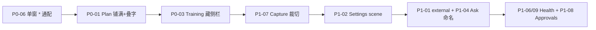

# Kenos Mac 核心页截图审计 — 问题标记与修复路径

**日期：** 2026-07-21（r1）· **r2 回归：** 2026-07-22
**证据截图（r1）：** `docs/ui-qa-screenshots/kenos-mac-core-20260721/`
**证据截图（r2）：** `docs/ui-qa-screenshots/kenos-mac-core-20260721-r2/`（15 张 uniq；见 `MANIFEST.txt`）
**五视角：** 视觉 · UX/IA · macOS HIG · Continuity · 缺陷猎人  
**状态：** CODE-LANDED（推荐序主项已齐）— **r3 截图被 Display Shield 阻断**；解锁后采图验收

### 五视角共识（基于 r2 截图 · 延迟回报）

| 视角 | 分 | 共识 P0 |
|------|----|---------|
| 视觉 | ~5.5 | Plan 叠字/死黑；Training 套娃；宽屏窄列系统病 |
| UX/IA | ~6.5 | Ask 命名漂移；未登录 Sign out；Shelf vs 侧栏重叠 |
| macOS HIG | ~6.5 | 空中间栏；Settings 非 scene；Sheet 规格 |
| Continuity | ~6 | Training 套娃 + Plan/全域铺满；`external` |
| 缺陷猎人 | 回归中偏高 | Plan 恶化；Capture 裁切；Health 空态/CPU |

**对照 CODE：** 上表问题多数已落地修复（见总表 CODE/FIXED）；r2 像素不能代表当前构建。r3 采图前勿用上述 OPEN 结论对外演示验收。

---

## 发布门禁（r2）

| 用途 | 结论 |
|------|------|
| 内部日用 | 可：侧栏直进 Plan / Money / Music / Library / Home；Capture / Approvals sheet 可用 |
| 对外演示 | 谨慎：布局/文案代码已修，**需 r3 截图确认** Plan / Training / Approvals / Health |

---

## 问题总表（r2 标定 · 含本轮代码态）

| ID | Sev | 状态 | 标题 | r2 证据 | 主落点 |
|----|-----|------|------|---------|--------|
| [MAC-P0-01](#mac-p0-01) | P0 | **CODE** | Plan 宽屏未铺满 + 叠字/裁切 | `06-plan.png` | Mac WK CSS 单列壳 |
| [MAC-P0-02](#mac-p0-02) | P0 | **FIXED** | Domain 浏览器式 chrome | `05`–`12` | `KenosMacDomainSurface` |
| [MAC-P0-03](#mac-p0-03) | P0 | **CODE** | Training 套娃侧栏 | `07-training.png` | Fitness `!isIosNativeShell` + CSS |
| [MAC-P0-04](#mac-p0-04) | P0 | **FIXED** | 连接叙事矛盾 | `04-settings` Reachable | Settings 文案 |
| [MAC-P0-05](#mac-p0-05) | P0 | **CODE** | Capture/Approvals 路由+质量 | sheet ✓；Approvals 人话化 ✓ | `14`/`15` |
| [MAC-P0-06](#mac-p0-06) | P0 | **FIXED** | deep link 多窗口 | `open`×5 → 1 窗 | `preferring/allowing: ["*"]` |
| [MAC-P1-01](#mac-p1-01) | P1 | **CODE** | Switch Space `external` | `13-spaces-shelf.png` | meta 去 external |
| [MAC-P1-02](#mac-p1-02) | P1 | **CODE** | Settings 非系统范式 | `04-settings.png` | `Settings` scene + opener |
| [MAC-P1-03](#mac-p1-03) | P1 | **FIXED** | 窗标题 `*.OS` | 域名为 Work/Plan… | `domainLabel` |
| [MAC-P1-04](#mac-p1-04) | P1 | **CODE** | 中英混用 + Ask 命名 | 跨页 | Ask / 问答 统一 |
| [MAC-P1-05](#mac-p1-05) | P1 | **CODE** | Work 劝退空态 | `05-work.png` | Plan 主 CTA · 回到今日 |
| [MAC-P1-06](#mac-p1-06) | P1 | **CODE** | Health 空态矛盾 | `10-health.png` | 无测量用 h_noData |
| [MAC-P1-07](#mac-p1-07) | P1 | **CODE** | Capture「Capture text」裁切 | `14-capture.png` | Capture 垂直标签 |
| [MAC-P1-08](#mac-p1-08) | P1 | **CODE** | Approvals ISO / slug 裸露 | `15-approvals.png` | ApprovalsView 人话化 |
| [MAC-P1-09](#mac-p1-09) | P1 | **CODE** | Health Focus 泄 CPU 峰值 | `10-health.png` | Agent note + scrub |
| [MAC-P1-10](#mac-p1-10) | P1 | **CODE** | Home「待确认确认」叠词 | `11-home.png` | →「待确认」 |
| [MAC-P1-11](#mac-p1-11) | P1 | **CODE** | Home 状态条与平面矛盾 | `11-home.png` | 软文案；判定未改 |
| [MAC-P1-12](#mac-p1-12) | P1 | **CODE** | Work「工作」+「Work」双标题 | `05-work.png` | native 藏 h1 |
| [MAC-P2-01](#mac-p2-01) | P2 | **CODE** | 侧栏 vs Switch Space 重叠 | `13` | Mac Shelf 去全量列表 |
| [MAC-P2-02](#mac-p2-02) | P2 | **CODE** | Domain 窄列 / 手机布局 | `08`/`09`/`12` 等 | prominentDetail + 全宽 CSS |
| [MAC-P2-03](#mac-p2-03) | P2 | **OPEN** | Home 文案（历史「待认亲」） | `11-home` | 并入 P1-10 |
| [MAC-P2-04](#mac-p2-04) | P2 | **CODE** | Today 双连接 CTA | `01-today.png` | 只留一个连接 CTA |
| [MAC-P2-05](#mac-p2-05) | P2 | **CODE** | Music 异常滚动条 | `12-music.png` | 单滚动面 + thin scrollbar |

### 代码已落地（对照）

| ID | 改动摘要 |
|----|----------|
| P0-02 / P1-03 | Domain toolbar 去三联；标题 `domainLabel` |
| P0-04 | Account vs Shell network；Reachable；Mac 未登录藏 Sign out |
| P0-05（路由） | Mac Capture / Approvals → sheet |
| **P0-06** | `preferring/allowing: ["*"]`；去掉 scene `matching`；禁自动 tabbing |
| **P0-01** | Mac WK `#kenos-mac-native-shell-css`：单列壳、藏 `.sidebar`、抬宽 content |
| **P0-03** | Fitness `desktop && !isIosNativeShell()` 才渲染 SideNav；同 CSS 藏 navigation |
| **P1-07** | Capture 垂直 label + footer 合并三层文案 |
| **P1-02** | `Settings { DailyBetaSettingsView }` + `MacSettingsOpener` / `presentSettings` |
| **P1-01** | Space Switcher / SpacesHub `meta` 不再标 `external` |
| **P1-04** | Dock/More「问答」；AIOS Work `Context Assistant`→`Ask` |
| **P1-08** | Approvals 人话风险/相对过期；未启用藏 Approve/Reject |
| **P1-06/09** | Health 无测量 headline+藏维网；Focus note 去 CPU 峰 |
| **P1-10/11** | Home「待确认」；外墙-only 软文案 |
| **P1-05/12** | Work：Plan 主 CTA + 回到今日；native 藏 h1 |
| **P2-01** | Mac Switch Space：无搜索时不列 All Domains |
| **P2-04** | Today 未登录 Inbox 去第二颗「连接账户」 |
| **P2-02** | `prominentDetail`；Mac CSS `--content-max:100%` 去居中窄列 |
| **P2-05** | Mac CSS：body 不滚、main 单滚动面；thin scrollbar |
| 基建 | `KenosSharedWebAuth` 跨平台 |

---

## P0 详解与网络修复路径

### MAC-P0-01

**现象（r2）：** Plan 挤在详情列左侧约 1/3，右侧大片死黑；「今日回顾」与「61 项待处理」叠字；左侧竖排统计被裁；「下一步」底部裁切。
**根因假设：** Planner 用 viewport `@media` / 固定 max-width 左对齐；嵌入 Mac 侧栏后可用宽 ≠ `window.innerWidth`。

**修复方向（网络共识 2025–26）：**

1. **Container Queries（首选）** — 布局响应**父容器**而非视口：
   ```css
   .plan-shell { container-type: inline-size; }
   @container (min-width: 720px) {
     .plan-today { display: grid; grid-template-columns: minmax(0, 1fr) …; }
   }
   ```
   - [MDN — Container size queries](https://developer.mozilla.org/en-US/docs/Web/CSS/Guides/Containment/Container_size_and_style_queries)
   - [web.dev — Container queries](https://web.dev/learn/css/container-queries)
   - 组件在侧栏旁窄槽、仪表盘宽槽都能各自适配（[Sabaoon — CQ + Subgrid](https://www.sabaoon.dev/blog/container-queries-subgrid-modern-css)）
2. Grid 用 `minmax(0, 1fr)` / `clamp()`，避免子项撑破列导致叠字。
3. Mac：确认 WK 容器 `frame(maxWidth: .infinity)`；嵌入态加 `?kenosEmbed=1` 或 `html.kenos-embed` 切桌面布局。
4. 叠字：卡片 header 改为明确两行（标题 / 计数），去掉绝对定位叠层。

**验收：** `06-plan.png` 主卡铺满详情列；无叠字、无竖文裁切。

---

### MAC-P0-02 — FIXED

Domain 无 Back/Forward/Reload/Safari；标题为域标签。r2 `05`–`12` 已验证。

---

### MAC-P0-03

**现象（r2）：** Kenos 侧栏 + 「FITNESS OS 训练 Companion」内建侧栏 + 双 Settings。
**成熟壳模式：** 原生侧栏管 app/Space 切换，WK **只渲染内容**（[SyntaxMacOs](https://github.com/AlexDesign420/SyntaxMacOs) 一类：Native Sidebar + persistent WK）。

**修复方向：**

1. Continuity URL 注入 `kenosEmbed=1`（或 bridge `kenos.shell.embed`），Fitness `+layout` **隐藏自有侧栏 / 底栏设置**。
2. 域内二级导航改顶栏 segmented / tabs（Mail 式）。
3. 内嵌「设置」改名「训练设置」或并入壳层 Advanced。
4. 壳层可用 `NavigationSplitView` `columnVisibility` 控制列显隐（[Nil Coalescing](https://nilcoalescing.com/blog/ProgrammaticallyHideAndShowSidebarInSplitView) · [Apple NavigationSplitView](https://developer.apple.com/documentation/swiftui/navigationsplitview)）— 针对的是壳列，不是 Web 内栏。

**验收：** Training 详情区仅一层域内导航或顶栏 tabs。

---

### MAC-P0-04 — FIXED

`04-settings`：Account「Not signed in」与 Shell「Reachability: Reachable」已拆开。
**残留 P1：** 未登录仍显示 **Sign out**（五视角共识）→ 建议并入文案修复：未登录隐藏/改为「清除本地会话」。

---

### MAC-P0-05 — PARTIAL

**路由 FIXED：** `14-capture` / `15-approvals` 为独立 sheet。
**质量 OPEN：** 见 [MAC-P1-07](#mac-p1-07)、[MAC-P1-08](#mac-p1-08)。

---

### MAC-P0-06 — CODE（待 r3 实机验单窗）

**现象（r2）：** `Window` 已替换 `WindowGroup`，但 `open kenos://domain/*` 仍刷出十余窗。

**已修（本轮）：**

```swift
KenosRootView(model: model)
    .handlesExternalEvents(preferring: ["*"], allowing: ["*"])
// 已去掉 scene 级 matching；NSWindow.allowsAutomaticWindowTabbing = false
```

**历史错误（已废）：**

```swift
.handlesExternalEvents(preferring: [], allowing: [])  // ❌ 空集永不匹配
.handlesExternalEvents(matching: ["kenos", "main"])  // 无 open scene 匹配时 → 开新 scene
```

**Apple 文档硬规则：**
> For both parameter sets, **an empty set of strings never matches**. The string `"*"` matches anything.
若 open scene 不 prefer / 不能 handle → **SwiftUI 创建新 scene**。
- [handlesExternalEvents(preferring:allowing:)](https://developer.apple.com/documentation/swiftui/view/handlesexternalevents(preferring:allowing:))
- [SO — deep link opens new window](https://stackoverflow.com/questions/64965480/swiftui-macos-app-with-app-protocol-deep-linking-opens-new-app-instance)
- [SO — URL scheme always new window](https://stackoverflow.com/questions/66647052/why-does-url-scheme-onopenurl-in-swiftui-always-open-a-new-window)
- [禁用多窗实践](http://www.csl.cool/2024/02/26/disable-multiple-windows-in-macos/)：`preferring: ["*"], allowing: ["*"]`

**建议 diff：**

```swift
Window("Kenos", id: "main") {
    KenosRootView(model: model)
        .handlesExternalEvents(preferring: ["*"], allowing: ["*"])
        .onOpenURL { url in model.open(urlString: url.absoluteString) }
}
.defaultSize(width: 1180, height: 760)
// 单 Window 场景：不要用 matching 再「注册可新建」；或 matching 仅冷启动
.commands {
    CommandGroup(replacing: .newItem) { /* Capture only — 已有 */ }
}
```

另：`NSWindow.allowsAutomaticWindowTabbing = false` 防工具栏「+」开窗（同上文实践）。

**验收：** `open kenos://domain/plan` ×5 → 始终 1 窗，侧栏到 Plan。

---

## P1 详解与网络修复路径

### MAC-P1-01

**现象：** Switch Space 卡片标 `external`，心智像外链站点。
**修：** Continuity 壳内路径去掉标签；仅真正 `NSWorkspace.open` 外开时保留。文案改「应用内」/去掉。

### MAC-P1-02

**现象：** Settings 嵌在主窗居中稀疏块。
**网络共识：** 独立 [`Settings`](https://developer.apple.com/documentation/swiftui/settings) scene + `TabView` + `Form` + `@AppStorage`；⌘, 系统菜单自动接线。
- [Adding a settings interface](https://developer.apple.com/documentation/foundation/adding-a-settings-interface-to-your-app)
- [Eclectic Light — Settings on macOS](https://eclecticlight.co/2024/04/30/swiftui-on-macos-settings-defaults-and-about/)
- [macOS Settings 惯例](https://zenn.dev/usagimaru/articles/b2a328775124ef)

```swift
#if os(macOS)
Settings {
    TabView {
        Tab("Account", systemImage: "person.crop.circle") { AccountForm() }
        Tab("Shell", systemImage: "network") { ShellNetworkForm() }
        Tab("Advanced", systemImage: "wrench.and.screwdriver") { AdvancedForm() }
    }
    .scenePadding()
    .frame(minWidth: 480, minHeight: 320)
}
#endif
```

侧栏 Settings → `openSettings()` / 环境 `OpenSettingsAction`。

### MAC-P1-03 — FIXED

窗标题为域标签，无 `*.OS`。

### MAC-P1-04

侧栏 / sheet / 窗标题跟系统 Locale；Ask vs 助手 vs Context Assistant **统一一词**。

### MAC-P1-05

Work：「打开 Plan」为主 CTA；「返回 Spaces」→「回到今日」；生产关闭勿写「暂未连接」若仅指数据源。

### MAC-P1-06

Health：按数据源拆空态；禁止「还没有测量数据」与「专注良好」同屏。

### MAC-P1-07

**现象：** Capture sheet「Capture text」贴左边裁切。
**修：** macOS `Form`/`LabeledContent` 边距与基线对齐问题常见 — 加 `.padding()`、自定义 `LabeledContentStyle`、或 `VStack` 垂直标签避免横向裁切。
- [SO — Form label align macOS](https://stackoverflow.com/questions/79882995/how-to-align-form-labels-in-swiftui-form-on-macos)
- [Majid — LabeledContent](https://swiftwithmajid.com/2022/07/13/mastering-labeledcontent-in-swiftui/)
压缩「Capture / Quick Capture / Capture text」三层文案。

### MAC-P1-08

Approvals：人话摘要 + 本地化相对时间；`plan.reschedule_task · R2` 收到「详情」；未启用时隐藏 Approve/Reject，改「了解如何开启」。Sheet 高度贴合内容（HIG）。

### MAC-P1-09

Health Focus 卡去掉「CPU 峰值」等调试字段（或仅 DEBUG / Advanced）。

### MAC-P1-10 / MAC-P1-11

Home：「待确认确认」→「待确认」；状态条与平面图数据同源，避免「内墙已清空」与图矛盾。

### MAC-P1-12

Work 页眉只保留一侧标题（壳 `domainLabel` 或 Web H1，勿双语叠放）。

---

## P2

| ID | 修法 |
|----|------|
| P2-01 | 侧栏 = 一键切换；Shelf = 搜索/收藏/描述，避免双份列表 |
| P2-02 | 同 P0-01：全域 Continuity container queries / embed 桌面布局 |
| P2-03 | 并入 P1-10 |
| P2-04 | Today 未登录只留一个主连接 CTA |
| P2-05 | 查 Music WK overlay scroll / 容器 overflow |

---

## 建议修复顺序（r2 ROI）



| 序 | ID | 为何先做 |
|----|-----|----------|
| 1 | **P0-06** | 一行修饰符即可止血；现空集是明确文档违规 |
| 2 | **P0-01** | 最高频 Space 不可读 |
| 3 | **P0-03** | Continuity「一个 OS」最大伤 |
| 4 | **P1-07** | P0-05 质量缺口，截图即见 |
| 5 | **P1-02** | HIG / 对外演示 |
| 6 | 其余 P1/P2 | 文案与打磨 |

---

## 参考链接（r2 检索）

| 主题 | URL |
|------|-----|
| Container Queries (MDN) | https://developer.mozilla.org/en-US/docs/Web/CSS/Guides/Containment/Container_size_and_style_queries |
| Container Queries (web.dev) | https://web.dev/learn/css/container-queries |
| handlesExternalEvents (View) | https://developer.apple.com/documentation/swiftui/view/handlesexternalevents(preferring:allowing:) |
| Deep link 新窗 (SO) | https://stackoverflow.com/questions/64965480/swiftui-macos-app-with-app-protocol-deep-linking-opens-new-app-instance |
| URL scheme 新窗 (SO) | https://stackoverflow.com/questions/66647052/why-does-url-scheme-onopenurl-in-swiftui-always-open-a-new-window |
| 禁多窗实践 | http://www.csl.cool/2024/02/26/disable-multiple-windows-in-macos/ |
| SwiftUI Settings | https://developer.apple.com/documentation/swiftui/settings |
| Adding settings interface | https://developer.apple.com/documentation/foundation/adding-a-settings-interface-to-your-app |
| NavigationSplitView | https://developer.apple.com/documentation/swiftui/navigationsplitview |
| Form / LabeledContent 对齐 | https://stackoverflow.com/questions/79882995/how-to-align-form-labels-in-swiftui-form-on-macos |
| Chromeless WK 壳 | https://rcarmo.github.io/projects/swift-webapp-viewer/ |

---

## r2 截图清单

| 文件 | 页面 | r2 备注 |
|------|------|---------|
| `01-today.png` | Today | 连接账户墙；双 CTA |
| `02-ask.png` | Ask | 本地可用；命名漂移 |
| `03-inbox.png` | Inbox | 连接卡 |
| `04-settings.png` | Settings | Reachable ✓；Sign out 残留 |
| `05-work.png` | Work | 占位劝退；双标题 |
| `06-plan.png` | Plan | **P0 布局+叠字** |
| `07-training.png` | Training | **P0 套娃侧栏** |
| `08-money.png` | Money | 窄列 / 空中间栏感 |
| `09-library.png` | Library | 完成度高；窄列 |
| `10-health.png` | Health | 空态矛盾；CPU 泄漏 |
| `11-home.png` | Home | 叠词 / 状态矛盾 |
| `12-music.png` | Music | 完成度高；滚动条 |
| `13-spaces-shelf.png` | Switch Space | `external` |
| `14-capture.png` | Capture sheet | **路由 ✓；标签裁切** |
| `15-approvals.png` | Approvals sheet | **路由 ✓；工程态** |
