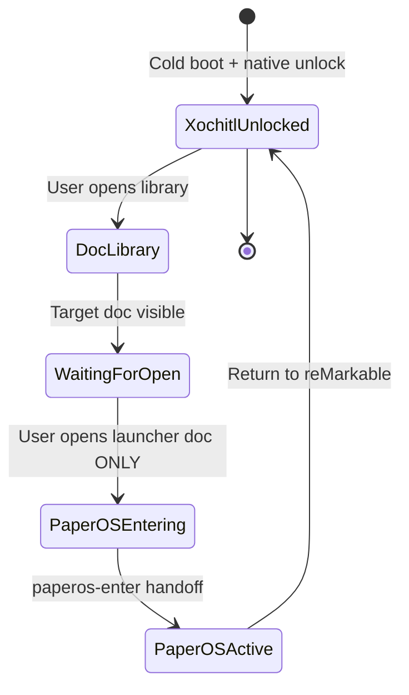
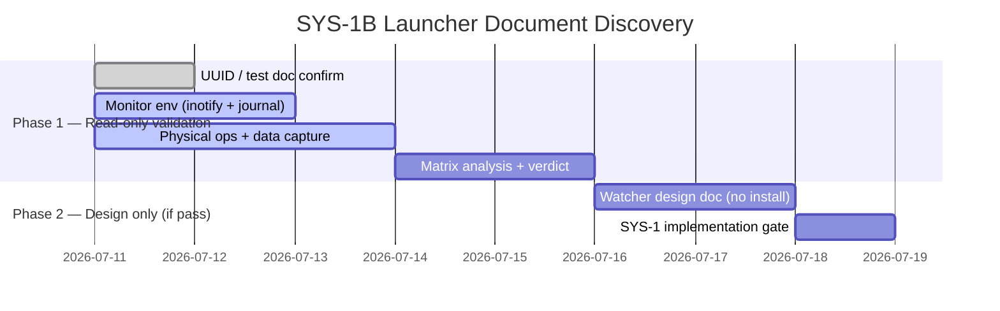

# PaperOS Device Lifecycle Discovery（P-MOVE-SYS-0 / SYS-1 discovery）

**Status:** SYS-0 **CONDITIONAL PASS — accepted**（2026-07-11）· SYS-1 implementation **blocked on launch-surface discovery**
**Owner:** Codex + Ken
**Agent 线:** Line B（Shell）· **P-MOVE-VERIFY** PASS（同设备窗口）
**阻塞：** `P-MOVE-SYS-1` 实现须待 launch-surface discovery 产出可验证信号；`P-MOVE-SYS-2` 及之后 **HARD BLOCKED**

> PaperOS 正在从「前台 App」升级为 **设备主 Shell**。本 gate 产出**真机状态机**，回答启动、退出、睡眠、唤醒、崩溃恢复与同步在 suspend 下的行为。

## 当前权威状态（2026-07-11）

| 阶段 | 状态 | 说明 |
| --- | --- | --- |
| `P-MOVE-VERIFY` | **PASS** | 生产数据面 E2E；见 [`paperos-data-plane-verify-2026-07-11.md`](./paperos-data-plane-verify-2026-07-11.md) |
| `P-MOVE-SYS-0` | **CONDITIONAL PASS — accepted** | 有界 enter/exit、suspend baseline、单次强杀恢复 |
| `P-MOVE-SYS-1A` | **BLOCKED / CLOSED** | 三击电源键；无可靠原生 UI 解锁证明 |
| `P-MOVE-SYS-1B` | **ACTIVE / INCOMPLETE** | Launcher Document 只读 discovery；尚无 verdict |
| `P-MOVE-SYS-1` 实现 | **BLOCKED** | 尚无通过 discovery 的设备端 launch surface |
| `P-MOVE-SYS-2` | **HARD BLOCKED** | 依赖 SYS-1 |
| `P-MOVE-6` | **BLOCKED** | 依赖 SYS-2 |
| `SYS-GATE` | **BLOCKED** | 等待完整生命周期链 |
| `SYS-3` / Mode B | **OUT OF SCOPE** | 自动启动禁止；未来亦须默认 Off |

### 依赖链

```text
VERIFY ✅
→ SYS-0 🟡 accepted
→ SYS-1 launch-surface discovery 🔄 (SYS-1B active)
→ SYS-1 implementation 🔒
→ SYS-2 🔒
→ P-MOVE-6 🔒
→ SYS-GATE 🔒
```

SYS-0 的 accepted conditional pass **仅授权**有界的 launch-surface read-only discovery；**不授权**在无 passing launch mechanism 时开工 lifecycle supervisor 或 SYS-2。

### 最终安全 handoff 状态（2026-07-11 session 结束）

```text
xochitl = active
rm-sync = active
PaperOS process count = 0
```

## 产品假设：PaperOS 默认启动模式

**定案（2026-07-11）：** MVP 采用 **Mode A — Xochitl default**；架构按 **「A 默认、B-ready」** 实现——`SYS-1` 先完成安全进出与故障回退，`SYS-3` 再加入默认关闭的 Beta 自动启动。

### 决策

PaperOS MVP 采用 **Mode A — Xochitl default**。

设备启动和解锁流程继续由原生系统负责。PaperOS 必须支持用户**直接在设备上**进入和退出，**不得**要求日常连接 Mac、SSH 或开发工具。

```text
Cold boot
→ Xochitl starts
→ User completes native unlock
→ User launches PaperOS on device
→ paperos-enter performs managed handoff
→ PaperOS becomes the foreground shell
```

PaperOS 的 System 菜单必须始终提供：

```text
Sleep
Restart PaperOS
Return to reMarkable
Restart device
Shut down
```

`Return to reMarkable` 必须：

1. 保存 PaperOS 当前状态和未提交笔迹；
2. 停止 PaperOS；
3. 释放显示、触控和 Marker 资源；
4. 启动或恢复 Xochitl；
5. 验证 Xochitl 及相关原生服务（含 rm-sync）恢复；
6. 不依赖 Mac 或 SSH。

### Beta 自动启动（Mode B-ready，SYS-3）

`P-MOVE-SYS-3` 可加入以下**默认关闭**设置：

```text
Launch PaperOS after unlock [Beta]: Off
```

开启后，supervisor 只能在确认原生解锁流程完成后自动运行 `paperos-enter`。**不得**在设备加密解锁之前抢占前台。

自动启动必须具备 crash-loop fallback：

```text
3 PaperOS launch failures within 120 seconds
→ disable auto-launch for the next boot
→ restore Xochitl
→ persist the failure reason
```

失败后须**持久关闭**下一次 auto-launch（非仅临时回 Xochitl），避免重启再次进入失败循环。设备侧须有 documented safe action 可关闭 auto-launch 并回到 Xochitl，无需 Mac。

### 升级为推荐模式（Mode B 默认）的条件

Mode B **不得**仅凭功能完成进入默认状态。须通过：

| Gate                |                                 最低标准 |
| ------------------- | ---------------------------------------: |
| PaperOS → Xochitl   |                          连续 10/10 成功 |
| Xochitl → PaperOS   |                          连续 10/10 成功 |
| Crash-loop fallback |                    强制失败 5/5 自动恢复 |
| 短按睡眠／唤醒      |             连续 20 次无黑屏、无输入失效 |
| Folio 睡眠／唤醒    |                           连续 20 次通过 |
| 写入中睡眠          |                       10/10 不丢最后笔迹 |
| 冷启动              |             10/10 不绕过解锁、不进入循环 |
| 长时间运行          |               至少 48 小时无不可恢复故障 |
| 无 Mac 恢复         | 用户仅用设备可关闭自动启动并返回 Xochitl |

另须通过：冷启动与解锁 Gate · 双向切换 Gate · 电源键与 Folio Gate · 写入中 suspend 完整性 Gate（见 [`paperos-device-lifecycle-gate.md`](./paperos-device-lifecycle-gate.md)）。

在上述条件完成前，**Mode A 保持默认**；Mode B 仅作为明确标注的 Beta 选项。

---

在 **45–60 分钟设备窗口**内，用日志与 instrumentation 回答 hub / `AGENT_WORKSTREAMS.md` §PaperOS lifecycle 所列问题。**禁止**只写桌面推测。

## 必须采集的命令

在设备上（USB SSH）记录输出到本目录证据或粘贴于下文 §采集记录：

```bash
systemctl cat xochitl
systemctl status xochitl
systemctl list-dependencies sleep.target
systemctl list-dependencies suspend.target
cat /sys/power/state
cat /etc/os-release
journalctl -b --no-pager | tail -200
```

## 必须 instrumentation 的场景

| #   | 场景                                                   | 记录                         |
| --- | ------------------------------------------------------ | ---------------------------- |
| 1   | 冷启动 → 解锁 → 当前默认谁在前台                       | journal + 操作者备注         |
| 2   | `systemctl start paperos` 前后 xochitl / rm-sync 状态  | `systemctl status`           |
| 3   | PaperOS Exit 后 xochitl 是否恢复、rm-sync 是否 active  | 同上                         |
| 4   | 短按电源键 睡眠 → 再按 唤醒                            | journal 时间窗               |
| 5   | Folio 合上 → 打开（若硬件支持）                        | 操作者 + journal             |
| 6   | PaperOS 前台时 suspend：进程是否冻结、最后一帧是否保留 | `ps` / journal               |
| 7   | 唤醒后触控、Marker、显示刷新                           | 操作者                       |
| 8   | Qt `applicationStateChanged` 是否出现在 epaper 平台    | PaperOS 日志（若已加 probe） |
| 9   | 唤醒后 Wi-Fi 与 sync 行为                              | `ApiClient` / footer 状态    |

## 实测状态机（2026-07-11 SYS-0）

```text
NATIVE              — xochitl=active；rm-sync=active；Ken 触控与 Marker 正常
ENTERING_PAPEROS    — existing /home/root/paperos/open-paperos.sh stops xochitl/rm-sync,
                      then runs one PaperOS foreground process
PAPEROS_ACTIVE      — verified; touch usable but visibly delayed with stale-frame residue;
                      Marker note stroke observed normal
PAPEROS_AMBIENT     — not distinguished
SUSPENDED           — systemctl suspend reached kernel deep suspend; PaperOS process survived
RESUMING            — power-button wake was logged; screen lit, but Ken could not visually
                      confirm a distinct locked/sleep state
RECOVERY            — kill -9 PaperOS → existing temporary open-paperos.sh wrapper started
                      xochitl + rm-sync; this is recovery class B, not native/automatic recovery
```

## 开放问题清单

| 问题                             | 结论（采集后） | 证据 |
| -------------------------------- | -------------- | ---- |
| 重启后谁先启动？                 | 未测；Mode A 规定 Xochitl 默认 | 无 cold-boot evidence |
| 必须经过 xochitl 解锁吗？        | 未测；不得据此改变 Mode A      | 无 unlock evidence |
| 无 Mac/SSH 如何进入 PaperOS？    | **未解决** — SYS-1 launch surface discovery 进行中 | SYS-1A closed；SYS-1B incomplete |
| 如何安全返回 xochitl + rm-sync？ | 正常 exit 与单次 force-kill wrapper 均恢复 | 15:52 与 16:06 evidence |
| 短按电源键行为？                 | logind 收到事件，但 PaperOS 无可见 sleep | Ken + journal |
| Folio 睡眠/唤醒？                | INCONCLUSIVE；设备无 Folio     | Ken observation |
| suspend 期间 Qt Timer / 网络？   | 未测                            | no timer/network instrumentation |
| 唤醒后 sync 补偿策略？           | 未测                            | SYS-2 scope |
| 连续崩溃 fallback？              | 未测（单次 kill only）         | SYS-GATE scope |

## 2026-07-11 采集记录（部分；不得据此放行 SYS-1）

### Finding 1 — native service baseline

**Observation:** Xochitl 与 rm-sync 在原生状态同时 active；`rm-sync.service`
`BindsTo=` / `PartOf=` Xochitl，Xochitl `Wants=` rm-sync。

**Evidence:** `systemctl cat/show/list-dependencies xochitl`；运行进程为
`/usr/bin/xochitl --system` 与 `/usr/bin/rm-sync`。

**Interpretation:** 停止 Xochitl 会连带停止 rm-sync；恢复原生 UI 时必须同时
验证两个 unit，而不是只验证 Xochitl PID。

**Implementation consequence:** `SYS-1` readiness/recovery 必须以 unit active
状态加真实 UI/输入恢复为准。

**Confidence:** High.

**Open question:** rm-sync 恢复后何时达到可用同步状态，尚未做持续窗口观察。

### Finding 2 — persistence and systemd baseline

**Observation:** systemd 为 `255.21`；`/home` 是持久加密 ext4；根分区只读；
`/etc` 是 volatile overlay；`paperos.service` 当前未安装。

**Evidence:** `systemctl --version`、`mount` / `df`、`systemctl status/cat paperos`。

**Interpretation:** `/home/root/paperos/` 是正确的 owned/persistent path；依赖
`/etc/systemd/system` symlink 的安装会在 overlay 生命周期后丢失。

**Implementation consequence:** 若 SYS-1 需要 unit，必须提供可重复 install、
uninstall、OS-update relink 与 rollback，不覆盖原生 Xochitl unit。

**Confidence:** High.

**Open question:** OS 升级与完整重启各自何时清空 `/etc` overlay，待实测。

### Finding 3 — bounded enter and normal exit

**Observation:** home-owned launcher 停止 Xochitl/rm-sync 后启动单一 PaperOS；
PaperOS bridge 就绪、生产 cache 更新；System 的 **Return to reMarkable** 正常
退出后 Xochitl 与 rm-sync 均恢复 active，未残留 PaperOS 进程。

**Evidence:** `15:50:45` Xochitl/rm-sync stopped；`15:52:26` Xochitl started；
`15:52:27` 两 unit active；[`paperos-data-plane-verify-2026-07-11.md`](./paperos-data-plane-verify-2026-07-11.md)。

**Interpretation:** 现有 launcher 足以支持 SYS-0 的有界正常进出测试。
PaperOS 触控/Marker/显示在单次 session 内已观测；单次强杀恢复亦已验证（Finding 6）。
Folio、重复崩溃、无 SSH 设备端入口仍未解决。

**Implementation consequence:** 保持 Mode A；SYS-1 实现仍 blocked，须待
launch-surface discovery（SYS-1B）产出可验证信号后方可定义 owned lifecycle supervisor。

**Confidence:** Medium–High for bounded enter/exit; High for single kill recovery.

**Open question:** 重复崩溃、wrapper 中断、无 Mac/SSH 设备端入口；Folio 不可用。

### Finding 4 — PaperOS input and display behavior

**Observation:** Ken could navigate in PaperOS with touch, but reported a clear
delay and stale-frame residue. In a PaperOS note, Marker drawing was normal.
After a suspend/resume, touch still worked, but the note-page Back touch target
only closed the toolbar instead of navigating back.

**Evidence:** PaperOS test bridge stayed alive across the interaction; its log
showed the epaper touch handler and Marker `/dev/input/event2` initialization.
Ken separately observed the physical panel and inputs.

**Interpretation:** input ownership is viable for this bounded session, but
PaperOS cannot yet claim production-quality display/input behavior. The Back
target issue is a UI/input-routing defect, not evidence that native resources
remain grabbed.

**Implementation consequence:** do not change UI or ink in SYS-0. Carry the
display latency/residue and Back-target defect into the appropriate later UI
workstream; SYS-1 readiness must not use bridge liveness alone as proof of
physical usability.

**Confidence:** High for the operator observation; Medium for root cause.

**Open question:** whether a controlled full refresh removes the residue
without unacceptable latency, and whether the Back conflict is reproducible.

### Finding 5 — power key and explicit suspend

**Observation:** while PaperOS was foreground, Ken's short power-key press had
no visible effect. `systemd-logind` recorded the key event. A one-off
`systemctl suspend` did perform a kernel deep suspend and returned on a
power-button wake; Ken saw the screen light but could not confirm a distinct
locked/sleep visual state.

**Evidence:** three `Power key pressed short` records at `16:02:46`–`16:02:56`;
then `systemctl suspend` at `16:03:58`, `PM: suspend entry (deep)`,
`rm_sleep_monitor Enter suspend`, `PM: suspend exit`, and `System returned
from sleep operation` at `16:04:15`.

**Interpretation:** the hardware and system suspend path work, but PaperOS has
not integrated the power-key request into a user-visible sleep policy.

**Implementation consequence:** this is a SYS-2 requirement: pre-suspend
flush, static sleep screen, controlled resume refresh, and one wake sync
reconciliation. Do not infer that short press is correct merely because
logind saw the event.

**Confidence:** High.

**Open question:** why the short press is not being acted on while Xochitl is
stopped, and whether it is expected to be handled by a native daemon.

### Finding 6 — forced termination recovery

**Observation:** PaperOS was force-killed once. Xochitl and rm-sync returned
active, no PaperOS process remained, and Ken verified both native touch and
Marker afterwards.

**Evidence:** exact command: `kill -9 9239` at `16:06:39`; by `16:06:41`,
`xochitl=active`, `rm-sync=active`, and PaperOS count was `0`. The existing
`/home/root/paperos/open-paperos.sh` trap then launched Xochitl.

**Interpretation:** recovery classification is **B — performed by a pre-existing
temporary recovery wrapper**. It is neither native recovery nor automatic
boot/supervisor recovery; it must not be represented as either.

**Implementation consequence:** the wrapper is acceptable SYS-0 evidence only.
SYS-1 must define an owned, idempotent lifecycle mechanism only after
launch-surface discovery passes — not merely because SYS-0 is accepted.

**Confidence:** High for this single test.

**Open question:** repeated crash behavior, interrupted wrapper behavior, and
no-SSH/device-only recovery remain untested.

## Ken physical observations (separate from logs)

| Test | Observation |
| --- | --- |
| Native touch baseline | Fast, clear, no issue |
| Native Marker baseline | Normal |
| PaperOS touch | Usable, but clearly delayed with old-frame residue |
| PaperOS Marker | Note page had no issue |
| PaperOS short power press | No visible reaction |
| Folio | Not available for this device session |
| Explicit suspend / power wake | No clear initial lock state observed; subsequent power press lit the screen |
| Native touch after kill | Original native system was responsive and good |
| Native Marker after kill | Not grabbed; normal |

### SYS-0 verdict

**CONDITIONAL PASS — accepted**（2026-07-11）。Safe bounded entry/exit and
single-crash return to Xochitl are understood, including verified native
touch/Marker recovery after force-kill. Physical power-key behavior in PaperOS
fails the expected sleep UX; Folio is untested; resume display/network/Qt
lifecycle behavior remains open. These are bounded **SYS-2** questions; they do
not authorize auto-launch, boot changes, SYS-1 implementation without a launch
surface, or any SYS-3 work.

---

## P-MOVE-SYS-1 — Launch surface discovery（总览）

**执行摘要：** SYS-1（设备端显式启动 PaperOS）仍 **BLOCKED**。官方要求保留 Xochitl
启动链与解锁职责；社区方案（XOVI/AppLoad、三击电源）存在兼容性与 bootloop 风险。
**优先路径：SYS-1B Launcher Document**（只读 discovery）。SYS-1A 已关闭。

### 指导原则

| 原则 | 要求 |
| --- | --- |
| **安全第一** | 不改动启动链；不弱化解锁流程 |
| **非侵入性** | 不修改 Xochitl 二进制；不使用 LD_PRELOAD / AppLoad 注入（当前未授权） |
| **可回滚** | 任何系统改动须可卸载；`/etc` 持久化须单独批准 |
| **良好 UX** | 入口可发现；误触率低 |
| **可靠性** | 触发须隐含「用户已主动解锁并操作」——无法靠系统启发式自动证明 |

### 官方与社区要点（摘要）

- **[Xochitl（官方）](https://developer.remarkable.com/documentation/xochitl):**
  主界面应用；加密设备上负责解锁；proprietary；rm-sync 随 Xochitl systemd 启停；
  **运行时不应访问/修改文档存储**。
- **[Developer Mode（官方）](https://developer.remarkable.com/documentation/developer-mode):**
  磁盘加密保护引导链；`/home` 可直接修改；`/etc` 持久化须显式 overlay 处理
  （如 `umount -R /etc`）。
- **[XOVI](https://github.com/asivery/xovi) / [AppLoad](https://github.com/asivery/rm-appload):**
  社区扩展框架；可在 Xochitl 内嵌入口；**加密设备开机自启 XOVI 会导致 bootloop**；
  社区与上游已转向「三击电源 / 三击顶部 Logo 后手动启动」，且每次重启后常需
  SSH `xovi/start`（tethered manager）。
- **[xovi-tripletap](https://github.com/rmitchellscott/xovi-tripletap):**
  证明三击电源 systemd handler 可行；修改系统文件；**不解决 unlock proof**。

### 候选启动机制比较

| 机制 | 说明 | 优点 | 缺点 / 风险 | 回滚 / OTA |
| --- | --- | --- | --- | --- |
| **电源三击（SYS-1A）** | 监听 `KEY_POWER`，三击后 `paperos-enter` | 不改 Xochitl UI；可 systemd 部署 | **无 unlock proof**；单击仍 DeepSleep；误触 | 停服务即可；OTA 可能移除脚本 |
| **Launcher 文档（SYS-1B）** ⭐ | 用户打开指定文档 → 被动检测唯一信号 | 非侵入；须解锁后操作；无二进制修改 | 须区分主动打开 vs 索引/缩略图误报 | 删文档即可；无系统持久修改 |
| **XOVI + AppLoad** | Xochitl 内图标/菜单启动 | 集成度高；有 KOReader 先例 | **侵入性最大**；bootloop 风险；维护成本高 | 卸载 XOVI；可能涉及 `/etc` overlay |
| **D-Bus / 未公开 API** | 命令式后台启动 | 理论无痕 | **无公开接口**；需逆向；违反非侵入 | N/A — 不建议 |
| **其他硬件/手势** | Folio、笔、Logo 三击等 | 利用现有输入 | 难监控；易与原生行为冲突；Logo 三击类同 1A | 禁用脚本即可 |

⭐ = **当前优先路径**（只读 discovery，非 implementation）。

### 原生 UI 解锁完成 — 检测方法分析

官方 **未公开** unlock-complete 显式标志。以下线索 **均不可** 单独作为解锁证明：

| 信号 | 为何不足 |
| --- | --- |
| `/sys/.../secboot` = unlocked | 启动后即存在，非用户解锁结果 |
| `xochitl` / `rm-sync` active | 解锁屏阶段服务可能已运行 |
| `/home` mounted | Xochitl 之前即挂载 |
| boot delay N 秒 | 启发式；未授权 |
| MDM unlocked | 非 UI 解锁证明 |
| `journalctl -u xochitl` | 闭源；无已知稳定「登录成功」条目 |
| 文档索引/缩略图访问 | 难以区分解锁 vs 后台渲染 |

**结论：** 任何 SYS-1 机制须将 **用户显式操作**（如打开特定文档）作为解锁后的
代理信号，而不能依赖系统状态自动判断。

### SYS-1 状态机（Launcher 文档 — 用户视角）



### SYS-1 发现时间线（示意）



Phase 2 **不得**在 discovery verdict 之前开工。

---

## P-MOVE-SYS-1A — Triple-power launch trigger（2026-07-11 discovery）

**Verdict:** **BLOCKED and closed.** The triple-power implementation is **not
authorized.** Do not weaken the native-unlock requirement using heuristics.

### Candidate

Standalone device-local triple-power-press listener.

### Device facts

```text
Power input:     /dev/input/event0
Device name:     44440000.bbnsm:pwrkey
Events:          KEY_POWER press/release frames
```

### Discovery results

| # | Observation | Type |
| --- | --- | --- |
| 1 | Passive `evtest` observation; **no** `EVIOCGRAB` | Device fact |
| 2 | Native single short press still entered Xochitl DeepSleep | Device fact + Ken observation |
| 3 | Three rapid presses → three complete press/release pairs within ~624 ms | Device fact |
| 4 | Device finally remained on awake Xochitl screen | Ken observation |
| 5 | PaperOS never launched | Device fact |
| 6 | Xochitl and rm-sync remained active throughout | Device fact |
| 7 | No files, units, timers, `/etc` entries, or persistent state changed | Device fact |

### Guard findings（unlock proof）

以下 **均不能** 当作「用户已完成 Xochitl 原生 UI 解锁」的证明：

```text
/home mounted
xochitl = active
rm-sync = active
secboot sysfs = unlocked
boot delay N seconds
MDM unlocked state
```

- `/home` 在 Xochitl 之前即已挂载，不是 unlock guard。
- `/sys/devices/platform/lpgpr/secboot` 当前报告 `unlocked`，但该值在 Xochitl
  之前即存在，不是 validated native UI unlock proof。
- 未发现公开稳定的 D-Bus signal、launcher API 或 validated native lock/unlock state。

### Interpretation

电源键三击 **可以** 被监听（社区 [`xovi-tripletap`](https://github.com/rmitchellscott/xovi-tripletap)
已证明 persistent systemd handler 可行），但该路线 **不解决** PaperOS 要求的
native UI unlock proof，且 xovi-tripletap 修改系统文件/服务、目标为 XOVI启动。

### Product requirement（不变）

```text
Mode A — Xochitl default

Cold boot → Xochitl → Native unlock → User explicitly enters PaperOS
```

### 当前禁止路线（节选）

Triple-power listener · boot delay heuristic · `/home` mount heuristic ·
secboot heuristic · Xochitl-active heuristic · XOVI · AppLoad · LD_PRELOAD ·
Xochitl QML/binary patch · unknown D-Bus calls · auto-launch after boot or
guessed unlock.

---

## P-MOVE-SYS-1B — Launcher Document discovery（ACTIVE / INCOMPLETE）

**Status:** **ACTIVE / INCOMPLETE** — No verdict. No validated signal. No
implementation. No persistent device change.

**推荐优先级：** ⭐ **首选路径**（安全、非侵入、用户操作即 unlock 代理）。

### Candidate

Dedicated Xochitl document named **「Open PaperOS」**（最终 launcher 文档名待定；
当前 discovery 使用非敏感占位文档 **Quick sheets**）。

### Intended hypothesis

```text
User completes native unlock
→ opens the Xochitl document library
→ deliberately opens one exact launcher document
→ passive watcher detects a unique foreground-open signal
→ (future) paperos-enter is invoked
```

### Current progress only

| Step | Action | Status |
| --- | --- | --- |
| 1 | SYS-1B read-only discovery started | ✅ |
| 2 | **Quick sheets** as non-sensitive test doc · UUID `6dc48b38-4709-4c41-8b49-77d5e0b1630a` | ✅ |
| 3 | Ken entered Xochitl library/Home | ✅ |
| 4 | Quick sheets thumbnail visible | ✅ |
| 4b | **Monitoring feasibility probe** — inotify tooling absent; poll-harness substitute built | ✅（见下 Finding M-1） |
| 5 | Scroll thumbnail off-screen, back on-screen **without open** | ⬜ **next** |
| 6–13 | Full test matrix below | ⬜ pending |

### 测试文档路径（on-device）

```text
~/.local/share/remarkable/xochitl/
```

每个文档为一组同 UUID 前缀文件（如 `{UUID}.content`、`.metadata`、缩略图等）。
Discovery 阶段 **先记录 Quick sheets 的 UUID**，不新建 launcher 文档、不重命名。

```bash
# SSH 到设备后 — 只读确认 UUID（Xochitl 运行时也仅 ls，不修改）
ls -la ~/.local/share/remarkable/xochitl/ | head
# 找到 Quick sheets 对应 UUID 后：
ls -la ~/.local/share/remarkable/xochitl/<UUID>*
```

### Finding M-1 — 监控可行性（2026-07-11 read-only probe）

**Observation:** 设备 BusyBox v1.36.1 **不含** `inotifywait` / `inotifyd` /
`strace` / `fatrace` / `lsof`（`busybox` applet 仅 `stat`/`netstat`，无 inotify）。
`/home` 挂载为 `ext4 rw,relatime`，根分区 `ro,relatime`。xochitl store 仅 36 个文件。

**Interpretation:** 原 §监控环境 **终端 A** 依赖 `inotifywait -m -r`，在本设备
**不可运行**。`relatime` 语义下 atime 不会在重复 open 时更新，故 **atime 轮询
也不可靠**（T-04 的 ≥10 次打开只会首次 bump atime）。零足迹条件下只能观测
**写/新建/删除/大小变化**（缩略图再生、`.metadata` lastOpened、`.content`、sync
新建文件），**无法** 观测「只读不写」的纯 open。

**Implementation consequence:** Phase A 用 **3 通道零足迹 observer**（QA 工具集
[`apps/planner/paper-device/qa-tools/sys1b/`](../../apps/planner/paper-device/qa-tools/sys1b/README.md)）：

1. **`fd.log`** — ~60ms 轮询 `/proc/<xochitl-pid>/fd`，检测文档被**持有打开**
   的 fd（doc store 路径）。**唯一** 能证明「主动打开」而非写副作用的通道。
   已验证：idle 时目标 UUID **不在** fd 表（零假阳性基线）；快速 open/close 可能
   在两次采样间被漏掉——**fd 缺席 ≠ 未打开**。
2. **`snap-raw.log`** — 1 Hz `find`+`stat` 快照，`snap-diff.sh` 事后 diff 出
   `NEW/MOD/DEL`（写副作用：缩略图、`.metadata` lastOpened、`.content`、sync）。
   写副作用 **≠** 用户主动打开。
3. **`journal.log`** — `journalctl -fu xochitl`（xochitl 自身日志；闭源，无已知
   稳定「文档已打开」条目）。

> **`fd + snapshot + journal` 三通道联合** 才可能满足 §验收判定；snapshot **单独**
> 不得用于放行 SYS-1B。工具/停止/分析用法见该 README §runbook。

**升级路径（Phase B，仅当 Phase A 无法区分且 Ken 批准）：** 从 **可复审源码** +
chiappa SDK 编译最小静态 aarch64 inotify probe，记录源码 hash + 二进制 SHA-256，
**仅** 放于 `/tmp/paperos-sys1b/inotify-probe`，只 watch 目标 UUID，记录 `IN_OPEN
IN_ACCESS IN_CLOSE_NOWRITE IN_MODIFY IN_CLOSE_WRITE IN_CREATE IN_MOVED_TO
IN_DELETE`；测后删除整个 `/tmp/paperos-sys1b`。禁止预编译二进制/包安装/systemd/
`/etc`/root 改动。**当前未做。**

**回退路径（Phase C = SYS-1C，仅当 SYS-1B BLOCKED）：** launcher 文档 + **Marker
落笔确认**（新建一次性 notebook，非 Quick sheets）；关联「目标 UUID 写 + Marker
事件 ±1500ms」，cooldown 10s、debounce 2s；Marker 输入按能力重新发现，不硬编码
event 号。仅 discovery，不启动 PaperOS。

**Confidence:** High（工具缺失、挂载选项、idle fd 基线均为已验证设备事实）。

**Open question:** 「主动打开 Quick sheets」是否在 `fd.log` 产生稳定唯一信号，且
在 T-01/T-02/T-03/T-06/T-07/T-08 全部缺席。**待 Ken 跑矩阵（物理操作只有 Ken 可做）。**

### 监控环境（只读 discovery；每个物理操作前启动）

> **本设备修正（见 Finding M-1）：** 终端 A 的 `inotifywait` **不可用**。整套 A/B/C
> 已并入单一 QA observer——`observe-sys1b.sh` 一条命令启动 fd + snapshot + journal
> 三通道；`stop-sys1b.sh` 保证不留监控进程；`snap-diff.sh` 事后分析。

```bash
# 在 Mac 上运行；只读 SSH；三通道；Ctrl-C 或 stop-sys1b.sh 停止
apps/planner/paper-device/qa-tools/sys1b/observe-sys1b.sh
apps/planner/paper-device/qa-tools/sys1b/snap-diff.sh ~/paperos-sys1b-capture/<stamp>/snap-raw.log
```

**原方案（本设备不可运行，保留作参照）：**

```bash
# ⚠️ 本设备无 inotify-tools
inotifywait -m -r ~/.local/share/remarkable/xochitl/ \
  -e open,access,modify,close_write \
  --format '%T %e %w%f' --timefmt '%H:%M:%S'
```

**observer 内含 · 终端 B — Xochitl 日志：**

```bash
journalctl -fu xochitl --no-pager
```

**终端 C — 服务基线：**

```bash
watch -n2 'systemctl is-active xochitl rm-sync; pgrep -c paperos || echo 0'
```

**可选 — 目标文件时间戳：**

```bash
watch -n2 'ls -la --time-style=long-iso ~/.local/share/remarkable/xochitl/<UUID>.* 2>/dev/null'
```

**禁止：** `EVIOCGRAB` 抢占输入；修改 xochitl 目录内文件；安装 systemd watcher。

### 物理操作测试矩阵（SYS-1B）

对每一行：Ken 执行操作 → 记录 inotify 事件 + journal 片段 + 时间戳。
**成功标准：** 「主动打开目标文档」10/10 产生 **一致且唯一** 的候选信号；其他操作
**均不产生** 该信号。否则 verdict = **BLOCKED**。

| ID | 物理操作 | 预期（候选信号） | 实测信号 | 误触发？ | 日期 |
| --- | --- | --- | --- | --- | --- |
| T-01 | 进入文档库，目标缩略图可见，**不点击** | 无打开级信号 | _pending_ | — | — |
| T-02 | 滚动列表，目标缩略图滚出再滚回，**不打开** | 可能仅有 `.png`/缩略图访问，非完整打开 | _pending_ | — | — |
| T-03 | 搜索文档名，列表过滤显示，**不打开** | 仅索引查询，无打开 | _pending_ | — | — |
| T-04 | **主动打开**目标文档（≥10 次） | **核心：** 一致的唯一打开信号 | _pending_ | — | — |
| T-05 | 打开后返回文档库 / 关闭文档 | 可能有 save/close，**不应**重复触发启动级信号 | _pending_ | — | — |
| T-06 | 打开 **其他** 文档 | 无目标 UUID 的启动级信号 | _pending_ | — | — |
| T-07 | `systemctl suspend` + 电源唤醒后再打开目标 | 信号仍稳定，非陈旧事件 | _pending_ | — | — |
| T-08 | 等待 `rm-sync` 同步一轮 | 同步不 mimics 用户打开 | _pending_ | — | — |

### 验收判定

| 结果 | 条件 |
| --- | --- |
| **CONDITIONAL PASS（discovery）** | T-04 10/10 真阳性；T-01–T-03、T-06–T-08 无同信号假阳性 |
| **BLOCKED** | 无法区分主动打开与索引/缩略图/sync；或假阳性不可消除 |
| **INCOMPLETE** | 矩阵未跑完（当前状态） |

### 后续设计（仅 discovery PASS 后评审；**本阶段不实施**）

若发现可靠信号，方可起草（不安装）：

- 可选 systemd user/service 监听 **单一** 打开事件 → 调用 `paperos-enter`
- 去重：同一会话多次打开不重复启动
- `/etc` 持久化须：install · uninstall · reboot · OTA relink · rollback 设计
- 紧急：Xochitl 崩溃时不误启 PaperOS

### 备选（仅 SYS-1B BLOCKED 后考虑；当前未授权）

- XOVI/AppLoad 图标入口 — **侵入性高**；禁止开机自启；须单独 gate
- 三击顶部 Logo — 类同 SYS-1A，无 unlock proof
- D-Bus 逆向 — **禁止**

### 不得声称

- 打开文档有唯一 filesystem event（尚未证明）
- inotify 已足够
- launcher-document 机制已选定
- SYS-1B 已通过或失败
- 可安装 document watcher

### Platform constraint（官方）

[Xochitl 文档](https://developer.remarkable.com/documentation/xochitl) 以 UUID
文件组存放；**Xochitl 运行时不应访问或修改文档存储**。SYS-1B 只做被动 observation；
不修改文档库；不假定文件访问 ≡ 用户前台打开。

### 风险矩阵（SYS-1B discovery + 未来 implementation）

| 风险类别 | 具体风险 | 严重性 | 可能性 | 缓解 |
| --- | --- | :---: | :---: | --- |
| 安全/隐私 | 未解锁时启动 PaperOS | 高 | 中 | 仅用户打开文档触发；不用启发式 unlock |
| 启动失败 | 触发导致 Xochitl 崩溃 / bootloop | 高 | 低 | 禁止 XOVI 开机自启；单次明确操作后触发 |
| 误触发 | 索引/缩略图 mimics 打开 | 中 | 中 | 测试矩阵 T-01–T-08；10/10 真阳性门槛 |
| UX | 入口难发现或易误触 | 中 | 低 | 显式命名文档；电源方案已关闭 |
| OTA | 升级后 watcher 失效 | 中 | 中 | `/etc` overlay 设计 + relink 演练 |
| 系统稳定 | 监控进程资源/冲突 | 低 | 低 | discovery 用临时 SSH 会话；可快速停止 |
| 合规 | 违反官方规范 | 高 | 低 | 只读 discovery；不修改固件/二进制 |

---

## Resume from here（handoff）

**Resume task:** `P-MOVE-SYS-1B` read-only discovery — **T-02**

**Prerequisites（SSH 三终端）：** 按上文 §监控环境 启动 inotify + journalctl + watch。

**Next physical action:** In Xochitl library/Home, scroll the **Quick sheets**
thumbnail off-screen, then scroll it back into view **without opening** the
document. Record all file events vs T-02 expected row in §物理操作测试矩阵.

**Then continue matrix in order:** T-03 → T-04 (≥10×) → T-05 → T-06 → T-07 → T-08.

**Do not:** implement a watcher, create launcher document, rename files in
xochitl store, power listener, or any persistent service.

**End state check:**

```text
xochitl = active
rm-sync = active
PaperOS process count = 0
```

---

## 外部平台约束（保留引用）

1. **[Xochitl（reMarkable 官方）](https://developer.remarkable.com/documentation/xochitl):**
   主应用；含登录、设置、文档管理；proprietary；加密设备启动时必须运行；
   rm-sync 随 Xochitl systemd 启停；运行时不应修改文档存储。
2. **[Developer Mode（reMarkable 官方）](https://developer.remarkable.com/documentation/developer-mode):**
   `/home` 为首选可直接修改分区；根分区 rw 不自然跨重启保持；`/etc` 修改须
   overlay 显式处理。准确表述：**当前未授权持久 systemd 安装**；若将来需要，
   须单独设计 install/uninstall/reboot/OTA relink/rollback。
3. **[xovi-tripletap](https://github.com/rmitchellscott/xovi-tripletap):**
   证明三击电源键 handler 可行；修改系统；不建立 PaperOS unlock proof。
4. **[XOVI](https://github.com/asivery/xovi) / [AppLoad](https://github.com/asivery/rm-appload):**
   LD_PRELOAD/function-hook 扩展；**当前 SYS-1 未授权**；加密设备禁止 XOVI 开机自启。
5. **reMarkable 文档存储：** UUID 文件组于 `~/.local/share/remarkable/xochitl/`。

## Gate 关闭条件（SYS-GATE；未开始）

1. [`paperos-device-lifecycle-gate.md`](./paperos-device-lifecycle-gate.md) LC-01–LC-15 全部有设备证据
2. SYS-1 launch surface 通过且 implementation 完成
3. SYS-2 sleep/wake 完成
4. `AGENT_WORKSTREAMS.md` §依赖图 与本文一致

## 相关

- [`../roadmap/apps/planner-pro-move.md`](../roadmap/apps/planner-pro-move.md) §P-MOVE-SYS
- [`paperos-device-lifecycle-gate.md`](./paperos-device-lifecycle-gate.md)（SYS-GATE 用例）
- [`paperos-data-plane-verify-2026-07-11.md`](./paperos-data-plane-verify-2026-07-11.md)（VERIFY PASS）
- [`../PRO_MOVE_P_MOVE_4_EXIT_RECOVERY_LAUNCHER_GATE.md`](../PRO_MOVE_P_MOVE_4_EXIT_RECOVERY_LAUNCHER_GATE.md)（P-MOVE-4 基线）
