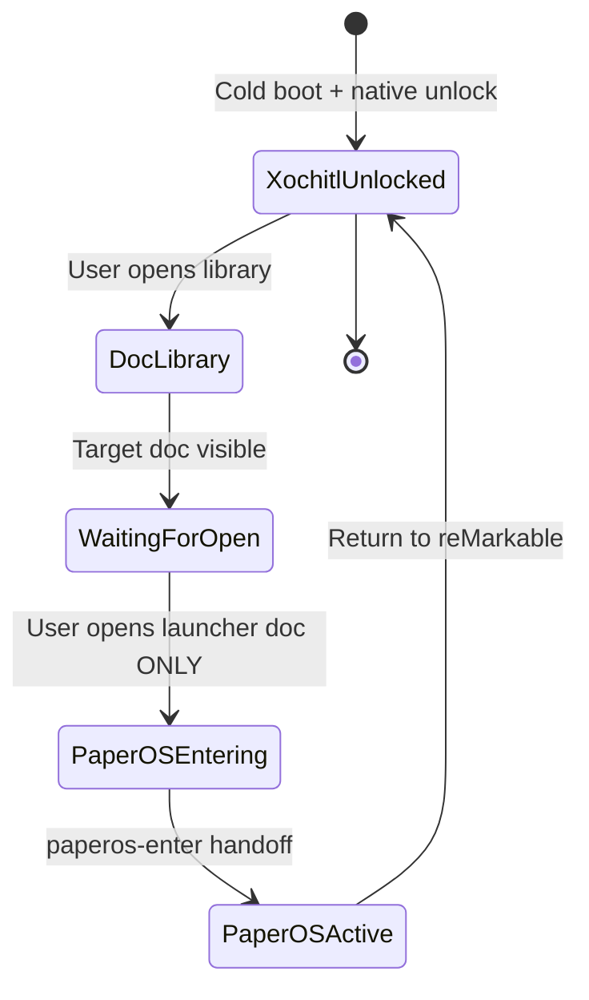
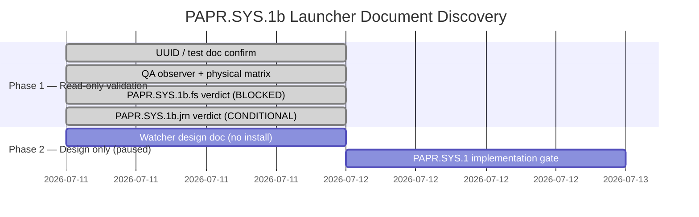

# PaperOS Device Lifecycle Discovery（`PAPR.SYS.0` / `PAPR.SYS.1` discovery）

> **Canonical ID：** [`../../roadmap/TICKET_NAMING.md`](../../roadmap/TICKET_NAMING.md) · Legacy 别名见对照表。

**Status:** PAPR.SYS.0 **CONDITIONAL PASS — accepted**（2026-07-11）· PAPR.SYS.1 launch architecture discovery **completed** · **PAPR.SYS.1 PRIMARY LANE** — design → 分步 impl（2026-07-12 · Ken 逐步授权）

> **导航 hub：** [`README.md`](./README.md) — 先读此页再进正文。
> **Owner:** Codex + Ken
> **Agent 线:** Line B（Shell）· **PAPR.DATA.verify** PASS（同设备窗口）
> **2026-07-11 暂停：** Owner 在 discovery 后暂停全量 impl · **2026-07-12 恢复主航道** — 仅 **分步**推进，每步须 Ken 授权
> **阻塞：** `PAPR.SYS.2` 及之后 **HARD BLOCKED** until PAPR.SYS.1 对应分步完成并有 reviewed verdict

> PaperOS 正在从「前台 App」升级为 **设备主 Shell**。本 gate 产出**真机状态机**，回答启动、退出、睡眠、唤醒、崩溃恢复与同步在 suspend 下的行为。

## 当前权威状态（2026-07-12）

| 阶段                  | 状态                                            | 说明                                                                                                      |
| --------------------- | ----------------------------------------------- | --------------------------------------------------------------------------------------------------------- |
| `PAPR.DATA.verify`    | **PASS**                                        | 生产数据面 E2E；见 [`data-plane-2026-07-11.md`](./data-plane-2026-07-11.md) |
| `PAPR.SYS.0`          | **CONDITIONAL PASS — accepted**                 | 有界 enter/exit、suspend baseline、单次强杀恢复                                                           |
| `PAPR.SYS.1a`         | **BLOCKED / CLOSED**                            | 三击电源键；无可靠原生 UI 解锁证明                                                                        |
| `PAPR.SYS.1b.fs`      | **BLOCKED / CLOSED**                            | lastOpened / metadata / snapshot / fd 无法可靠识别纯打开                                                  |
| `PAPR.SYS.1b.jrn`     | **CONDITIONAL PASS — accepted**                 | journal `EntityOpen::open` 含完整 UUID；真机矩阵 10/10 TP · 0 FP                                          |
| `PAPR.SYS.1` 实现     | **PRIMARY LANE — design → 分步 impl**           | 2026-07-12 主航道 Active；watcher / launcher 按 Ken 授权分步                                              |
| `PAPR.SYS.2`          | **HARD BLOCKED**                                | 依赖 PAPR.SYS.1                                                                                           |
| `PAPR.SYNC.6`         | **BLOCKED**                                     | 依赖 PAPR.SYS.2                                                                                           |
| `PAPR.SYS.gate`       | **BLOCKED**                                     | 等待完整生命周期链                                                                                        |
| `PAPR.SYS.3` / Mode B | **OUT OF SCOPE**                                | 自动启动禁止；未来亦须默认 Off                                                                            |

### 依赖链

```text
VERIFY ✅
→ PAPR.SYS.0 🟡 accepted
→ PAPR.SYS.1 launch discovery ✅ (PAPR.SYS.1b.jrn conditional pass)
→ PAPR.SYS.1 implementation 🟡 PRIMARY LANE（2026-07-12 · Ken 分步授权）
→ PAPR.SYS.2 🔒
→ PAPR.SYNC.6 🔒
→ PAPR.SYS.gate 🔒
```

Architecture discovery completed. **2026-07-12：** PAPR.SYS.1 主航道 Active — design + 分步 impl（每步 Ken 授权）。副线 agent 不得实现 watcher/launcher。

### 最终安全 handoff 状态（2026-07-11 session 结束）

```text
xochitl = active
rm-sync = active
PaperOS process count = 0
observer process count = 0
no temporary probe directory
paperos.service not installed
```

Also confirmed: no watcher · no launcher document · no systemd lifecycle integration · no `/etc` change · no XOVI · no AppLoad · no LD_PRELOAD · no automatic launch · PAPR.SYS.2 / PAPR.SYS.3 not started.

## 产品假设：PaperOS 默认启动模式

**定案（2026-07-11）：** MVP 采用 **Mode A — Xochitl default**；架构按 **「A 默认、B-ready」** 实现——`PAPR.SYS.1` 先完成安全进出与故障回退，`PAPR.SYS.3` 再加入默认关闭的 Beta 自动启动。

### 决策

PaperOS MVP 采用 **Mode A — Xochitl default**。

设备启动和解锁流程继续由原生系统负责。PaperOS 必须支持用户**直接在设备上**进入和退出，**不得**要求日常连接 Mac、SSH 或开发工具。

```text
Cold boot
→ Xochitl starts
→ User completes native unlock
→ User launches PaperOS on device
→ paperos-enter performs managed handoff
→ PaperOS becomes the foreground shell
```

PaperOS 的 System 菜单必须始终提供：

```text
Sleep
Restart PaperOS
Return to reMarkable
Restart device
Shut down
```

`Return to reMarkable` 必须：

1. 保存 PaperOS 当前状态和未提交笔迹；
2. 停止 PaperOS；
3. 释放显示、触控和 Marker 资源；
4. 启动或恢复 Xochitl；
5. 验证 Xochitl 及相关原生服务（含 rm-sync）恢复；
6. 不依赖 Mac 或 SSH。

### Beta 自动启动（Mode B-ready，PAPR.SYS.3）

`PAPR.SYS.3` 可加入以下**默认关闭**设置：

```text
Launch PaperOS after unlock [Beta]: Off
```

开启后，supervisor 只能在确认原生解锁流程完成后自动运行 `paperos-enter`。**不得**在设备加密解锁之前抢占前台。

自动启动必须具备 crash-loop fallback：

```text
3 PaperOS launch failures within 120 seconds
→ disable auto-launch for the next boot
→ restore Xochitl
→ persist the failure reason
```

失败后须**持久关闭**下一次 auto-launch（非仅临时回 Xochitl），避免重启再次进入失败循环。设备侧须有 documented safe action 可关闭 auto-launch 并回到 Xochitl，无需 Mac。

### 升级为推荐模式（Mode B 默认）的条件

Mode B **不得**仅凭功能完成进入默认状态。须通过：

| Gate                |                                 最低标准 |
| ------------------- | ---------------------------------------: |
| PaperOS → Xochitl   |                          连续 10/10 成功 |
| Xochitl → PaperOS   |                          连续 10/10 成功 |
| Crash-loop fallback |                    强制失败 5/5 自动恢复 |
| 短按睡眠／唤醒      |             连续 20 次无黑屏、无输入失效 |
| Folio 睡眠／唤醒    |                           连续 20 次通过 |
| 写入中睡眠          |                       10/10 不丢最后笔迹 |
| 冷启动              |             10/10 不绕过解锁、不进入循环 |
| 长时间运行          |               至少 48 小时无不可恢复故障 |
| 无 Mac 恢复         | 用户仅用设备可关闭自动启动并返回 Xochitl |

另须通过：冷启动与解锁 Gate · 双向切换 Gate · 电源键与 Folio Gate · 写入中 suspend 完整性 Gate（见 [`paperos/lifecycle-gate.md`](./lifecycle-gate.md)）。

在上述条件完成前，**Mode A 保持默认**；Mode B 仅作为明确标注的 Beta 选项。

---

在 **45–60 分钟设备窗口**内，用日志与 instrumentation 回答 hub / `AGENT_WORKSTREAMS.md` §PaperOS lifecycle 所列问题。**禁止**只写桌面推测。

## 必须采集的命令

在设备上（USB SSH）记录输出到本目录证据或粘贴于下文 §采集记录：

```bash
systemctl cat xochitl
systemctl status xochitl
systemctl list-dependencies sleep.target
systemctl list-dependencies suspend.target
cat /sys/power/state
cat /etc/os-release
journalctl -b --no-pager | tail -200
```

## 必须 instrumentation 的场景

| #   | 场景                                                   | 记录                         |
| --- | ------------------------------------------------------ | ---------------------------- |
| 1   | 冷启动 → 解锁 → 当前默认谁在前台                       | journal + 操作者备注         |
| 2   | `systemctl start paperos` 前后 xochitl / rm-sync 状态  | `systemctl status`           |
| 3   | PaperOS Exit 后 xochitl 是否恢复、rm-sync 是否 active  | 同上                         |
| 4   | 短按电源键 睡眠 → 再按 唤醒                            | journal 时间窗               |
| 5   | Folio 合上 → 打开（若硬件支持）                        | 操作者 + journal             |
| 6   | PaperOS 前台时 suspend：进程是否冻结、最后一帧是否保留 | `ps` / journal               |
| 7   | 唤醒后触控、Marker、显示刷新                           | 操作者                       |
| 8   | Qt `applicationStateChanged` 是否出现在 epaper 平台    | PaperOS 日志（若已加 probe） |
| 9   | 唤醒后 Wi-Fi 与 sync 行为                              | `ApiClient` / footer 状态    |

## 实测状态机（2026-07-11 PAPR.SYS.0）

```text
NATIVE              — xochitl=active；rm-sync=active；Ken 触控与 Marker 正常
ENTERING_PAPEROS    — existing /home/root/paperos/open-paperos.sh stops xochitl/rm-sync,
                      then runs one PaperOS foreground process
PAPEROS_ACTIVE      — verified; touch usable but visibly delayed with stale-frame residue;
                      Marker note stroke observed normal
PAPEROS_AMBIENT     — not distinguished
SUSPENDED           — systemctl suspend reached kernel deep suspend; PaperOS process survived
RESUMING            — power-button wake was logged; screen lit, but Ken could not visually
                      confirm a distinct locked/sleep state
RECOVERY            — kill -9 PaperOS → existing temporary open-paperos.sh wrapper started
                      xochitl + rm-sync; this is recovery class B, not native/automatic recovery
```

## 开放问题清单

| 问题                             | 结论（采集后）                                                                        | 证据                                                                               |
| -------------------------------- | ------------------------------------------------------------------------------------- | ---------------------------------------------------------------------------------- |
| 重启后谁先启动？                 | 未测；Mode A 规定 Xochitl 默认                                                        | 无 cold-boot evidence                                                              |
| 必须经过 xochitl 解锁吗？        | 未测；不得据此改变 Mode A                                                             | 无 unlock evidence                                                                 |
| 无 Mac/SSH 如何进入 PaperOS？    | **架构候选已找到，实现按步验收** — journal UUID 机制 viable；须专用 launcher + watcher | PAPR.SYS.1a/1b.fs closed；PAPR.SYS.1b.jrn conditional pass；PAPR.SYS.1 primary lane |
| 如何安全返回 xochitl + rm-sync？ | 正常 exit 与单次 force-kill wrapper 均恢复                                            | 15:52 与 16:06 evidence                                                            |
| 短按电源键行为？                 | logind 收到事件，但 PaperOS 无可见 sleep                                              | Ken + journal                                                                      |
| Folio 睡眠/唤醒？                | INCONCLUSIVE；设备无 Folio                                                            | Ken observation                                                                    |
| suspend 期间 Qt Timer / 网络？   | 未测                                                                                  | no timer/network instrumentation                                                   |
| 唤醒后 sync 补偿策略？           | 未测                                                                                  | PAPR.SYS.2 scope                                                                   |
| 连续崩溃 fallback？              | 未测（单次 kill only）                                                                | PAPR.SYS.gate scope                                                                |

## 2026-07-11 采集记录（部分；不得据此放行 PAPR.SYS.1）

### Finding 1 — native service baseline

**Observation:** Xochitl 与 rm-sync 在原生状态同时 active；`rm-sync.service`
`BindsTo=` / `PartOf=` Xochitl，Xochitl `Wants=` rm-sync。

**Evidence:** `systemctl cat/show/list-dependencies xochitl`；运行进程为
`/usr/bin/xochitl --system` 与 `/usr/bin/rm-sync`。

**Interpretation:** 停止 Xochitl 会连带停止 rm-sync；恢复原生 UI 时必须同时
验证两个 unit，而不是只验证 Xochitl PID。

**Implementation consequence:** `PAPR.SYS.1` readiness/recovery 必须以 unit active
状态加真实 UI/输入恢复为准。

**Confidence:** High.

**Open question:** rm-sync 恢复后何时达到可用同步状态，尚未做持续窗口观察。

### Finding 2 — persistence and systemd baseline

**Observation:** systemd 为 `255.21`；`/home` 是持久加密 ext4；根分区只读；
`/etc` 是 volatile overlay；`paperos.service` 当前未安装。

**Evidence:** `systemctl --version`、`mount` / `df`、`systemctl status/cat paperos`。

**Interpretation:** `/home/root/paperos/` 是正确的 owned/persistent path；依赖
`/etc/systemd/system` symlink 的安装会在 overlay 生命周期后丢失。

**Implementation consequence:** 若 PAPR.SYS.1 需要 unit，必须提供可重复 install、
uninstall、OS-update relink 与 rollback，不覆盖原生 Xochitl unit。

**Confidence:** High.

**Open question:** OS 升级与完整重启各自何时清空 `/etc` overlay，待实测。

### Finding 3 — bounded enter and normal exit

**Observation:** home-owned launcher 停止 Xochitl/rm-sync 后启动单一 PaperOS；
PaperOS bridge 就绪、生产 cache 更新；System 的 **Return to reMarkable** 正常
退出后 Xochitl 与 rm-sync 均恢复 active，未残留 PaperOS 进程。

**Evidence:** `15:50:45` Xochitl/rm-sync stopped；`15:52:26` Xochitl started；
`15:52:27` 两 unit active；[`paperos/data-plane-2026-07-11.md`](./data-plane-2026-07-11.md)。

**Interpretation:** 现有 launcher 足以支持 PAPR.SYS.0 的有界正常进出测试。
PaperOS 触控/Marker/显示在单次 session 内已观测；单次强杀恢复亦已验证（Finding 6）。
Folio、重复崩溃、正式 launcher、持久集成仍未解决；设备端入口现为 **viable candidate**，非已实现功能。

**Implementation consequence:** 保持 Mode A；PAPR.SYS.1 实现已解锁，但必须按 reviewed step 推进，不得一次性启用 watcher / auto-launch。
须待 owner 授权后设计专用 launcher 文档、journal watcher 与 owned lifecycle supervisor。

**Confidence:** Medium–High for bounded enter/exit; High for single kill recovery.

**Open question:** 重复崩溃、wrapper 中断、无 Mac/SSH 设备端入口；Folio 不可用。

### Finding 4 — PaperOS input and display behavior

**Observation:** Ken could navigate in PaperOS with touch, but reported a clear
delay and stale-frame residue. In a PaperOS note, Marker drawing was normal.
After a suspend/resume, touch still worked, but the note-page Back touch target
only closed the toolbar instead of navigating back.

**Evidence:** PaperOS test bridge stayed alive across the interaction; its log
showed the epaper touch handler and Marker `/dev/input/event2` initialization.
Ken separately observed the physical panel and inputs.

**Interpretation:** input ownership is viable for this bounded session, but
PaperOS cannot yet claim production-quality display/input behavior. The Back
target issue is a UI/input-routing defect, not evidence that native resources
remain grabbed.

**Implementation consequence:** do not change UI or ink in PAPR.SYS.0. Carry the
display latency/residue and Back-target defect into the appropriate later UI
workstream; PAPR.SYS.1 readiness must not use bridge liveness alone as proof of
physical usability.

**Confidence:** High for the operator observation; Medium for root cause.

**Open question:** whether a controlled full refresh removes the residue
without unacceptable latency, and whether the Back conflict is reproducible.

### Finding 5 — power key and explicit suspend

**Observation:** while PaperOS was foreground, Ken's short power-key press had
no visible effect. `systemd-logind` recorded the key event. A one-off
`systemctl suspend` did perform a kernel deep suspend and returned on a
power-button wake; Ken saw the screen light but could not confirm a distinct
locked/sleep visual state.

**Evidence:** three `Power key pressed short` records at `16:02:46`–`16:02:56`;
then `systemctl suspend` at `16:03:58`, `PM: suspend entry (deep)`,
`rm_sleep_monitor Enter suspend`, `PM: suspend exit`, and `System returned
from sleep operation` at `16:04:15`.

**Interpretation:** the hardware and system suspend path work, but PaperOS has
not integrated the power-key request into a user-visible sleep policy.

**Implementation consequence:** this is a PAPR.SYS.2 requirement: pre-suspend
flush, static sleep screen, controlled resume refresh, and one wake sync
reconciliation. Do not infer that short press is correct merely because
logind saw the event.

**Confidence:** High.

**Open question:** why the short press is not being acted on while Xochitl is
stopped, and whether it is expected to be handled by a native daemon.

### Finding 6 — forced termination recovery

**Observation:** PaperOS was force-killed once. Xochitl and rm-sync returned
active, no PaperOS process remained, and Ken verified both native touch and
Marker afterwards.

**Evidence:** exact command: `kill -9 9239` at `16:06:39`; by `16:06:41`,
`xochitl=active`, `rm-sync=active`, and PaperOS count was `0`. The existing
`/home/root/paperos/open-paperos.sh` trap then launched Xochitl.

**Interpretation:** recovery classification is **B — performed by a pre-existing
temporary recovery wrapper**. It is neither native recovery nor automatic
boot/supervisor recovery; it must not be represented as either.

**Implementation consequence:** the wrapper is acceptable PAPR.SYS.0 evidence only.
PAPR.SYS.1 must define an owned, idempotent lifecycle mechanism only after owner
authorizes implementation — not merely because PAPR.SYS.0 or PAPR.SYS.1b.jrn discovery passed.

**Confidence:** High for this single test.

**Open question:** repeated crash behavior, interrupted wrapper behavior, and
no-SSH/device-only recovery remain untested.

## Ken physical observations (separate from logs)

| Test                          | Observation                                                                 |
| ----------------------------- | --------------------------------------------------------------------------- |
| Native touch baseline         | Fast, clear, no issue                                                       |
| Native Marker baseline        | Normal                                                                      |
| PaperOS touch                 | Usable, but clearly delayed with old-frame residue                          |
| PaperOS Marker                | Note page had no issue                                                      |
| PaperOS short power press     | No visible reaction                                                         |
| Folio                         | Not available for this device session                                       |
| Explicit suspend / power wake | No clear initial lock state observed; subsequent power press lit the screen |
| Native touch after kill       | Original native system was responsive and good                              |
| Native Marker after kill      | Not grabbed; normal                                                         |

### PAPR.SYS.0 verdict

**CONDITIONAL PASS — accepted**（2026-07-11）。Safe bounded entry/exit and
single-crash return to Xochitl are understood, including verified native
touch/Marker recovery after force-kill. Physical power-key behavior in PaperOS
fails the expected sleep UX; Folio is untested; resume display/network/Qt
lifecycle behavior remains open. These are bounded **PAPR.SYS.2** questions; they do
not authorize auto-launch, boot changes, PAPR.SYS.1 implementation without owner
authorization, or any PAPR.SYS.3 work.

---

## PAPR.SYS.1 — Launch surface discovery（总览 · 2026-07-11 完成）

**执行摘要：** PAPR.SYS.1 launch architecture discovery **completed**.
PAPR.SYS.1a（三击电源）与 PAPR.SYS.1b.fs（文件系统信号）**BLOCKED / CLOSED**.
PAPR.SYS.1b.jrn（journal `EntityOpen::open` UUID）**CONDITIONAL PASS — accepted**.
PAPR.SYS.1 产品实现 **PRIMARY LANE**（2026-07-12）— design → 分步 impl，每步须 Ken 授权。

官方要求保留 Xochitl 启动链与解锁职责；社区方案（XOVI/AppLoad、三击电源）存在兼容性与 bootloop 风险。
**可行候选：** 用户在 Xochitl 内主动打开专用 launcher 文档 → journal watcher 检测目标 UUID →（未来）`paperos-enter`。

### 指导原则

| 原则         | 要求                                                                  |
| ------------ | --------------------------------------------------------------------- |
| **安全第一** | 不改动启动链；不弱化解锁流程                                          |
| **非侵入性** | 不修改 Xochitl 二进制；不使用 LD_PRELOAD / AppLoad 注入（当前未授权） |
| **可回滚**   | 任何系统改动须可卸载；`/etc` 持久化须单独批准                         |
| **良好 UX**  | 入口可发现；误触率低                                                  |
| **可靠性**   | 触发须隐含「用户已主动解锁并操作」——无法靠系统启发式自动证明          |

### 官方与社区要点（摘要）

- **[Xochitl（官方）](https://developer.remarkable.com/documentation/xochitl):**
  主界面应用；加密设备上负责解锁；proprietary；rm-sync 随 Xochitl systemd 启停；
  **运行时不应访问/修改文档存储**。
- **[Developer Mode（官方）](https://developer.remarkable.com/documentation/developer-mode):**
  磁盘加密保护引导链；`/home` 可直接修改；`/etc` 持久化须显式 overlay 处理
  （如 `umount -R /etc`）。
- **[XOVI](https://github.com/asivery/xovi) / [AppLoad](https://github.com/asivery/rm-appload):**
  社区扩展框架；可在 Xochitl 内嵌入口；**加密设备开机自启 XOVI 会导致 bootloop**；
  社区与上游已转向「三击电源 / 三击顶部 Logo 后手动启动」，且每次重启后常需
  SSH `xovi/start`（tethered manager）。
- **[xovi-tripletap](https://github.com/rmitchellscott/xovi-tripletap):**
  证明三击电源 systemd handler 可行；修改系统文件；**不解决 unlock proof**。

### 候选启动机制比较

| 机制                                              | 说明                                               | 优点                                  | 缺点 / 风险                                 | 回滚 / OTA                         |
| ------------------------------------------------- | -------------------------------------------------- | ------------------------------------- | ------------------------------------------- | ---------------------------------- |
| **电源三击（PAPR.SYS.1a）**                       | 监听 `KEY_POWER`，三击后 `paperos-enter`           | 不改 Xochitl UI；可 systemd 部署      | **无 unlock proof**；单击仍 DeepSleep；误触 | 停服务即可；OTA 可能移除脚本       |
| **Launcher 文档 + journal（PAPR.SYS.1b.jrn）** ⭐ | 用户打开指定文档 → journal `EntityOpen::open` UUID | 非侵入；须解锁后操作；10/10 TP · 0 FP | 依赖未公开 Xochitl 日志格式；OTA 可能改变   | 删文档即可；watcher 须 fail closed |
| **XOVI + AppLoad**                                | Xochitl 内图标/菜单启动                            | 集成度高；有 KOReader 先例            | **侵入性最大**；bootloop 风险；维护成本高   | 卸载 XOVI；可能涉及 `/etc` overlay |
| **D-Bus / 未公开 API**                            | 命令式后台启动                                     | 理论无痕                              | **无公开接口**；需逆向；违反非侵入          | N/A — 不建议                       |
| **其他硬件/手势**                                 | Folio、笔、Logo 三击等                             | 利用现有输入                          | 难监控；易与原生行为冲突；Logo 三击类同 1A  | 禁用脚本即可                       |

⭐ = **accepted discovery candidate**（PAPR.SYS.1b.jrn conditional pass；**非** production implementation）。

### 原生 UI 解锁完成 — 检测方法分析

官方 **未公开** unlock-complete 显式标志。以下线索 **均不可** 单独作为解锁证明：

| 信号                          | 为何不足                         |
| ----------------------------- | -------------------------------- |
| `/sys/.../secboot` = unlocked | 启动后即存在，非用户解锁结果     |
| `xochitl` / `rm-sync` active  | 解锁屏阶段服务可能已运行         |
| `/home` mounted               | Xochitl 之前即挂载               |
| boot delay N 秒               | 启发式；未授权                   |
| MDM unlocked                  | 非 UI 解锁证明                   |
| `journalctl -u xochitl`       | 闭源；无已知稳定「登录成功」条目 |
| 文档索引/缩略图访问           | 难以区分解锁 vs 后台渲染         |

**结论：** 任何 PAPR.SYS.1 机制须将 **用户显式操作**（如打开特定文档）作为解锁后的
代理信号，而不能依赖系统状态自动判断。

### PAPR.SYS.1 状态机（Launcher 文档 — 用户视角）



### PAPR.SYS.1 发现时间线（示意）



Phase 2 **paused by owner** — do not start without explicit authorization.

---

## PAPR.SYS.1a — Triple-power launch trigger（2026-07-11 discovery）

**Verdict:** **BLOCKED and closed.** The triple-power implementation is **not
authorized.** Do not weaken the native-unlock requirement using heuristics.

### Candidate

Standalone device-local triple-power-press listener.

### Device facts

```text
Power input:     /dev/input/event0
Device name:     44440000.bbnsm:pwrkey
Events:          KEY_POWER press/release frames
```

### Discovery results

| #   | Observation                                                             | Type                          |
| --- | ----------------------------------------------------------------------- | ----------------------------- |
| 1   | Passive `evtest` observation; **no** `EVIOCGRAB`                        | Device fact                   |
| 2   | Native single short press still entered Xochitl DeepSleep               | Device fact + Ken observation |
| 3   | Three rapid presses → three complete press/release pairs within ~624 ms | Device fact                   |
| 4   | Device finally remained on awake Xochitl screen                         | Ken observation               |
| 5   | PaperOS never launched                                                  | Device fact                   |
| 6   | Xochitl and rm-sync remained active throughout                          | Device fact                   |
| 7   | No files, units, timers, `/etc` entries, or persistent state changed    | Device fact                   |

### Guard findings（unlock proof）

以下 **均不能** 当作「用户已完成 Xochitl 原生 UI 解锁」的证明：

```text
/home mounted
xochitl = active
rm-sync = active
secboot sysfs = unlocked
boot delay N seconds
MDM unlocked state
```

- `/home` 在 Xochitl 之前即已挂载，不是 unlock guard。
- `/sys/devices/platform/lpgpr/secboot` 当前报告 `unlocked`，但该值在 Xochitl
  之前即存在，不是 validated native UI unlock proof。
- 未发现公开稳定的 D-Bus signal、launcher API 或 validated native lock/unlock state。

### Interpretation

电源键三击 **可以** 被监听（社区 [`xovi-tripletap`](https://github.com/rmitchellscott/xovi-tripletap)
已证明 persistent systemd handler 可行），但该路线 **不解决** PaperOS 要求的
native UI unlock proof，且 xovi-tripletap 修改系统文件/服务、目标为 XOVI启动。

### Product requirement（不变）

```text
Mode A — Xochitl default

Cold boot → Xochitl → Native unlock → User explicitly enters PaperOS
```

### 当前禁止路线（节选）

Triple-power listener · boot delay heuristic · `/home` mount heuristic ·
secboot heuristic · Xochitl-active heuristic · XOVI · AppLoad · LD_PRELOAD ·
Xochitl QML/binary patch · unknown D-Bus calls · auto-launch after boot or
guessed unlock.

---

## PAPR.SYS.1b — Launcher Document discovery（2026-07-11 完成）

Discovery split into two tracks: **PAPR.SYS.1b.fs** (filesystem signals) and **PAPR.SYS.1b.jrn** (journal signals). QA instrumentation: [`apps/planner/paper-device/qa-tools/sys1b/`](../../../apps/planner/paper-device/qa-tools/sys1b/README.md) — **QA-only discovery instrumentation**, not production lifecycle code, not installed as a device service.

### Test fixture（discovery only）

```text
Name: Quick sheets
UUID: 6dc48b38-4709-4c41-8b49-77d5e0b1630a
```

**Quick sheets was only the discovery fixture.** Do not write "Quick sheets is the PaperOS launcher." A future implementation requires a dedicated **「Open PaperOS」** document with its own stable UUID.

### Intended hypothesis（unchanged product requirement）

```text
User completes native unlock
→ opens the Xochitl document library
→ deliberately opens one exact launcher document
→ passive watcher detects journal EntityOpen UUID for that document
→ (future) paperos-enter is invoked
```

### 测试文档路径（on-device）

```text
~/.local/share/remarkable/xochitl/
```

每个文档为一组同 UUID 前缀文件。Discovery 阶段记录 Quick sheets UUID；**未**新建 launcher 文档、未重命名。

### Finding M-1 — 监控可行性（2026-07-11 read-only probe）

**Observation:** 设备 BusyBox v1.36.1 **不含** `inotifywait` / `inotifyd` /
`strace` / `fatrace` / `lsof`。`/home` 挂载为 `ext4 rw,relatime`；atime 轮询不可靠。

**Implementation consequence:** Phase A 用 **3 通道零足迹 QA observer**（`observe-sys1b.sh`）：

1. **`fd.log`** — `/proc/<xochitl-pid>/fd` 轮询（**PAPR.SYS.1b.fs：不可靠**）
2. **`snap-raw.log`** — 1 Hz `find`+`stat` 快照（**PAPR.SYS.1b.fs：不可靠**）
3. **`journal.log`** — `journalctl -fu xochitl`（**PAPR.SYS.1b.jrn：viable**）

Capture 示例（本地证据）：`~/paperos-sys1b-capture/<stamp>/`（`journal.log` · `fd.log` · `snap-raw.log`）。

```bash
apps/planner/paper-device/qa-tools/sys1b/observe-sys1b.sh
apps/planner/paper-device/qa-tools/sys1b/snap-diff.sh ~/paperos-sys1b-capture/<stamp>/snap-raw.log
apps/planner/paper-device/qa-tools/sys1b/stop-sys1b.sh
```

**Confidence:** High（工具缺失、挂载选项、idle fd 基线均为已验证设备事实）。

---

## PAPR.SYS.1b.fs — Filesystem route（BLOCKED / CLOSED）

**Verdict:** **BLOCKED / CLOSED.** Do not describe `lastOpened`, metadata polling, thumbnails, or FD polling as a viable production trigger.

### Device facts

Test document metadata baseline included:

```json
{
  "lastOpened": "1783786167802",
  "lastOpenedPage": 2
}
```

A physically confirmed target open, corroborated by Xochitl journal, produced:

- no `lastOpened` update · no `lastOpenedPage` update
- no metadata hash or mtime update · zero snapshot writes
- no target UUID hit in `/proc/<xochitl>/fd`

**Rejected production signals:** `.metadata lastOpened` · metadata mtime/hash · thumbnail writes · 1 Hz `find`+`stat` · `/proc/<pid>/fd` polling.

---

## PAPR.SYS.1b.jrn — Journal route（CONDITIONAL PASS — accepted）

**Verdict:** **CONDITIONAL PASS — accepted.** The exact journal UUID trigger mechanism is viable.

### J0 — Event signature（device fact）

```text
rm.library.ext.open
EntityOpen::open:
EntityId{<document UUID>}
```

Representative evidence (Quick sheets open):

```text
18:00:00.350 rm.library.ext.open
EntityOpen::open:
EntityId{6dc48b38-4709-4c41-8b49-77d5e0b1630a}

18:00:00.399 rm.docworker
-> worker on 6dc48b38-4709-4c41-8b49-77d5e0b1630a now running

18:00:00.402 rm.documentlockmanager
Opening document in unlocked mode:
6dc48b38-4709-4c41-8b49-77d5e0b1630a
```

**Interpretation:** UUID maps 1:1 to document basename; target vs non-target distinguishable; no file writes required; user must deliberately open in active Xochitl UI. Do **not** interpret `unlocked mode` alone as device-unlock proof.

### J1 — Bounded physical matrix（2026-07-11）

| Action                 | Trials / window | Target UUID events | Notes                                    |
| ---------------------- | --------------: | -----------------: | ---------------------------------------- |
| Home idle              |            15 s |                  0 | no false positive                        |
| Settings → Home        |               5 |                  0 | no false positive                        |
| Search without opening |               3 |                  0 | no false positive                        |
| Open other document    |               5 |                  0 | five distinct non-target UUID events     |
| Open Quick sheets      |              10 |             **10** | one target event per open                |
| Suspend / resume       |               3 |                  0 | no false positive                        |
| Xochitl restart        |               1 |                  0 | no false positive                        |
| rm-sync-active idle    |          ~2 min |                  0 | not a confirmed network sync transaction |

```text
Target true positive: 10/10 · Known false positives: 0
One deliberate target open → one target EntityOpen event
```

Latency meets current ≤1000 ms requirement (event before fully visible document UI).

### Why CONDITIONAL PASS only

Undocumented Xochitl log format; OTA may change category, level, format, or journal reconnect. Future watcher must **fail closed** on unknown build, missing pattern, ambiguous parser, journal unavailable, missing/deleted launcher UUID, or old-event replay risk → leave Xochitl active, do not launch PaperOS.

### 物理操作测试矩阵（completed via J1）

| ID   | 物理操作            | 预期           | 实测（journal UUID） | 误触发？ | 日期       |
| ---- | ------------------- | -------------- | -------------------- | -------- | ---------- |
| T-01 | 缩略图可见，不点击  | 无目标 UUID    | 0                    | 否       | 2026-07-11 |
| T-02 | 滚动 off/on，不打开 | 无目标 UUID    | 0                    | 否       | 2026-07-11 |
| T-03 | 搜索，不打开        | 无目标 UUID    | 0                    | 否       | 2026-07-11 |
| T-04 | 主动打开 ≥10×       | 10/10          | **10/10**            | 否       | 2026-07-11 |
| T-05 | 打开后返回库        | 不重复启动级   | —                    | —        | 2026-07-11 |
| T-06 | 打开其他文档        | 无目标 UUID    | 0 target             | 否       | 2026-07-11 |
| T-07 | suspend + 唤醒      | 稳定           | 0 FP                 | 否       | 2026-07-11 |
| T-08 | rm-sync idle        | 不 mimics 打开 | 0                    | 否       | 2026-07-11 |

### PAPR.SYS.1 implementation — NOT STARTED

Not implemented: dedicated Open PaperOS document · production launcher UUID · journal watcher · cursor · replay prevention · reconnect · disarm/re-arm · `paperos-enter`/`paperos-exit` · single-instance lock · readiness timeout/recovery · persistent systemd · install/uninstall · reboot · OTA relink · rollback · fail-closed policy · deleted-launcher handling.

### 不得声称

- Quick sheets is the production launcher
- filesystem / fd / lastOpened is the trigger
- journal watcher is installed or shipping
- PAPR.SYS.1 is implemented, in progress, or PASS

### Platform constraint（官方）

[Xochitl 文档](https://developer.remarkable.com/documentation/xochitl) — passive observation only; no document store modification.

### 风险矩阵（PAPR.SYS.1b.jrn + 未来 implementation）

| 风险类别       | 具体风险               | 严重性 | 可能性 | 缓解                                 |
| -------------- | ---------------------- | :----: | :----: | ------------------------------------ |
| OTA / 日志格式 | journal pattern 变更   |   高   |   中   | fail closed                          |
| 安全/隐私      | 未解锁时启动           |   高   |   低   | 仅打开 launcher 文档                 |
| 误触发         | sync/索引 mimics 打开  |   中   |   低   | J1 matrix 0 FP                       |
| 重放           | watcher restart 旧事件 |   中   |   中   | cursor + replay prevention（待设计） |
| UX             | launcher 被删          |   中   |   低   | 删除检测 → fail closed               |

---

## Future resume point（owner authorization required）

Paused intentionally after architecture discovery. **Do not resume without explicit owner authorization.**

**Next phase:** `PAPR.SYS.1` design — **not PAPR.SYS.2**

1. Design dedicated **「Open PaperOS」** document + UUID binding
2. Design live-only journal watcher with replay prevention
3. Design fail-closed OS/Xochitl compatibility checks
4. Design `paperos-enter` / `paperos-exit` ownership boundaries
5. Design install, uninstall, reboot, OTA relink, rollback
6. Manually started bounded prototype before persistent enablement

**End state at pause:**

```text
xochitl = active · rm-sync = active · PaperOS count = 0 · observer count = 0
```

---

## 外部平台约束（保留引用）

1. **[Xochitl（reMarkable 官方）](https://developer.remarkable.com/documentation/xochitl):**
   主应用；含登录、设置、文档管理；proprietary；加密设备启动时必须运行；
   rm-sync 随 Xochitl systemd 启停；运行时不应修改文档存储。
2. **[Developer Mode（reMarkable 官方）](https://developer.remarkable.com/documentation/developer-mode):**
   `/home` 为首选可直接修改分区；根分区 rw 不自然跨重启保持；`/etc` 修改须
   overlay 显式处理。准确表述：**当前未授权持久 systemd 安装**；若将来需要，
   须单独设计 install/uninstall/reboot/OTA relink/rollback。
3. **[xovi-tripletap](https://github.com/rmitchellscott/xovi-tripletap):**
   证明三击电源键 handler 可行；修改系统；不建立 PaperOS unlock proof。
4. **[XOVI](https://github.com/asivery/xovi) / [AppLoad](https://github.com/asivery/rm-appload):**
   LD_PRELOAD/function-hook 扩展；**当前 PAPR.SYS.1 未授权**；加密设备禁止 XOVI 开机自启。
5. **reMarkable 文档存储：** UUID 文件组于 `~/.local/share/remarkable/xochitl/`。

## Gate 关闭条件（PAPR.SYS.gate；未开始）

1. [`lifecycle-gate.md`](./lifecycle-gate.md) LC-01–LC-15 全部有设备证据
2. PAPR.SYS.1b.jrn conditional pass accepted; PAPR.SYS.1 implementation completed and reviewed
3. PAPR.SYS.2 sleep/wake 完成
4. `AGENT_WORKSTREAMS.md` §依赖图 与本文一致

## 相关

- [`../../roadmap/apps/paperos.md`](../../roadmap/apps/paperos.md) §PAPR.SYS
- [`lifecycle-gate.md`](./lifecycle-gate.md)（PAPR.SYS.gate 用例）
- [`data-plane-2026-07-11.md`](./data-plane-2026-07-11.md)（VERIFY PASS）
- [`../../archive/paperos/milestones-2026-07.md`](../../archive/paperos/milestones-2026-07.md)（PAPR.DEV.4 基线）
