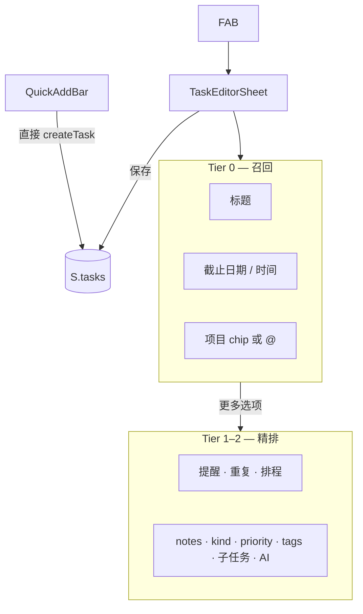

# Planner 任务捕获（Capture）规范 — 草案

> **Roadmap：** **PLNR.CAPTURE.0**（并入 **PLNR.UIUX.0** 走查前冻结）· [`../roadmap/apps/planner.md`](../roadmap/apps/planner.md)
> **代码锚点：** `QuickAddBar.svelte` · `TaskEditorSheet.svelte` · `Fab.svelte` · `taskEditorDefaults.js` · `ui.svelte.js`
> **姊妹文档：** [`planner-task-display-spec.md`](./planner-task-display-spec.md)（创建 → 列表展示契约）
> **状态：** 2026-07-12 字段 IA + Dialog 行为已实现；自动化通过，剩余真机 iOS 输入法 / 键盘 gate

## 术语

Planner 代码库无 `ticket` 命名；产品里的「工单 / ticket」= **Task（任务）**。全屏创建/编辑 UI 为 **`TaskEditorSheet`**（`role="dialog"`）；行内快速创建为 **`QuickAddBar`**。

---

## 1. 问题陈述

| 问题 | 现状 | 影响 |
| ---- | ---- | ---- |
| **两条路径能力分裂** | 已解决：`taskCapture.js` 共享 `@` 协议；Sheet 有 `ProjectPicker` | Today FAB / Inbox / 项目详情同一捕获语法 |
| **字段排序与频率不匹配** | 已解决：项目升至 Tier 0，从高级区移除 | 标题是主视觉；日期、时间、项目作为核心上下文 |
| **iOS 入口不对称** | Today 隐藏 QuickAdd；Inbox 无 FAB 仅有 QuickAdd | 用户在不同页面学到不同捕获习惯 |
| **技术债** | 已解决：`createTaskEditorDraft()` 完整初始化，默认折叠 | 不再因 `undefined !== default` 误展开 |
| **IME 覆盖不全** | 已解决：Sheet / QuickAdd 都使用 `createImeGuard()` | composition 期间 Enter 不选项、不提交 |

---

## 2. 设计原则

借鉴「召回 → 精排」分层（非搜索基础设施；仅作 UX 设计语言）：

1. **先召回、后精排** — 主区（Tier 0）≤ 4 个高频字段；其余折叠进「更多选项」
2. **输入即归属** — 项目用 chip / `@`，不藏在高级区深处下拉
3. **路径语法一致** — 同一 `@项目` 协议在所有入口生效（或文档明确标注例外）
4. **捕获–展示契约** — 主区暴露的字段必须在列表可见（见 §7；对齐 display spec）
5. **移动端优先** — iOS PWA：键盘、safe-area、sticky actions、`80dvh` 约束见 §8

---

## 3. 捕获路径矩阵（iOS PWA）

| 页面 | FAB | QuickAddBar | 默认 `dueDate` | 默认 `listId` | 典型创建方式 |
| ---- | --- | ----------- | -------------- | ------------- | ------------ |
| **Today** `/` | `large` | 隐藏 | 今天 | 设置默认 / inbox | FAB → TaskEditorSheet |
| **Inbox** | 无 | `showOnMobile` | `null` | `inbox` | QuickAdd（可 `@`）或空态 CTA → Sheet |
| **Upcoming** | `compact` | 隐藏 | `null` | 默认 | FAB → Sheet |
| **Calendar** | `compact` | 隐藏 | 选中日期 | 默认 | FAB / 日程槽 → Sheet（预填 schedule） |
| **Lists** `/lists/[id]` | `compact` | 桌面可见 | `null` | 该清单 | FAB → Sheet |
| **Projects** `/projects/[id]` | 无 | 共享 QuickAdd | `null` | 默认 | `QuickAddBar({ projectId })` |

**FAB 规则：** `apps/planner/src/lib/nav.js` → `resolveFabMode()`
**路由默认值：** `apps/planner/src/lib/taskEditorDefaults.js` → `resolveTaskEditorDefaults()`

---

## 4. 字段分层（Recall / Rerank）

### Tier 0 — 主区（Recall · 目标态）

| 顺序 | 字段 | 控件（目标） | 当前实现 |
| ---- | ---- | ------------ | -------- |
| 1 | **标题** | `#task-title` input | ✅ 主区 |
| 2 | **截止日期** | `DateField` | ✅ 主区 |
| 3 | **截止时间** | `TimeField` | ✅ 主区 |
| 4 | **项目** | `ProjectPicker` + 标题内 `@` 快捷语法 | ✅ 主区 |

**硬上限：** Tier 0 不超过 **4** 个字段（含项目）。

### Tier 1 — 一键扩展（与日期联动）

| 字段 | 依赖 |
| ---- | ---- |
| 提醒 `reminderMinutes` | 需 `dueDate` |
| 重复 `recurrence` | 独立 |
| 日程块 `scheduledDate` / `scheduledStart` / `durationMinutes` | `scheduledDate` 解锁时段 |

### Tier 2 — 高级（Rerank · 当前「更多选项」顺序）

notes → 提醒 → 重复 → 排程 → kind → priority → urgency/size → area/effort → nextAction → **项目（现状）** → aiContext → listId → tags → 子任务 → AI 拆分

**目标态调整：** 项目升至 Tier 0 后，从 Tier 2 移除重复项。

---

## 5. `@项目` 协议（当前实现 SSOT）

**SSOT：** `apps/planner/src/lib/domain/taskCapture.js`；消费端：`QuickAddBar.svelte` · `TaskEditorSheet.svelte` · `ProjectPicker.svelte`

| 项 | 规则 |
| -- | ---- |
| **触发正则** | `/(?:^|\s)@([^@\s]*)$/` |
| **数据源** | `selectableProjects()` — 排除 archived / shipped / deleted |
| **匹配** | 标题子串 `includes(atQuery)`，最多 **5** 条 |
| **选中** | `selectedProjectId = project.id`；`cleanTitle()` 剥离 `@片段` |
| **展示** | 输入框左侧 pill 徽章；可点击清除 |
| **提交** | `createTask({ title, listId, dueDate, projectId })` |
| **预填** | `projectId` prop（项目详情页） |

**设计边界（PLNR.PROJ.0）：** 保留 `task.projectId`；**不把项目名复制进任务标题**（`@片段` 仅作输入语法，提交前剥离）。

### 建议源优先级（目标态 · 多信号融合）

1. 路由预填 `projectId`（`/projects/[id]`）
2. 用户显式 `@` 选择
3. 最近使用项目（**待实现** · Parked）
4. 字母序全量（当前 Sheet `<select>` 行为）

### v1 明确不做（Not doing）

- `#标签` 语法（现状：逗号分隔 tags）
- 自然语言日期（`tomorrow`、`下周五`）
- 从标题解析 APP3 ticket ID（`PLNR.*`）
- 向量 / 语义项目检索
- 人员 `@` 提及

---

## 6. 校验与默认值

| 规则 | 现状 |
| ---- | ---- |
| 标题必填 | `save()` 仅 `title.trim()` 检查；保存按钮不 disabled |
| 新建 focus | `requestAnimationFrame(() => titleInput?.focus())` |
| Enter 保存 | TaskEditorSheet 标题；有 `createImeGuard()` |
| `createTask` 默认 priority | `'P3'`（`domain/tasks.js`） |
| 新建 draft | `createTaskEditorDraft()` 与 domain defaults 对齐（`priority: 'P3'` 等） |
| 标题校验 | 空标题时主按钮 disabled；强制保存路径显示行内错误 |
| 脏草稿 | 遮罩 / 关闭 / Escape / 取消均进入放弃确认 |
| 成功反馈 | Sheet / QuickAdd 统一 toast + 撤销；删除二次确认 + 撤销 |

---

## 7. 捕获–展示契约

与 [`planner-task-display-spec.md`](./planner-task-display-spec.md) 对齐：

| 捕获字段（Tier 0 目标） | 列表必须可见 | 展示位置 |
| ----------------------- | ------------ | -------- |
| `projectId` | ✅ | Chip 行 project chip（**Today compact 也要**） |
| `dueDate` / `dueTime` | ✅ | meta 行（按页面矩阵） |
| `scheduledDate` / `scheduledStart` / `durationMinutes` | ✅ | meta 时段 |
| `meta.kind` | ✅ | 色条 / 图标 |
| `reminderMinutes` | ✅ | 🔔 chip |
| `tags` | 可选 | chip（过多 +N） |
| `notes` / `aiContext` | ❌ | 仅编辑器 / 详情 |
| `subtasks` | 建议 | meta 或 chip `n/m` |

**原则：** 若在主区暴露某字段，关闭 dialog 后用户在对应列表页应能**一眼看到**该信息。

---

## 8. 移动端约束

| 约束 | 实现 |
| ---- | ---- |
| Sheet 高度 | `min(88dvh, var(--app-vh) - 8px)`，跟随 `visualViewport` |
| Safe area | `env(safe-area-inset-bottom)` on sheet + sticky actions |
| 触控目标 | 标题/日期 `min-height: 60px`；actions `56px` |
| 滚动锁定 | `lockScroll()` + PWA `body:has(.sheet-bg)`（`scroll-shell.css`） |
| FAB 定位 | `bottom: calc(112px + safe-area)` 避开 tab bar |
| IME | 见 [`input-ime.md`](./input-ime.md) §Planner Capture |

---

## 9. 验收（PLNR.CAPTURE.0 关闭）

1. ✅ **Today FAB** 创建任务可设项目（`@` 或 picker），不必进「更多选项」
2. ✅ Tier 0 字段 ≤ 4；项目已从高级区移除
3. ✅ **Inbox `@项目`** mobile + desktop E2E（含列表 project chip）
4. ✅ 新建任务默认折叠高级区
5. ✅ `QuickAddBar` 与 `TaskEditorSheet` 共享 `taskCapture.js`
6. ✅ 自动化截图：`docs/ui-qa-screenshots/planner/task-capture/latest/`
7. ⏳ 真机 iOS：中文 IME 选词、键盘开启高度、safe-area 人工复核

---

## 10. 实现切片

| 步 | 内容 | 文件 |
| -- | ---- | ---- |
| 0 | 对齐本规范 + display spec 契约 | 本文档 · `planner-task-display-spec.md` |
| 1 | ✅ 完整 draft defaults | `taskEditorDraft.js` · `ui.svelte.js` |
| 2 | ✅ 共享 `@` 协议 + project picker | `domain/taskCapture.js` · `ProjectPicker.svelte` |
| 3 | ✅ TaskEditorSheet 主区重组 | `TaskEditorSheet.svelte` |
| 4 | ✅ QuickAdd IME guard + keyboard listbox | `QuickAddBar.svelte` · `input-ime.md` |
| 5 | ✅ dirty guard · focus trap · Escape · toast/undo · delete confirm | `TaskEditorSheet.svelte` |
| 6 | ✅ unit / mobile + desktop E2E / 截图 | QA |
| 7 | ⏳ 真机 iOS 键盘 + CJK IME | Ken gate |

**Agent：** 并入 **PLNR.UIUX.0** Fable 走查（与 P-TASK-DISPLAY-0 并行）· Codex 单测 / E2E

---

## 11. 风险与缓解

| 风险 | 缓解 |
| ---- | ---- |
| 两路径继续分裂 | 共享 picker 模块；capture spec 为语法 SSOT |
| 主区字段膨胀 | Tier 0 硬上限 4 |
| `@` + IME 冲突 | 先 spec 再实现；composition 期间不触发建议下拉 |
| 优化后列表信息丢失 | §7 契约表 + display spec 联合验收 |
| scope 膨胀（NL 日期 / 向量检索） | §5 Not doing；hub §Not doing 同步 |

---

## 12. 相关代码索引

| 类别 | 路径 |
| ---- | ---- |
| 主 Dialog | `apps/planner/src/lib/components/TaskEditorSheet.svelte` |
| 快速添加 | `apps/planner/src/lib/components/QuickAddBar.svelte` |
| FAB | `apps/planner/src/lib/components/Fab.svelte` |
| 状态 | `apps/planner/src/lib/ui.svelte.js` |
| 默认值 | `apps/planner/src/lib/taskEditorDefaults.js` |
| 创建 | `apps/planner/src/lib/domain/tasks.js` |
| 项目 | `apps/planner/src/lib/domain/projects.js` |
| 捕获语法 | `apps/planner/src/lib/domain/taskCapture.js` |
| 项目选择 | `apps/planner/src/lib/components/ProjectPicker.svelte` |
| 日程槽预填 | `apps/planner/src/lib/components/schedule/ScheduleSlotSheet.svelte` |
